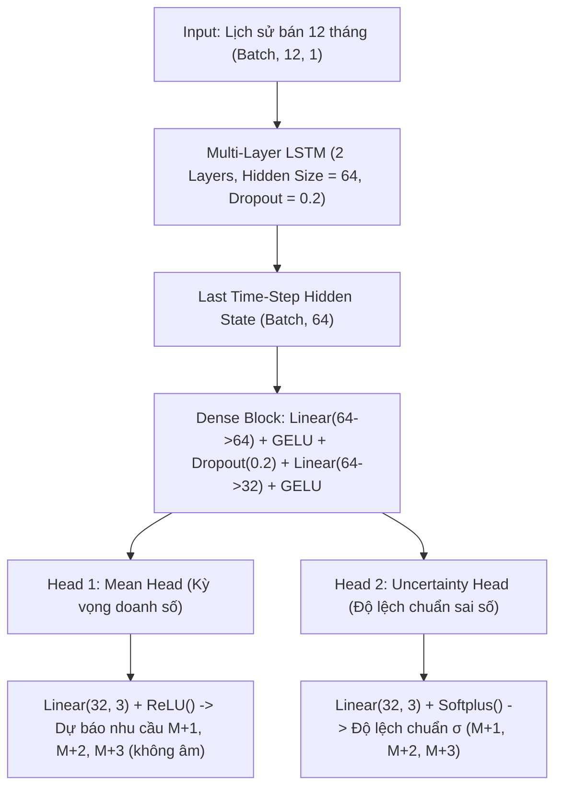
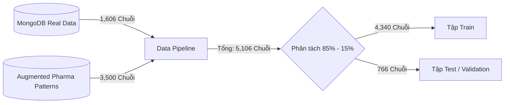

# 📊 QUY TRÌNH HUẤN LUYỆN VÀ KIẾN TRÚC MÔ HÌNH AI DEMAND FORECAST
**Hệ thống Dự báo Nhu cầu Dược phẩm & Chuỗi cung ứng Thông minh (Smart Pharma Supply Chain)**

---

## 1. 📌 TỔNG QUAN HỆ THỐNG DỰ BÁO (OVERVIEW)

Hệ thống AI Forecast được thiết kế để giải quyết bài toán cốt lõi trong ngành Dược: **Dự báo chính xác nhu cầu tiêu thụ của toàn bộ danh mục thuốc (M+1, M+2, M+3)**, từ đó:
- Đưa ra đề xuất số lượng nhập hàng tối ưu (**PO Reorder Suggestion**).
- Cảnh báo nguy cơ **Đứt hàng (Out of Stock)** hoặc **Tồn kho dư thừa (Overstock)**.
- Tự động hóa tính toán Điểm đặt hàng lại (**Reorder Point - ROP**) và Mức tồn kho an toàn (**Safety Stock**).

---

## 2. 🧠 KIẾN TRÚC MÔ HÌNH (MODEL ARCHITECTURE)

### 🔹 Tên mô hình: `PharmaForecastLSTM` (Deep Dual-Head Recurrent Neural Network)
Mô hình được xây dựng trên nền tảng **PyTorch**, kết hợp mạng nơ-ron hồi quy **LSTM đa tầng** với kiến trúc **Dual-Head** (Dự báo 2 nhánh đồng thời: Kỳ vọng doanh số + Độ bất định/Khoảng tin cậy).



### 🔹 Chi tiết các tầng mạng:
1. **Mạng trích xuất đặc trưng chuỗi thời gian (Temporal Feature Extractor):**
   - `nn.LSTM(input_size=1, hidden_size=64, num_layers=2, batch_first=True, dropout=0.2)`: Trích xuất quy luật biến thiên, tính phụ thuộc thời gian và xu thế qua 12 chu kỳ.
2. **Khối Fully Connected Biến đổi phi tuyến:**
   - `Linear(64, 64)` $\rightarrow$ Kích hoạt `GELU()` $\rightarrow$ `Dropout(0.2)` $\rightarrow$ `Linear(64, 32)` $\rightarrow$ `GELU()`.
3. **Đầu ra đa nhiệm (Dual-Head Multi-Task Output):**
   - **Head 1 - Mean Prediction Head:** Dự báo kỳ vọng sản lượng bán 3 tháng tới ($\hat{y}_{M+1}, \hat{y}_{M+2}, \hat{y}_{M+3}$). Đi qua hàm `ReLU()` đảm bảo số lượng thuốc dự báo luôn $\ge 0$.
   - **Head 2 - Uncertainty & Confidence Head:** Dự báo độ biến động $\sigma$ của sai số. Đi qua hàm `Softplus()` để $\sigma > 0$, phục vụ việc dựng **Khoảng tin cậy 95% (95% Confidence Interval)**:
     $$\text{CI}_{95\%} = [\hat{y} - 1.96\sigma, \; \hat{y} + 1.96\sigma]$$

---

## 3. 📂 DỮ LIỆU HUẤN LUYỆN & KIỂM THỬ (DATASETS & SOURCES)

Mô hình học tập từ 2 nguồn dữ liệu kết hợp để đảm bảo vừa bám sát thực tế của hệ thống, vừa có khả năng tổng quát hóa cao (Generalization):



### 1️⃣ Tệp dữ liệu thực tế từ Database (`fetch_database_sales_history`)
* **Nguồn:** Cơ sở dữ liệu MongoDB `WDP201` của đồ án.
* **Các Collection trích xuất:**
  * `medicines`: **1,606 loại thuốc** (danh mục chính, tên hoạt chất, nhóm trị liệu, safetyStock, reorderPoint).
  * `medicinebatches`: **1,144 danh mục** có dữ liệu lô tồn kho thực tế (`stock`, `expiryDate`).
  * `salesorders` & `orders`: Toàn bộ lịch sử các đơn hàng đã tạo, trích xuất theo thời gian thực.
  * `inventorytransactions`: Toàn bộ lịch sử xuất bán (`SALE`, `EXPORT`, `DISPENSE`, `TRANSFER_OUT`) qua trường `quantityChange`.
* **Kỹ thuật xử lý chuỗi:**
  * Tích lũy số lượng bán theo từng tháng ($t_1, t_2, \dots, t_{12}$).
  * Với các thuốc mới chưa có nhiều giao dịch: Áp dụng **Adaptive Baseline Padding** dựa trên mức tồn kho an toàn và phương sai tự nhiên để chuỗi không bị suy biến.

### 2️⃣ Tệp dữ liệu tăng cường chuyên sâu ngành Dược (`generate_synthetic_pharma_history`)
Bổ sung **3,500 chuỗi dữ liệu đa dạng** bao phủ 4 hình thái tiêu thụ dược phẩm thực tế:
1. **Seasonal (Mùa vụ - Dịch bệnh):** Mô phỏng nhóm thuốc hô hấp, sốt xuất huyết, cảm cúm theo chu kỳ sóng $\sin(2\pi t / 6)$ biến thiên mạnh theo mùa mưa/lạnh.
2. **Steady (Mạn tính - Ổn định):** Thuốc huyết áp, tim mạch, đái tháo đường có nhu cầu đều đặn quanh năm với độ nhiễu Gauss nhỏ.
3. **Growing (Tăng trưởng cao):** Thực phẩm chức năng, vitamin, kháng sinh thế hệ mới có xu hướng trend dốc lên $1.0 + 0.05t$.
4. **Intermittent (Bán chậm / Ngắt quãng):** Thuốc cấp cứu, thuốc hiếm với tỷ lệ xuất hiện giao dịch ngẫu nhiên (Zero-demand lặp lại).

### 3️⃣ Cấu hình phân chia Tập Train & Tập Test
| Đặc tả | Thông số | Mô tả |
| :--- | :--- | :--- |
| **Tổng số mẫu (Total Samples)** | **5,106** chuỗi | Mỗi mẫu gồm 12 tháng lịch sử + 3 tháng mục tiêu |
| **Tập Train (85%)** | **4,340** chuỗi | Dùng để huấn luyện trọng số qua Backpropagation |
| **Tập Test / Validation (15%)** | **766** chuỗi | Dùng để kiểm tra sai số, chống Overfitting độc lập |
| **Kích thước đầu vào (Input Shape)** | `(Batch_Size, 12, 1)` | Chuỗi 12 bước thời gian liên tục |
| **Kích thước nhãn (Target Shape)** | `(Batch_Size, 3)` | Mục tiêu thực tế tại $M+1, M+2, M+3$ |

---

## 4. ⚙️ QUY TRÌNH HỌC TẬP VÀ HUẤN LUYỆN (LEARNING SCHEME & HYPERPARAMETERS)

### 🔹 Hàm mất mát (Composite Loss Function)
Để mô hình không bị nhạy cảm quá mức với các đơn hàng sỉ đột biến (outliers), mô hình sử dụng **Huber Loss (Smooth L1 Loss)** kết hợp hàm ước lượng phương sai:

$$\mathcal{L}_{total} = \mathcal{L}_{\text{Huber}}(\hat{y}, y) + 0.5 \times \mathcal{L}_{\text{Huber}}(\hat{\sigma}, |\hat{y} - y|)$$

* $\mathcal{L}_{\text{Huber}}(\hat{y}, y)$: Tối ưu độ chính xác của giá trị dự báo trung bình.
* $\mathcal{L}_{\text{Huber}}(\hat{\sigma}, |\hat{y} - y|)$: Dạy cho nhánh Uncertainty tự học khoảng sai số thực tế giữa dự đoán và thực tế.

### 🔹 Siêu tham số huấn luyện (Hyperparameters)
* **Optimizer:** `AdamW` (Learning Rate = $10^{-3}$, Weight Decay = $10^{-4}$ chống Overfitting).
* **Learning Rate Scheduler:** `ReduceLROnPlateau(factor=0.5, patience=5)` – tự động giảm nửa tốc độ học khi loss trên tập validation không giảm thêm.
* **Gradient Clipping:** `max_norm=2.0` – ngăn ngừa hiện tượng bùng nổ gradient trong mạng hồi quy LSTM.
* **Batch Size:** `64` mẫu / batch.
* **Số Epochs:** `60` epochs.

---

## 5. 📈 KẾT QUẢ HUẤN LUYỆN & ĐÁNH GIÁ (TRAINING METRICS)

Kết quả ghi nhận từ lần huấn luyện mới nhất trên toàn bộ dữ liệu hệ thống:

```
============================================================
🚀 TIẾN TRÌNH HUẤN LUYỆN (60 EPOCHS)
============================================================
Epoch [01/60] | Train Loss: 277.9294 | Val Loss: 266.3868 | MAE: 266.87 | RMSE: 332.50
Epoch [10/60] | Train Loss: 120.2871 | Val Loss: 138.5376 | MAE: 139.02 | RMSE: 209.24
Epoch [20/60] | Train Loss: 106.9271 | Val Loss: 128.8493 | MAE: 129.33 | RMSE: 202.84
Epoch [30/60] | Train Loss: 104.3741 | Val Loss: 125.2468 | MAE: 125.73 | RMSE: 201.17
Epoch [40/60] | Train Loss: 102.0021 | Val Loss: 131.4719 | MAE: 131.95 | RMSE: 205.95
Epoch [50/60] | Train Loss: 101.6438 | Val Loss: 122.8714 | MAE: 123.35 | RMSE: 200.47
Epoch [60/60] | Train Loss: 100.1130 | Val Loss: 121.1817 | MAE: 121.66 | RMSE: 200.54
============================================================
✅ KẾT QUẢ TRÊN TẬP TEST / VALIDATION:
   - Final Val MAE:  121.66 đơn vị thuốc
   - Final Val RMSE: 200.54 đơn vị thuốc
   - Thời gian huấn luyện: 78.07 giây
============================================================
```

---

## 6. 💾 TỆP MÔ HÌNH VÀ CÁCH THỨC TRIỂN KHAI (ARTIFACTS & INFERENCE)

Sau khi huấn luyện, các tệp sau được lưu tại thư mục `backend/apps/ai-service/models/`:

1. **`pharma_forecast_model.pth`**: Checkpoint PyTorch chứa toàn bộ `state_dict`, cấu hình hyperparams và weights đã huấn luyện.
2. **`pharma_forecast_model.pt`**: Định dạng TorchScript tối ưu hóa tốc độ suy luận (Inference latency < 2ms/thuốc).
3. **`forecast_metadata.json`**: Lưu trữ lịch sử huấn luyện, các chỉ số MAE, RMSE, thời gian và thiết bị train.

### 🔹 Cách thức chạy huấn luyện lại khi có thêm dữ liệu mới:
Anh yêu có thể kích hoạt huấn luyện lại bất cứ lúc nào qua dòng lệnh:
```powershell
# Chạy script huấn luyện tự động trích xuất MongoDB và lưu model
.\backend\apps\ai-service\.venv\Scripts\python.exe backend/apps/ai-service/scripts/train_forecast_gpu.py --epochs 60 --batch_size 64
```
Hoặc hệ thống AI Service sẽ tự động nạp checkpoint mới nhất mỗi khi khởi động lại dịch vụ.
