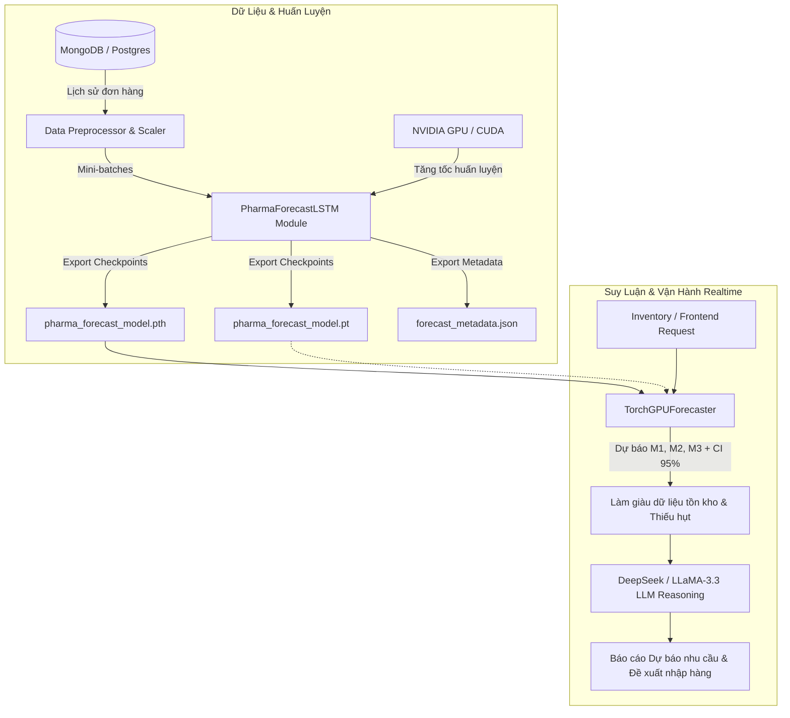

# 📖 TÀI LIỆU VẬN HÀNH PIPELINE AI DEMAND FORECASTING (GPU / PYTORCH)

Tài liệu hướng dẫn chi tiết về cấu trúc, cơ chế vận hành, quy trình tự động huấn luyện (Auto-Training Lifecycle) và hướng dẫn triển khai (Deployment) cho hệ thống AI Dự báo nhu cầu Dược phẩm WDP301.

---

## 1. 🏗️ Kiến trúc Tổng quan (System Architecture)

Hệ thống sử dụng mô hình dự báo chuỗi thời gian học sâu **Hybrid Deep Learning + LLM**:
1. **PyTorch LSTM Neural Network (`services/pharma_forecaster_nn.py`):** Xử lý định lượng, dự báo số lượng bán $M+1, M+2, M+3$ kèm khoảng tin cậy 95% trên GPU.
2. **Vectorized GPU Forecaster (`services/forecaster.py`):** Load mô hình `.pth` / `.pt` vào VRAM và tính toán dự báo hàng loạt mã thuốc trong vài mili-giây.
3. **Qualitative LLM Reasoner (`services/llm_service.py`):** Tổng hợp số liệu từ GPU, phân tích yếu tố mùa vụ, dịch bệnh, thời tiết và tạo báo cáo trực quan cho dược sĩ / quản lý kho.



---

## 2. 🔄 Cơ chế Vận hành Huấn luyện (AI Training Lifecycle)

Anh yêu **KHÔNG CẦN** phải chạy lệnh thủ công mỗi lần! Hệ thống được thiết kế với **3 chế độ tự động hóa & linh hoạt**:

| Chế độ | Cách thức hoạt động | Trường hợp sử dụng |
|---|---|---|
| **1. Tự động khi khởi động (Auto-train on Startup)** | Khi AI Service bật lên, hệ thống sẽ tự động quét thư mục `models/`. Nếu chưa có file `pharma_forecast_model.pth` (ví dụ lần đầu deploy container mới), server sẽ **tự động train ngầm trong background thread** mà không làm treo hay gián đoạn API server. | Tự động hóa 100% khi deploy Docker / Cloud / Railway / Kubernetes. |
| **2. Kích hoạt qua API (On-Demand API Trigger)** | Gửi HTTP POST tới `http://localhost:8000/api/ai/forecast/train` (hoặc bấm nút "Huấn luyện lại AI" trên Dashboard). | Khi có đợt nhập dữ liệu mới lớn hoặc định kỳ chạy Cronjob hàng tuần/tháng. |
| **3. Lệnh thủ công (Manual CLI Script)** | Chạy lệnh `python scripts/train_forecast_gpu.py`. | Dành cho kỹ sư AI muốn debug trực tiếp, tùy chỉnh số Epochs hoặc Hyperparameters. |

---

## 3. 📂 Cấu trúc Thư mục & Trọng số Model

```text
backend/apps/ai-service/
├── models/
│   ├── pharma_forecast_model.pth    # File trọng số chuẩn PyTorch phục vụ Deploy
│   ├── pharma_forecast_model.pt     # File checkpoint PyTorch đầy đủ
│   └── forecast_metadata.json       # Siêu dữ liệu (Số Epochs, RMSE, MAE, GPU Device)
├── routers/
│   └── forecast.py                  # API endpoints (/train, /predict, /hardware-status)
├── scripts/
│   └── train_forecast_gpu.py        # Script huấn luyện chính trên GPU CUDA
├── services/
│   ├── pharma_forecaster_nn.py      # Định nghĩa mạng nơ-ron PharmaForecastLSTM
│   ├── forecaster.py                # Engine nạp model và suy luận (TorchGPUForecaster)
│   └── llm_service.py               # Tích hợp Hybrid AI với LLM
├── main.py                          # Điểm khởi động FastAPI & Background Auto-train
└── pipeline.md                      # Tài liệu hướng dẫn vận hành này
```

---

## 4. 🚀 Hướng dẫn Triển khai (Deployment Guide)

### Cách 1: Chạy trực tiếp trên máy chủ / Local
1. Kích hoạt môi trường ảo:
   ```powershell
   cd backend\apps\ai-service
   .\.venv\Scripts\activate
   ```
2. Khởi động AI Service:
   ```powershell
   uvicorn main:app --host 0.0.0.0 --port 8000
   ```
   *(Server sẽ tự kiểm tra model và tự nạp vào GPU RTX 3050)*

### Cách 2: Triển khai Docker / Container
Trong `Dockerfile`, file trọng số `models/pharma_forecast_model.pth` sẽ được copy cùng code. Khi container khởi động:
- Nếu đã có file `.pth`: Sẽ load ngay lập tức trong **< 0.5s**.
- Nếu chưa có: Tự động chạy tiến trình Auto-train ngầm tạo model mới.

---

## 5. 📡 Danh sách API Reference

### 1. Kiểm tra trạng thái Phần cứng & Model
- **Endpoint:** `GET /api/ai/forecast/hardware-status`
- **Response:**
  ```json
  {
    "gpu": {
      "cuda_available": true,
      "device_name": "NVIDIA GeForce RTX 3050 Laptop GPU",
      "vram_total_mb": 4096.0,
      "vram_free_mb": 3950.0
    },
    "model_metadata": {
      "model_type": "PharmaForecastLSTM",
      "final_val_mae": 132.2,
      "final_val_rmse": 221.0,
      "saved_at": "2026-09-04"
    }
  }
  ```

### 2. Kích hoạt Huấn luyện lại trên GPU
- **Endpoint:** `POST /api/ai/forecast/train`
- **Body (Tùy chọn):**
  ```json
  {
    "epochs": 60,
    "batch_size": 64,
    "learning_rate": 0.001
  }
  ```

### 3. Dự báo Nhu cầu theo mã thuốc
- **Endpoint:** `POST /api/ai/forecast/predict`
- **Body:**
  ```json
  {
    "sales_history": { "2026-01": 120, "2026-02": 135, "2026-03": 150 },
    "safety_stock": 50,
    "current_stock": 100,
    "price": 45000
  }
  ```
