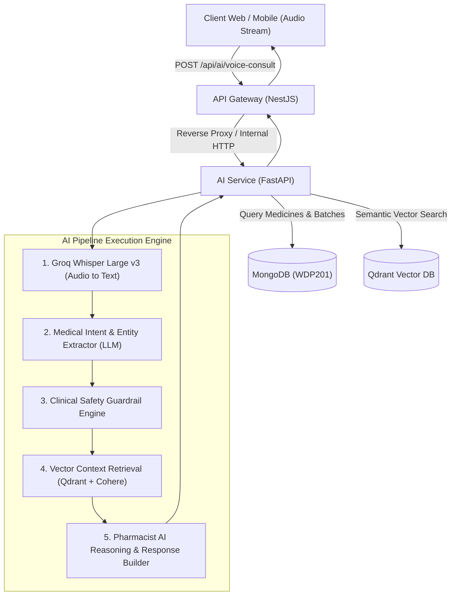

# 📑 BÁO CÁO NGHIÊN CỨU TÍNH KHẢ THI & GIẢI PHÁP KỸ THUẬT (R&D FEASIBILITY REPORT)

## ĐỀ TÀI: AI CÁ NHÂN HÓA TƯ VẤN DƯỢC PHẨM THEO NHÓM ĐỐI TƯỢNG KẾT HỢP NHẬN DIỆN GIỌNG NÓI (VOICE-TO-TEXT)
**Hệ thống:** Quản trị & Bán lẻ Dược phẩm Chuẩn GPP (WDP301)  
**Tác giả:** Đội ngũ Nghiên cứu & Phát triển AI  
**Ngày lập:** Tháng 09/2026  

---

## 1. TỔNG QUAN Ý TƯỞNG & ĐẶT VẤN ĐỀ (EXECUTIVE SUMMARY)

### 1.1. Bối cảnh thực tiễn
Trong quá trình tương tác tại nhà thuốc (trực tiếp tại quầy hoặc qua ứng dụng trực tuyến), khách hàng thường gặp khó khăn trong việc:
1. **Nhập liệu & Diễn đạt:** Người cao tuổi, người đang sốt mệt hoặc phụ huynh chăm con nhỏ gặp rào cản khi phải gõ bàn phím tìm kiếm tên thuốc phức tạp hoặc mô tả các triệu chứng lâm sàng đan xen.
2. **Nguy cơ tương tác & Chống chỉ định theo cá nhân:** Cùng một triệu chứng sốt/đau đầu, phác đồ điều trị của phụ nữ mang thai, trẻ sơ sinh, người cao tuổi mắc bệnh suy thận/tiểu đường hoặc người có tiền sử dị ứng hoàn toàn khác nhau. Việc tự ý mua thuốc không theo đối tượng tiềm ẩn rủi ro sốc thuốc và biến chứng nghiêm trọng.

### 1.2. Mục tiêu nghiên cứu
Xây dựng giải pháp AI thông minh tích hợp nhận diện giọng nói (Voice-to-Text / Speech-to-Text) kết hợp mô hình RAG (Retrieval-Augmented Generation) và Rule Engine an toàn y khoa nhằm:
* Chuyển đổi giọng nói tự nhiên của người bệnh thành văn bản có cấu trúc.
* Bóc tách thực thể y tế (Triệu chứng, Đối tượng sử dụng, Tiền sử dị ứng, Bệnh nền).
* Đề xuất danh mục sản phẩm không kê đơn (OTC), thực phẩm chức năng và vật tư y tế phù hợp với từng nhóm đối tượng, tuyệt đối tuân thủ chống chỉ định lâm sàng chuẩn Dược Quốc Gia GPP.

---

## 2. PHÂN TÍCH MA TRẬN NHÓM ĐỐI TƯỢNG & RÀO CHẮN AN TOÀN LÂM SÀNG

```
                             [ Giọng nói khách hàng ]
                                        │
                                        ▼ (Groq Whisper Large v3)
                           [ Văn bản triệu chứng thô ]
                                        │
                                        ▼ (LLM Entity Extractor)
             ┌──────────────────────────┴──────────────────────────┐
             ▼                                                     ▼
     [ Hồ sơ đối tượng ]                                  [ Triệu chứng & Bệnh ]
  (Tuổi, Bầu, Dị ứng, Nền...)                         (Sốt, Ho, Đau họng...)
             │                                                     │
             └──────────────────────────┬──────────────────────────┘
                                        │
                                        ▼
                       [ BỘ LỌC CHỐNG CHỈ ĐỊNH DƯỢC LÝ ]
                       (Rule-based Safety Guardrail)
                                        │
                   ┌────────────────────┴────────────────────┐
                   ▼ (An toàn - OTC)                         ▼ (Nguy cơ / Kê đơn)
       [ Truy vấn RAG Vector DB ]               [ Cảnh báo chuyển viện / Bác sĩ ]
       (Qdrant + Cohere Embedding)               (Chặn tự động kê đơn)
                   │
                   ▼
     [ Danh mục đề xuất cá nhân hóa ]
```

### Bảng ma trận đối tượng & Quy tắc an toàn (Clinical Rules Matrix):

| Nhóm đối tượng | Đặc điểm chuyển hóa dược | Chống chỉ định bắt buộc (Guardrail) | Sản phẩm ưu tiên đề xuất |
| :--- | :--- | :--- | :--- |
| 👶 **Trẻ sơ sinh & Trẻ nhỏ (<6 tuổi)** | Gan thận chưa phát triển hoàn chỉnh, nguy cơ ngộ độc thuốc cao. | • Cấm Aspirin (Hội chứng Reye).<br>• Cấm viên nén to dễ sặc.<br>• Kiểm soát liều theo cân nặng/tháng tuổi. | Siro thảo dược, dung dịch nhỏ giọt, gói cốm hạ sốt Paracetamol đúng liều, xịt mũi muối biển. |
| 🤰 **Phụ nữ có thai & Cho con bú** | Thuốc đi qua nhau thai và bài tiết qua sữa mẹ. | • Cấm NSAIDs (Ibuprofen, Naproxen, Diclofenac).<br>• Cấm kháng sinh nhóm Quinolone, Tetracycline.<br>• Phân loại FDA: Chỉ dùng Category A, B. | Vitamin bầu, Sắt/Canxi hữu cơ, Thảo dược lành tính, Paracetamol đơn chất liều thấp. |
| 👴 **Người cao tuổi & Bệnh mãn tính** | Giảm thanh thải thận, thường kèm Tim mạch, Huyết áp, Tiểu đường. | • Cấm thuốc co mạch (Pseudoephedrine) khi có tăng huyết áp.<br>• Cấm siro chứa hàm lượng đường cao cho người tiểu đường. | Thuốc ít độc gan/thận, Men tiêu hóa, Viên bổ não/khớp, Thiết bị theo dõi huyết áp/đường huyết. |
| 🌿 **Người có cơ địa dị ứng** | Nguy cơ sốc phản vệ hoặc phát ban dị ứng chéo. | • Đối soát tự động tá dược và hoạt chất với trường `drugAllergies` trong User Profile. | Kháng Histamin H1 thế hệ 2 (Cetirizine, Loratadine), Thảo dược không mẫn cảm. |
| 👨‍💼 **Người lớn thông thường** | Ít chống chỉ định đặc thù. | • Kiểm soát giới hạn liều tối đa trong 24 giờ. | Các dòng viên nén OTC, viên sủi, combo phục hồi thể trạng nhanh. |

---

## 3. KIẾN TRÚC GIẢI PHÁP KỸ THUẬT (TECHNICAL ARCHITECTURE)

Hệ thống được thiết kế theo mô hình Microservices phân tán sẵn có của WDP301:



### 3.1. Các module thành phần:
1. **Module Voice-to-Text (STT):**
   * Công nghệ: **Whisper Large v3 (Groq REST API)**.
   * Ưu điểm: Độ trễ siêu thấp (300 - 500ms), tối ưu từ khóa tiếng Việt chuyên ngành y tế bằng pre-prompt context.
2. **Module Trích xuất Thực thể & Phân tích Ý định (NER & Intent):**
   * Sử dụng Llama 3.3 70B / Gemini 1.5 Flash để bóc tách JSON chuẩn: `{ symptoms, target_group, duration, allergies, severity }`.
3. **Module Rào chắn An toàn (Clinical Safety Guardrail):**
   * Ngăn chặn hoàn toàn việc kê đơn thuốc kê đơn (ETC), thuốc gây nghiện, tiền chất.
   * Tự động kích hoạt thông điệp chuyển tuyến khám Bác sĩ khi phát hiện triệu chứng nguy hiểm (Khó thở, đau thắt ngực, sốt co giật...).
4. **Module RAG & Đề xuất Sản phẩm (Product Recommendation Engine):**
   * Tìm kiếm tương đồng ngữ nghĩa bằng Vector Embedding kết hợp bộ lọc Metadata trên MongoDB (`stock > 0`, `targetGroup`, `contraindication`).
   * Trả về thẻ sản phẩm (`MedicineCard`) có thể thêm vào giỏ hàng 1-chạm.

---

## 4. ĐÁNH GIÁ TÍNH KHẢ THI (FEASIBILITY SCORECARD)

| Hạng mục đánh giá | Mức độ khả thi | Rủi ro tiềm ẩn | Biện pháp giảm thiểu |
| :--- | :---: | :--- | :--- |
| **1. Hạ tầng & Dữ liệu sẵn có** | **9.5/10** | Dữ liệu thuốc thiếu trường `Đối tượng sử dụng` ở một số bản ghi cũ. | Chạy pipeline chuẩn hóa tự động cập nhật trường `targetGroup` bằng LLM. |
| **2. Tốc độ & Độ chính xác STT** | **9.0/10** | Giọng vùng miền hoặc tạp âm môi trường ồn ào. | Cung cấp UI cho phép người dùng xem lại và chỉnh sửa văn bản sau khi nói. |
| **3. Tránh ảo giác y khoa (Hallucination)** | **9.0/10** | LLM tự sáng tác tên thuốc hoặc chỉ định sai. | Sử dụng RAG chặt chẽ, chỉ cho phép LLM đề xuất thuốc có thực trong Database tồn kho. |
| **4. Chi phí vận hành** | **10/10** | Chi phí API khi lượng người dùng tăng cao. | Whisper và Llama trên Groq/Cohere có chi phí cực thấp (~$0.0005/lượt tư vấn). |

---

## 5. LỘ TRÌNH TRIỂN KHAI DỰ KIẾN (ROADMAP)

* **Giai đoạn 1 (1 - 2 tuần):** Xây dựng Core API `POST /api/ai/voice-consult`, tích hợp Groq Whisper STT và Rule Engine lọc chống chỉ định.
* **Giai đoạn 2 (1 tuần):** Thiết kế giao diện Voice Microphone trên Web & Mobile App (Hiệu ứng sóng âm thanh, chọn nhanh nhóm đối tượng).
* **Giai đoạn 3 (1 tuần):** Kiểm thử hồi quy với 100 kịch bản ca bệnh lâm sàng mẫu và nghiệm thu.

---
*Tài liệu được lưu trữ chính thức tại `docs/research.md` thuộc đồ án WDP301.*
