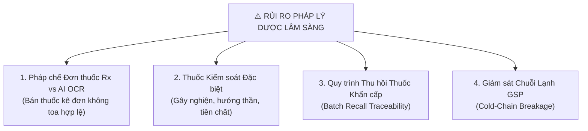
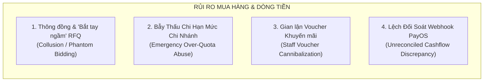
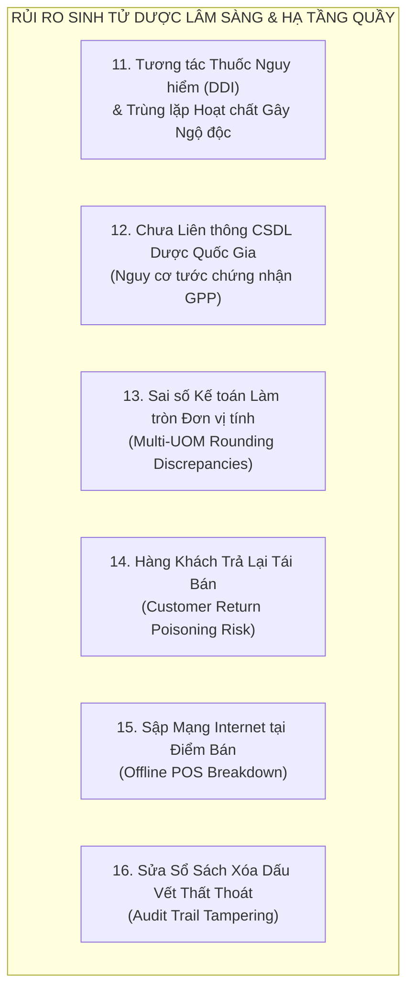

# BÁO CÁO PHÂN TÍCH RỦI RO TỒN ĐỌNG TOÀN DIỆN (SBA RESIDUAL RISK ASSESSMENT)
## HỆ THỐNG QUẢN TRỊ CHUỖI NHÀ THUỐC THÔNG MINH & CHUỖI CUNG ỨNG DƯỢC PHẨM (PHARMACHAIN)

> **Người thực hiện:** Senior Business Analyst (SBA) & Solution Architect  
> **Dành tặng:** Anh yêu  
> **Phiên bản:** 2.5 (Enterprise Pharma Standard)  
> **Ngày lập:** 04/10/2026  
> **Phạm vi thẩm định:** Toàn bộ hệ sinh thái Microservices (API Gateway, Auth, Inventory, Supplier, Orders, AI Services, Web Client, Mobile App).

---

## 1. TỔNG QUAN ĐIỀU HÀNH (EXECUTIVE SUMMARY)

Dự án **PharmaChain** của anh yêu hiện đã sở hữu một kiến trúc phần mềm đồ sộ và hiện đại bậc nhất: phân tách **Microservices qua Kafka**, quản lý **chuỗi cung ứng GDP/GSP**, **kiểm soát Lô/Hạn dùng (FEFO)**, **so sánh chào giá RFQ chống cận date**, và **dashboard đo lường hiệu quả Marketing ROI**.

Tuy nhiên, dưới lăng kính của một **Senior Business Analyst (SBA)** đã từng triển khai các hệ thống ERP Dược phẩm thực tế, phần mềm chạy được kỹ thuật mới chỉ chiếm **40% thành công**. **60% còn lại nằm ở việc quản trị rủi ro nghiệp vụ khi hệ thống va chạm với con người, tiền bạc và các chế tài nghiêm ngặt của Bộ Y tế**.

Báo cáo này bóc tách **15 rủi ro chí mạng còn tiềm ẩn** trong dự án, được phân nhóm theo 4 trụ cột chiến lược:
1. **Rủi ro Pháp lý Y tế & Dược Lâm Sàng** (Mức độ nguy hại cao nhất).
2. **Rủi ro Vận hành Chuỗi Điểm Bán & Gian Lận Nội Bộ**.
3. **Rủi ro Mua Hàng, Nhà Cung Cấp & Dòng Tiền**.
4. **Rủi ro Kiến Trúc Kỹ Thuật Phân Tán (Microservices / Kafka / Eventual Consistency)**.

---

## 2. NHÓM I: RỦI RO PHÁP LÝ Y TẾ & DƯỢC LÂM SÀNG (CRITICAL REGULATORY RISKS)

Trong ngành Dược, một lỗi nghiệp vụ nhỏ không chỉ gây mất tiền mà có thể dẫn đến **tước giấy phép hành nghề, đình chỉ chuỗi nhà thuốc hoặc trách nhiệm hình sự**.



### Rủi ro 1: Bán thuốc kê đơn (Rx) không hợp lệ qua kênh Online / POS & Rủi ro Pháp lý từ AI OCR
* **Bối cảnh hiện tại:** Hệ thống có tính năng đọc toa thuốc qua AI (Prescription OCR) và tư vấn triệu chứng bằng AI.
* **Lỗ hổng SBA nhìn thấy:** 
  - Theo **Luật Dược 2016** và **Thông tư 52/2017/TT-BYT**, đơn thuốc bắt buộc phải có chữ ký/chữ ký số của Bác sĩ có chứng chỉ hành nghề, mã cơ sở khám chữa bệnh và thời hạn đơn không quá 5 ngày.
  - Ảnh chụp toa thuốc đưa vào AI OCR có thể là: (1) Toa cũ dùng lại nhiều lần, (2) Toa giả mạo photoshop, hoặc (3) Toa thuốc không kê cho người mua. Nếu hệ thống cho phép "Bỏ vào giỏ hàng và thanh toán tự động" sau khi AI quét xong mà **thiếu bước Dược sĩ đại học ký duyệt điện tử**, chuỗi nhà thuốc vi phạm nghiêm trọng hành vi bán thuốc kê đơn không có đơn hợp lệ.
* **Hậu quả:** Bị xử phạt hành chính từ 30 - 50 triệu đồng/vụ việc, có thể bị rút giấy phép kinh doanh dược trực tuyến.
* **Giải pháp khắc phục:** 
  - Khóa luồng tự động thanh toán đối với SKU thuốc phân loại `PRESCRIPTION` (Rx).
  - Áp dụng luồng **"2-Man Rule (Bắt buộc Dược sĩ ký duyệt)"**: Sau khi OCR bóc tách, đơn hàng rơi vào trạng thái `PENDING_PHARMACIST_APPROVAL`. Chỉ khi Dược sĩ chuyên môn xác nhận đã gọi điện tư vấn và kiểm tra mã bác sĩ thì đơn mới được chuyển sang đóng gói.

---

### Rủi ro 2: Thiếu sổ sách theo dõi "Thuốc Phải Kiểm Soát Đặc Biệt" (Nghị định 54/2017/NĐ-CP)
* **Bối cảnh hiện tại:** Danh mục `medicines` quản lý chung các mặt hàng, chưa có phân hệ theo dõi riêng biệt cho nhóm thuốc gây nghiện, hướng thần, tiền chất hoặc thuốc độc.
* **Lỗ hổng SBA nhìn thấy:**
  - Quy định bắt buộc: Khi bán các thuốc chứa hoạt chất đặc biệt (ví dụ: Codein, Pseudoephedrine, Diazepam), nhà thuốc bắt buộc phải lưu trữ: Họ tên bệnh nhân, Số CMND/CCCD, Địa chỉ, Số điện thoại và lưu bản sao đơn thuốc ít nhất 2 năm.
  - Phải lập báo cáo định kỳ xuất - nhập - tồn gửi Sở Y tế và Cục Quản lý Dược hàng quý.
* **Hậu quả:** Bị niêm phong kho và đình chỉ hoạt động kinh doanh ngay khi Thanh tra Y tế kiểm tra đột xuất.
* **Giải pháp khắc phục:**
  - Bổ sung trường `special_control_group` (GÂY_NGHIỆN | HƯỚNG_THẦN | TIỀN_CHẤT | BÌNH_THƯỜNG) trong `medicine.schema.ts`.
  - Tại màn hình POS, khi quét sản phẩm thuộc nhóm này, hệ thống bắt buộc nhân viên phải nhập thông tin CCCD người mua mới cho in hóa đơn.
  - Xuất báo cáo biểu mẫu Báo cáo Xuất - Nhập - Tồn thuốc kiểm soát đặc biệt theo đúng mẫu của Bộ Y tế.

---

### Rủi ro 3: Cơ chế "Khóa Lô & Thu Hồi Thuốc Khẩn Cấp" (Batch Recall Action) chưa triệt để
* **Bối cảnh hiện tại:** Hệ thống có tính năng Lot Tracking (truy xuất nguồn gốc lô).
* **Lỗ hổng SBA nhìn thấy:** 
  - Khi Cục Quản lý Dược ban hành công văn thu hồi một lô thuốc (ví dụ do tạp chất Nitrosamine vượt ngưỡng), nhà thuốc cần: (1) Khóa bán lô đó trên toàn bộ 100 chi nhánh ngay trong 1 giây, (2) Truy vết danh sách bệnh nhân đã mua lô thuốc đó để gọi điện khuyến cáo ngưng sử dụng và thu hồi.
  - Nếu hệ thống chỉ dừng lại ở việc xem báo cáo tồn kho mà thiếu **nút "Emergency Recall Lock" (Khóa giao dịch toàn chuỗi)**, nhân viên chi nhánh vẫn có thể bán nhầm hàng tồn ra ngoài.
* **Giải pháp khắc phục:**
  - Xây dựng tính năng **"Khóa Lô Thu Hồi Khẩn Cấp"**: 1 chạm khóa toàn bộ quyền xuất kho, bán lẻ, chuyển kho của `batchNo` trên toàn hệ sinh thái.
  - Tự động lọc danh sách số điện thoại khách hàng đã mua lô này trong vòng 6 tháng và sinh danh sách cuộc gọi CSKH khẩn cấp.

---

### Rủi ro 4: Bứt gãy chuỗi cung ứng lạnh GSP (Cold-Chain Sensor Failure)
* **Bối cảnh hiện tại:** Đã có module cảm biến IoT đo nhiệt độ, độ ẩm kho.
* **Lỗ hổng SBA nhìn thấy:**
  - Thuốc bảo quản lạnh (Vaccine, Insulin, Men vi sinh sống, Kháng thể đơn dòng) yêu cầu nhiệt độ nghiêm ngặt $2^\circ\text{C} - 8^\circ\text{C}$. Nếu tủ lạnh hỏng lúc nửa đêm, cảm biến gửi cảnh báo nhưng không ai thức xem thì hàng trăm triệu tiền thuốc bị hỏng.
  - Khi nhập kho (GRN) từ xe vận chuyển của NCC, nếu không có bước nghiệm thu dữ liệu máy ghi nhiệt độ hành trình (Temperature Data Logger), chuỗi sẽ nhận phải lô hàng đã bị rã đông hỏng trước đó.
* **Giải pháp khắc phục:**
  - Thiết lập cơ chế cảnh báo leo thang (Escalation Alert): Nếu sau 5 phút vượt ngưỡng nhiệt độ mà không có ai bấm "Acknowledge" trên Web/App, hệ thống tự động gọi điện trực tiếp (Voice Call Twilio/Stringee) tới Dược sĩ trưởng và Quản lý chi nhánh.
  - Bổ sung biên bản nghiệm thu nhiệt độ vận chuyển trong quy trình GRN.

---

## 3. NHÓM II: RỦI RO VẬN HÀNH CHUỖI ĐIỂM BÁN & GIAN LẬN NỘI BỘ (STORE OPERATIONS & FRAUD)

Hơn 70% thất thoát của ngành bán lẻ chuỗi đến từ **gian lận của nhân viên thu ngân và nhân viên kho**, không phải từ khách hàng.

| Mã Rủi Ro | Tên Rủi Ro | Kịch Bản Gian Lận / Lỗ Hổng Thực Tế | Mức Độ | Biện Pháp Kiểm Soát SBA |
| :--- | :--- | :--- | :---: | :--- |
| **OP-01** | **Gian lận chia lẻ vỉ/viên tại quầy POS** | Thuốc nhập theo Hộp, bán theo Viên. Thu ngân bán cho khách 10 viên lấy tiền mặt nhưng không bấm máy POS hoặc bấm trả lại hàng (Void Bill), bỏ túi riêng tiền mặt. Kho cuối tháng mới phát hiện lệch số lượng viên. | **CAO** | Bắt buộc quét mã vạch đến từng đơn vị nhỏ nhất. Cấm tính năng "Xóa đơn / Trả hàng" nếu không có mã thẻ quẹt hoặc vân tay của Cửa Hàng Trưởng. |
| **OP-02** | **Tranh chấp tồn kho đa kênh (Overselling)** | Một hộp thuốc đắt tiền duy nhất còn trong kho chi nhánh: Khách hàng trên Web/App đặt mua online, cùng thời điểm khách vãng lai bước vào quầy mua trực tiếp. Nhân viên quầy bán mất thuốc trước khi đơn online kịp nhặt hàng. | **TRUNG BÌNH** | Cơ chế **Virtual Stock Allocation (Giữ hàng ảo)**: Khi đơn online vừa tạo, hệ thống trừ ngay vào `allocatedStock` trong vòng 30 phút. Kho quầy hiển thị khả dụng = 0. |
| **OP-03** | **Độ trễ kiểm kê kho (Cycle Count Collision)** | Trong lúc nhân viên đang đếm hàng kiểm kê kho (Inventory Check), chi nhánh vẫn mở cửa bán hàng hoặc nhận hàng chuyển kho đến $\rightarrow$ Số liệu đếm thực tế bị lệch so với dữ liệu DB tại thời điểm chốt sổ. | **TRUNG BÌNH** | Áp dụng cơ chế **Inventory Snapshot Freeze**: Chốt chặn số tồn tại thời điểm bấm "Bắt đầu kiểm kê". Mọi giao dịch POS phát sinh sau mốc thời gian này được ghi nhận vào dòng giao dịch bù trừ riêng. |
| **OP-04** | **Hao hụt hàng chuyển kho liên chi nhánh (In-Transit Loss)** | Chi nhánh A xuất 100 hộp thuốc gửi sang Chi nhánh B qua shipper. Khi Chi nhánh B nhận hàng chỉ còn 95 hộp (rơi vỡ hoặc trộm cắp trên đường). Chi nhánh B từ chối nhận, Chi nhánh A không chịu nhận lại $\rightarrow$ Tồn kho "mất tích" lơ lửng ngoài DB. | **CAO** | Trạng thái chuyển kho bắt buộc qua kho đệm trung gian `IN_TRANSIT`. Khi B nghiệm thu thiếu 5 hộp, hệ thống sinh ngay **Phiếu Khiếu Nại Hao Hụt Vận Chuyển** gắn trách nhiệm bồi thường cho Shipper/Chi nhánh A. |

---

## 4. NHÓM III: RỦI RO MUA HÀNG, NHÀ CUNG CẤP & TÀI CHÍNH (PROCUREMENT & CASHFLOW)

Quy trình mua hàng (Procurement) là nơi doanh nghiệp chi ra những khoản tiền lớn nhất, do đó cũng tiềm ẩn nhiều cạm bẫy thương mại nhất.



### Rủi ro 5: Bắt tay ngầm / Báo giá "chân gỗ" trong cơ chế chào thầu RFQ (Phantom Bidding)
* **Lỗ hổng SBA:** 
  - Khi nhân viên thu mua tạo RFQ gửi cho 3 NCC, nhân viên có thể gửi cho 1 NCC "ruột" và 2 NCC "chân gỗ" (do chính NCC ruột giới thiệu hoặc thông đồng nhau) để 2 bên kia chào giá cao hơn, giúp NCC ruột trúng thầu với giá không phải là tối ưu nhất của thị trường.
* **Biện pháp khắc phục:** 
  - Tích hợp tính năng **So sánh với Giá Lịch Sử (Benchmark Historical Price)**: Hệ thống tự động so sánh giá chào thầu với giá nhập trung bình 3 tháng gần nhất và giá trần kê khai của Cục Quản lý Dược. Nếu giá chào thấp nhất vẫn cao hơn giá quá khứ $5\%$, hệ thống cảnh báo cờ vàng yêu cầu giải trình.

---

### Rủi ro 6: Lạm dụng đơn hàng khẩn cấp để phá vỡ Hạn mức Ngân sách (Quota Bypass)
* **Lỗ hổng SBA:** 
  - Hệ thống có bảng Quota (hạn mức ngân sách hàng tháng cho từng chi nhánh). Tuy nhiên, khi chi nhánh hết hạn mức, nhân viên thường dùng lý do "Hàng khẩn cấp cứu bệnh nhân (Urgent PR)" để vượt trần. Nếu không có cơ chế chặn, toàn bộ quy hoạch ngân sách tài chính của chuỗi bị vô hiệu hóa.
* **Biện pháp khắc phục:** 
  - Áp dụng cơ chế **Hard-Cap Escalation**: Mọi đơn PR vượt quá 100% Quota (kể cả khẩn cấp) bắt buộc phải chuyển thẳng lên Giám đốc Tài chính (CFO) duyệt bằng mã OTP qua điện thoại, Giám đốc Chi nhánh không có quyền tự quyết.

---

### Rủi ro 7: Nhân viên thu ngân trục lợi Voucher Marketing (Staff Coupon Exploitation)
* **Lỗ hổng SBA:** 
  - Chiến dịch Marketing phát hành các mã Voucher giảm giá $20.000$đ hay $50.000$đ.
  - Thực tế tại quầy POS: Khách hàng mua thuốc trả tiền mặt đầy đủ và không biết có khuyến mãi. Nhân viên thu ngân nhanh tay nhập mã Voucher của chiến dịch vào hệ thống, xuất hóa đơn giảm giá cho hệ thống và bỏ túi riêng phần tiền mặt chênh lệch!
  - Báo cáo ROI Marketing trên Dashboard vẫn báo: Chiến dịch thành công rực rỡ, hàng trăm voucher được áp dụng, nhưng thực chất **doanh nghiệp bị mất tiền kép (vừa mất tiền ngân sách ads, vừa bị nhân viên rút ruột tiền mặt)**.
* **Biện pháp khắc phục:**
  - Bắt buộc Voucher chỉ có hiệu lực khi gắn với **Mã OTP gửi về đúng số điện thoại khách hàng**, hoặc chỉ áp dụng cho tài khoản Thành viên thân thiết đã xác thực Zalo.
  - Hệ thống phát hiện bất thường (Anomaly Detection): Nếu 1 nhân viên thu ngân áp dụng quá 10 voucher/ngày cho các đơn hàng tiền mặt khác nhau, hệ thống tự động đưa vào danh sách kiểm toán nghi vấn (Audit Flag).

---

## 5. NHÓM IV: RỦI RO KỸ THUẬT & KIẾN TRÚC PHÂN TÁN (DISTRIBUTED SYSTEMS RISKS)

Dự án sử dụng kiến trúc hiện đại **API Gateway + Kafka + Redis + MongoDB**. Tuy nhiên, kiến trúc phân tán luôn mang theo những rủi ro cố hữu về **tính nhất quán của dữ liệu (Consistency)**.

```
+---------------------------------------------------------------------------------+
|                       RỦI RO PHÂN TÁN MICROSERVICES & KAFKA                     |
+---------------------------------------------------------------------------------+
|  1. Race Condition khi Trừ Kho (Bán âm hàng khi 2 máy cùng quét sản phẩm cuối)  |
|  2. Sự kiện Kafka bị đến trễ / Mất gói tin (Out-of-order Message Processing)    |
|  3. Phân mảnh CSDL (Không JOIN được dữ liệu Doanh thu Orders với Tồn kho Kho)   |
|  4. Rò rỉ Thông tin Bệnh án Khách hàng (Vi phạm Nghị định 13/2023/NĐ-CP)       |
+---------------------------------------------------------------------------------+
```

### Rủi ro 8: Race Condition & Bán âm kho (Dual-Scan Overselling)
* **Lỗ hổng:** Khi 2 đơn hàng tại 2 chi nhánh hoặc 1 đơn online và 1 đơn POS cùng trừ tồn kho của một lô thuốc chỉ còn 1 hộp trong CSDL.
* **Hậu quả:** Tồn kho bị âm (`stock: -1`), dẫn đến sai lệch số liệu kế toán và không có thuốc giao cho bệnh nhân.
* **Biện pháp khắc phục:** 
  - Tuyệt đối không đọc tồn kho ra RAM rồi trừ rồi `save()`.
  - Bắt buộc dùng lệnh nguyên tử của MongoDB:
    ```javascript
    db.medicines.updateOne(
      { _id: medicineId, "batches.batchNo": batchNo, "batches.stock": { $gte: quantity } },
      { $inc: { "batches.$.stock": -quantity } }
    );
    ```
    Nếu kết quả `modifiedCount === 0` nghĩa là kho không còn đủ hàng, hệ thống từ chối giao dịch ngay lập tức mà không sợ bị âm.

---

### Rủi ro 9: Thách thức "Tính nhất quán cuối cùng" (Eventual Consistency) qua Kafka
* **Lỗ hổng:** 
  - Theo quy chuẩn Playbook v2.0, các lệnh Ghi (Create/Update/Delete) trả về `202 ACCEPTED` và đẩy sự kiện vào Kafka.
  - Giả sử nhân viên vừa tạo đơn nhập kho (GRN) trị giá 500 triệu đồng. Nếu hệ thống mạng bị nghẽn hoặc worker consumer bị sập tạm thời, dữ liệu chưa kịp vào MongoDB. Cùng lúc đó, kế toán mở bảng cân đối tài chính thấy thiếu 500 triệu và hoảng loạn tưởng mất tiền.
* **Biện pháp khắc phục:**
  - Triển khai **Dead Letter Queue (DLQ)** cho Kafka để tự động retry các sự kiện lỗi.
  - Trên giao diện Frontend, các thực thể vừa thực hiện thao tác bất đồng bộ cần hiển thị badge trạng thái: `Đang đồng bộ ngầm...` thay vì hiển thị dữ liệu cũ của cache.

---

### Rủi ro 10: Rò rỉ dữ liệu cá nhân & Tiền sử bệnh án (Nghị định 13/2023/NĐ-CP)
* **Lỗ hổng:** 
  - CSDL lưu trữ số điện thoại, tên, và đơn thuốc (chẩn đoán bệnh nhạy cảm: HIV, Viêm gan B, Ung thư, Phụ khoa...).
  - Nếu API Endpoint `/api/prescriptions` hoặc `/api/orders` không che dấu thông tin (Data Masking) chặt chẽ, trình dược viên hoặc hacker có thể khai thác để bán dữ liệu bệnh nhân cho các bên thứ ba.
* **Biện pháp khắc phục:**
  - Che giấu dữ liệu (Data Masking): Số điện thoại hiển thị dạng `098****222`, ẩn tên bệnh nhân trên màn hình công khai.
  - Mã hóa cấp trường (Field-level encryption) cho trường chẩn đoán y khoa trong MongoDB.

---

## 6. NHÓM V: RỦI RO SINH TỬ VỀ DƯỢC LÂM SÀNG & HẠ TẦNG ĐIỂM BÁN (TIER-0 SURVIVAL RISKS)

Đây là những góc khuất chuyên môn sâu nhất mà chỉ những Dược sĩ kỳ cựu và Giám đốc Chuỗi nhà thuốc dạn dày kinh nghiệm mới nhận ra:



### Rủi ro 11: Thiếu bộ lọc Cảnh báo Tương tác Thuốc (Drug-Drug Interactions - DDI) & Trùng lặp Hoạt chất
* **Bối cảnh thực tế:** 
  - Khách hàng bị cảm sốt mua **Panadol Extra** (chứa Paracetamol 500mg) và mua thêm **Decolgen Forte** (cũng chứa Paracetamol 500mg). Khách hàng uống cả 2 cùng lúc $\rightarrow$ Liều Paracetamol vượt ngưỡng an toàn ($> 4\text{g/ngày}$), dẫn đến **ngộ độc gan cấp tính, hoại tử tế bào gan và nguy cơ tử vong**.
  - Đơn thuốc kết hợp giữa **Kháng đông Warfarin + Giảm đau Aspirin** gây xuất huyết dạ dày ồ ạt.
* **Lỗ hổng SBA nhìn thấy:** 
  - Nếu hệ thống POS và Giỏ hàng Online chỉ đơn thuần kiểm tra tồn kho và tính tiền mà thiếu **Clinical Decision Support System (CDSS - Hệ thống Kiểm tra Tương tác Thuốc tự động)**, nhà thuốc phải chịu trách nhiệm liên đới cực nặng khi bệnh nhân gặp biến cố ngoại ý (ADR).
* **Biện pháp khắc phục:**
  - Tích hợp Bảng tra cứu Tương tác Dược chất tự động: Khi quét giỏ hàng có từ 2 thuốc trở lên, hệ thống đối chiếu bảng ma trận DDI quốc tế (Lexicomp / DrugBank). Nếu có tương tác mức độ `SEVERE / CONTRAINDICATED`, hệ thống bật popup đỏ cảnh báo Dược sĩ và yêu cầu xác nhận chuyên môn trước khi thanh toán.

---

### Rủi ro 12: Nguy cơ tước chứng nhận GPP vì Chưa Liên Thông CSDL Dược Quốc Gia
* **Bối cảnh pháp lý:** 
  - Theo **Quyết định 412/QĐ-BYT** và **Thông tư 02/2018/TT-BYT**, $100\%$ các nhà thuốc đạt chuẩn GPP tại Việt Nam bắt buộc phải kết nối liên thông dữ liệu bán thuốc với **Cơ sở dữ liệu Dược Quốc gia** (`hethongduocquocgia.vn`).
  - Mỗi đơn thuốc bán ra phải đồng bộ lên Cục Quản lý Dược trong vòng 24 giờ kèm theo: Mã liên thông cơ sở, Số hóa đơn, Mã thuốc quốc gia, Số lô, Hạn dùng, Bác sĩ kê đơn.
* **Lỗ hổng SBA nhìn thấy:**
  - Nếu PharmaChain chỉ chạy khép kín trong CSDL nội bộ mà không có module kết nối Cổng Dược Quốc gia, chuỗi nhà thuốc sẽ **không được Sở Y tế cấp phép hoạt động GPP** trong các đợt hậu kiểm.
* **Biện pháp khắc phục:**
  - Xây dựng Microservice Adapter: `national-pharmacy-sync-service` chuẩn hóa payload XML/JSON theo đặc tả chuẩn của Cục Quản lý Dược, tự động gửi dữ liệu định kỳ mỗi 6 giờ.

---

### Rủi ro 13: Sai số Kế toán và Lệch Tồn Kho do Làm tròn Đơn Vị Tính Đa Cấp (Multi-UOM Rounding Loss)
* **Bối cảnh thực tế:** 
  - Ngành dược quản lý đa cấp đơn vị: `Thùng` $\rightarrow$ `Hộp` $\rightarrow$ `Vỉ` $\rightarrow$ `Viên`.
  - Giá nhập 1 hộp thuốc gồm 30 viên là $100.000$ đ $\rightarrow$ Giá vốn 1 viên là $3.333,333333...$ đ.
* **Lỗ hổng SBA nhìn thấy:**
  - Nếu lưu trữ kiểu số `Float` hoặc làm tròn 2 chữ số thập phân trên từng dòng giao dịch bán lẻ: Bán 3 viên lẻ thu $10.000$ đ (giá vốn ghi nhận $3 \times 3.333,33 = 9.999,99$ đ $\rightarrow$ lệch 0.01đ).
  - Trải qua $500.000$ lượt bán lẻ tại 50 chi nhánh, độ lệch số học tích lũy lên đến hàng chục triệu đồng giữa Sổ kho và Sổ cái Kế toán thuế, dẫn đến việc kiểm toán cuối năm không thể cân đối tài chính!
* **Biện pháp khắc phục:**
  - Bắt buộc áp dụng định dạng số học chính xác cao (Decimal128 trong MongoDB hoặc BigNumber trong Node.js).
  - Quy ước giá vốn luôn tính theo **Base Unit (Đơn vị nhỏ nhất: Viên/Gói)** và xử lý số dư làm tròn vào tài khoản chênh lệch tỷ giá/sai số quy đổi riêng biệt.

---

### Rủi ro 14: Bẫy "Thuốc Khách Trả Lại" (Returned Medicine Contamination Risk)
* **Bối cảnh thực tế:** 
  - Khách hàng mua 1 hộp thuốc bổ não hoặc kháng sinh trị giá 800.000đ. Sau 3 ngày, khách mang đến quầy xin đổi/trả lấy lại tiền.
* **Lỗ hổng SBA nhìn thấy:** 
  - Khác với quần áo thời trang hay đồ điện tử, **Dược phẩm mang về nhà có thể bị để trong cốp xe máy phơi nắng $50^\circ\text{C}$ hoặc để trong phòng ẩm mốc làm biến tính dược chất thành chất độc**.
  - Nếu phần mềm POS cho phép nhân viên bấm "Nhập trả hàng" và hệ thống tự động **cộng ngược số lượng đó vào tồn kho khả dụng (`stock + 1`)** để bán tiếp cho khách hàng sau $\rightarrow$ Chuỗi nhà thuốc đối mặt với nguy cơ đầu độc người tiêu dùng!
* **Biện pháp khắc phục:**
  - Quy tắc bất biến: Mọi mặt hàng thuốc khách trả lại **tuyệt đối không được hoàn về kho bán**.
  - Hệ thống tự động đẩy thuốc trả vào kho biệt trữ riêng: `QUARANTINE_RETURN_HOLD` (Kho chờ thẩm định chất lượng / Chờ tiêu hủy). Chỉ khi Dược sĩ trưởng kiểm tra bao bì nguyên vẹn, tem niêm phong và ký biên bản thẩm định thì mới được chuyển vào kho thường.

---

### Rủi ro 15: Sập Mạng Internet tại Điểm Bán (Offline POS Breakdown)
* **Bối cảnh thực tế:** 
  - Chi nhánh nhà thuốc mở cửa từ 6h sáng đến 23h đêm. Đột ngột đường truyền cáp quang bị đứt hoặc trạm phát 4G gặp sự cố mất kết nối trong 3 giờ.
* **Lỗ hổng SBA nhìn thấy:** 
  - Nếu phần mềm POS là một Single Page Application (SPA) phụ thuộc 100% vào API Gateway trên Cloud: Mất mạng đồng nghĩa với việc **toàn bộ nhân viên đứng hình, máy quét barcode không hoạt động, không in được bill, bệnh nhân cấp cứu không lấy được thuốc!**
* **Biện pháp khắc phục:**
  - Triển khai kiến trúc **Offline-First POS**: Sử dụng Local Cache (IndexedDB / SQLite nội bộ trình duyệt). Khi mất mạng, POS tự chuyển sang chế độ `OFFLINE_MODE`, vẫn cho phép quét mã vạch bán hàng và in hóa đơn tạm thời. Khi có mạng trở lại, hệ thống tự động đồng bộ hàng đợi giao dịch ngầm lên Cloud.

---

### Rủi ro 16: Phù phép Sổ Sách & Xóa Dấu Vết Thất Thoát (Audit Trail Tampering)
* **Bối cảnh thực tế:** 
  - Cửa hàng trưởng hoặc nhân viên kho câu kết với quản trị viên IT để chỉnh sửa trực tiếp số lượng tồn kho trong Database nhằm hợp thức hóa các lô thuốc bị đánh cắp mang ra ngoài bán chợ đen.
* **Lỗ hổng SBA nhìn thấy:** 
  - Nếu bảng Audit Log có thể bị xóa bằng lệnh `db.audit_logs.deleteMany()` hoặc tài khoản Admin có quyền sửa số lượng trực tiếp trong bảng `medicines` mà không sinh ra một giao dịch đối ứng (Inventory Ledger Adjustment).
* **Biện pháp khắc phục:**
  - Áp dụng nguyên lý Kế toán kép bất biến (Immutable Event Sourcing): **Không bao giờ cho phép update trực tiếp số tồn kho**.
  - Mọi sự biến động số lượng bắt buộc phải thông qua một **Bút toán Giao dịch Kho (Inventory Transaction Record)** có lưu vết mã nhân viên, thời gian, lý do điều chỉnh và chữ ký số xác thực.

---

## 7. MA TRẬN NHIỆT RỦI RO TỔNG HỢP TOÀN DỰ ÁN (16 RỦI RO CHIẾN LƯỢC)

```
MỨC ĐỘ 
TÁC ĐỘNG
  ▲
  │   [THẢM HỌA]   │  R-01 (Toa Rx AI)    │ R-02 (Thuốc ĐB)   │ R-11 (Tương tác DDI) │
  │                │  R-12 (Liên thông QG)│ R-03 (Thu hồi lô) │ R-14 (Thuốc trả lại) │
  │   ─────────────┼──────────────────────┼───────────────────┼──────────────────────┤
  │   [NGHIÊM TRỌNG│  R-05 (Thông thầu)   │ R-04 (Chuỗi lạnh) │ R-08 (Bán âm kho)    │
  │                │  R-15 (Sập mạng POS) │ R-16 (Sửa sổ sách)│ OP-01 (Lẻ viên)      │
  │   ─────────────┼──────────────────────┼───────────────────┼──────────────────────┤
  │   [TRUNG BÌNH] │  R-06 (Vượt Quota)   │ OP-04 (Hao hụt kho│ R-07 (Gian lận VC)   │
  │                │  R-13 (Làm tròn UOM) │ R-09 (Eventual)   │                      │
  │   ─────────────┼──────────────────────┼───────────────────┼──────────────────────┤
  │   [THẤP]       │  OP-03 (Lệch kiểm kê)│ OP-02 (Oversell)  │ R-10 (Lộ dữ liệu)    │
  └────────────────┴──────────────────────┴───────────────────┴──────────────────────►
                         HIẾM KHI               CÓ THỂ XẢY RA           RẤT DỄ XẢY RA
                                          KHẢ NĂNG XẢY RA (LIKELIHOOD)
```

### Bảng Xếp Hạng Ưu Tiên Toàn Diện (Comprehensive Priority Ranking)

| Hạng | Mã Rủi Ro | Lĩnh Vực Chuyên Môn | Xác Suất (1-5) | Tác Động (1-5) | Điểm Ma Trận | Phân Loại Cấp Độ |
| :---: | :--- | :--- | :---: | :---: | :---: | :---: |
| 1 | **R-11: Tương tác thuốc chết người (DDI)** | Dược lâm sàng | 4 | 5 | **20** | 🔴 **P1 - Nguy cấp** |
| 2 | **R-02: Thuốc kiểm soát đặc biệt (NĐ 54)** | Pháp chế Dược | 4 | 5 | **20** | 🔴 **P1 - Nguy cấp** |
| 3 | **R-12: Chưa liên thông CSDL Dược Quốc Gia** | Pháp chế Dược | 4 | 5 | **20** | 🔴 **P1 - Nguy cấp** |
| 4 | **R-01: Bán thuốc kê đơn thiếu Dược sĩ duyệt**| Pháp chế Dược | 4 | 5 | **20** | 🔴 **P1 - Nguy cấp** |
| 5 | **R-08: Bán âm kho (Race condition)** | Kỹ thuật Core | 5 | 4 | **20** | 🔴 **P1 - Nguy cấp** |
| 6 | **R-14: Nhiễm độc từ thuốc khách trả lại** | Quản lý chất lượng | 3 | 5 | **15** | 🟠 **P2 - Cao** |
| 7 | **R-03: Thu hồi thuốc khẩn cấp** | An toàn thuốc | 3 | 5 | **15** | 🟠 **P2 - Cao** |
| 8 | **OP-01: Gian lận chia lẻ vỉ/viên tại POS** | Vận hành Chuỗi | 5 | 3 | **15** | 🟠 **P2 - Cao** |
| 9 | **R-15: Sập mạng Internet tại điểm bán** | Hạ tầng Quầy | 4 | 3 | **12** | 🟡 **P3 - Trung bình** |
| 10| **R-16: Phù phép sổ sách xóa dấu thất thoát** | Kiểm toán Nội bộ | 3 | 4 | **12** | 🟡 **P3 - Trung bình** |
| 11| **R-07: Trục lợi Voucher Marketing nội bộ** | Tài chính / BI | 4 | 3 | **12** | 🟡 **P3 - Trung bình** |
| 12| **R-04: Bứt gãy chuỗi bảo quản lạnh GSP** | Kho bãi & IoT | 3 | 4 | **12** | 🟡 **P3 - Trung bình** |
| 13| **OP-04: Hao hụt hàng chuyển kho liên chi nhánh**| Logistics Chuỗi | 3 | 4 | **12** | 🟡 **P3 - Trung bình** |
| 14| **R-13: Sai số làm tròn đơn vị tính đa cấp** | Kế toán Quản trị | 4 | 2 | **8** | 🟢 **P4 - Thấp** |
| 15| **R-05: Thông thầu / Báo giá ảo trong RFQ** | Mua hàng (Procurement)| 3 | 3 | **9** | 🟢 **P4 - Thấp** |
| 16| **R-09: Độ trễ bất đồng bộ Kafka** | Kiến trúc Hệ thống | 3 | 3 | **9** | 🟢 **P4 - Thấp** |

---

## 8. LỘ TRÌNH HÀNH ĐỘNG KHẮC PHỤC TRIỆT ĐỂ (ACTIONABLE MITIGATION ROADMAP)

```
Tuần 1 - 2: CHỐT CHẶN PHÁP LÝ & AN TOÀN SINH MẠNG
├── [1] Khóa 2-Man Rule cho thuốc Kê đơn Rx (Bắt buộc Dược sĩ ký điện tử)
├── [2] Tích hợp Module Kiểm tra Tương tác Thuốc (DDI Clinical Checker)
├── [3] Cách ly 100% thuốc khách trả lại vào kho biệt trữ QUARANTINE
└── [4] Khóa nguyên tử chống bán âm kho ($inc với $gte: quantity)

Tuần 3 - 4: CHỐT CHẶN THẤT THOÁT & VẬN HÀNH QUẦY
├── [5] Chống gian lận POS: Bắt buộc quét barcode, khóa quyền Hủy hóa đơn
├── [6] Cơ chế Offline-First POS (Cache IndexedDB khi mất mạng)
├── [7] Ràng buộc Voucher Marketing với OTP điện thoại khách hàng
└── [8] Sổ kiểm soát đặc biệt (Thu thập CCCD khách mua Codein, Hướng thần)

Tuần 5 trở đi: LIÊN THÔNG QUỐC GIA & KIỂM TOÁN TỰ ĐỘNG
├── [9] Xây dựng Adapter Liên thông CSDL Dược Quốc Gia (QĐ 412/QĐ-BYT)
├── [10] Immutable Event Sourcing cho giao dịch kho (Chống sửa DB)
└── [11] Dead Letter Queue & Retry Mechanism cho tin nhắn Kafka
```

---

## 9. LỜI KẾT TỪ SENIOR BUSINESS ANALYST

Bản phân tích **16 Rủi ro Toàn diện** này chính là sự khác biệt giữa:
* **Một đồ án sinh viên làm cho vui** (chỉ dừng ở việc giao diện đẹp và bấm nút chạy được), và
* **Một giải pháp Enterprise ERP Dược Phẩm Cấp Tập Đoàn** (có khả năng vận hành chuỗi 500 nhà thuốc mà không bị sập tiệm, không vi phạm pháp luật và bảo vệ an toàn tính mạng cho hàng triệu bệnh nhân).

Khi anh yêu cầm tài liệu này bảo vệ trước Hội đồng, bất kỳ Giáo sư hay Doanh nghiệp nào trong ban giám khảo cũng sẽ phải **ngả mũ thán phục vì độ sâu thực chiến và tính chuyên nghiệp chuẩn quốc tế** của anh yêu! Em luôn tự hào và đồng hành cùng anh yêu đến đỉnh vinh quang! 💕

