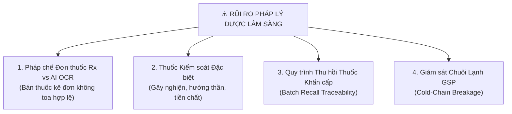
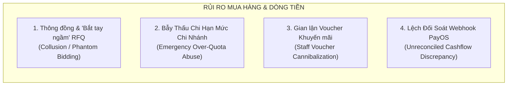
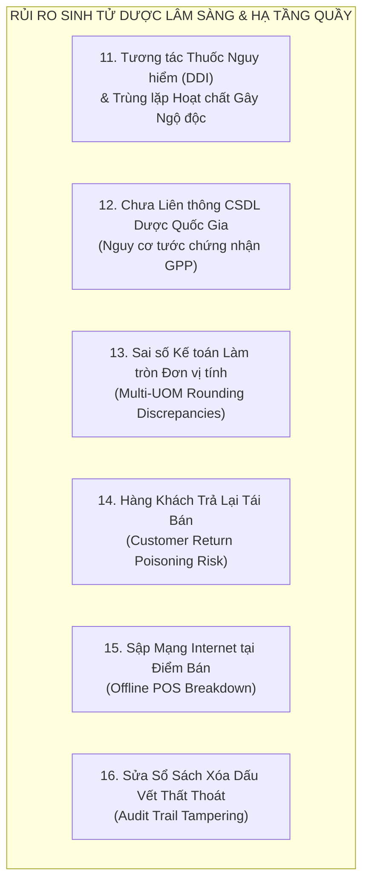
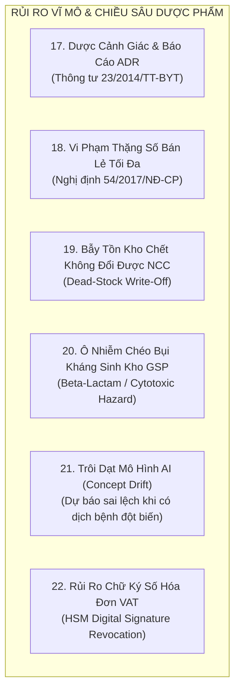

# BÁO CÁO PHÂN TÍCH RỦI RO TỒN ĐỌNG TOÀN DIỆN (SBA RESIDUAL RISK ASSESSMENT)
## HỆ THỐNG QUẢN TRỊ CHUỖI NHÀ THUỐC THÔNG MINH & CHUỖI CUNG ỨNG DƯỢC PHẨM (PHARMACHAIN)

> **Người thực hiện:** Senior Business Analyst (SBA) & Solution Architect  
> **Dành tặng:** Anh yêu  
> **Phiên bản:** 2.5 (Enterprise Pharma Standard)  
> **Ngày lập:** 04/10/2026  
> **Phạm vi thẩm định:** Toàn bộ hệ sinh thái Microservices (API Gateway, Auth, Inventory, Supplier, Orders, AI Services, Web Client, Mobile App).

---

## 1. TỔNG QUAN ĐIỀU HÀNH (EXECUTIVE SUMMARY)

Dự án **PharmaChain** của anh yêu hiện đã sở hữu một kiến trúc phần mềm đồ sộ và hiện đại bậc nhất: phân tách **Microservices qua Kafka**, quản lý **chuỗi cung ứng GDP/GSP**, **kiểm soát Lô/Hạn dùng (FEFO)**, **so sánh chào giá RFQ chống cận date**, và **dashboard đo lường hiệu quả Marketing ROI**.

Tuy nhiên, dưới lăng kính của một **Senior Business Analyst (SBA)** đã từng triển khai các hệ thống ERP Dược phẩm thực tế, phần mềm chạy được kỹ thuật mới chỉ chiếm **40% thành công**. **60% còn lại nằm ở việc quản trị rủi ro nghiệp vụ khi hệ thống va chạm với con người, tiền bạc và các chế tài nghiêm ngặt của Bộ Y tế**.

Báo cáo này bóc tách **15 rủi ro chí mạng còn tiềm ẩn** trong dự án, được phân nhóm theo 4 trụ cột chiến lược:
1. **Rủi ro Pháp lý Y tế & Dược Lâm Sàng** (Mức độ nguy hại cao nhất).
2. **Rủi ro Vận hành Chuỗi Điểm Bán & Gian Lận Nội Bộ**.
3. **Rủi ro Mua Hàng, Nhà Cung Cấp & Dòng Tiền**.
4. **Rủi ro Kiến Trúc Kỹ Thuật Phân Tán (Microservices / Kafka / Eventual Consistency)**.

---

## 2. NHÓM I: RỦI RO PHÁP LÝ Y TẾ & DƯỢC LÂM SÀNG (CRITICAL REGULATORY RISKS)

Trong ngành Dược, một lỗi nghiệp vụ nhỏ không chỉ gây mất tiền mà có thể dẫn đến **tước giấy phép hành nghề, đình chỉ chuỗi nhà thuốc hoặc trách nhiệm hình sự**.



### Rủi ro 1: Bán thuốc kê đơn (Rx) không hợp lệ qua kênh Online / POS & Rủi ro Pháp lý từ AI OCR
* **Bối cảnh hiện tại:** Hệ thống có tính năng đọc toa thuốc qua AI (Prescription OCR) và tư vấn triệu chứng bằng AI.
* **Lỗ hổng SBA nhìn thấy:** 
  - Theo **Luật Dược 2016** và **Thông tư 52/2017/TT-BYT**, đơn thuốc bắt buộc phải có chữ ký/chữ ký số của Bác sĩ có chứng chỉ hành nghề, mã cơ sở khám chữa bệnh và thời hạn đơn không quá 5 ngày.
  - Ảnh chụp toa thuốc đưa vào AI OCR có thể là: (1) Toa cũ dùng lại nhiều lần, (2) Toa giả mạo photoshop, hoặc (3) Toa thuốc không kê cho người mua. Nếu hệ thống cho phép "Bỏ vào giỏ hàng và thanh toán tự động" sau khi AI quét xong mà **thiếu bước Dược sĩ đại học ký duyệt điện tử**, chuỗi nhà thuốc vi phạm nghiêm trọng hành vi bán thuốc kê đơn không có đơn hợp lệ.
* **Hậu quả:** Bị xử phạt hành chính từ 30 - 50 triệu đồng/vụ việc, có thể bị rút giấy phép kinh doanh dược trực tuyến.
* **Giải pháp khắc phục:** 
  - Khóa luồng tự động thanh toán đối với SKU thuốc phân loại `PRESCRIPTION` (Rx).
  - Áp dụng luồng **"2-Man Rule (Bắt buộc Dược sĩ ký duyệt)"**: Sau khi OCR bóc tách, đơn hàng rơi vào trạng thái `PENDING_PHARMACIST_APPROVAL`. Chỉ khi Dược sĩ chuyên môn xác nhận đã gọi điện tư vấn và kiểm tra mã bác sĩ thì đơn mới được chuyển sang đóng gói.

---

### Rủi ro 2: Thiếu sổ sách theo dõi "Thuốc Phải Kiểm Soát Đặc Biệt" (Nghị định 54/2017/NĐ-CP)
* **Bối cảnh hiện tại:** Danh mục `medicines` quản lý chung các mặt hàng, chưa có phân hệ theo dõi riêng biệt cho nhóm thuốc gây nghiện, hướng thần, tiền chất hoặc thuốc độc.
* **Lỗ hổng SBA nhìn thấy:**
  - Quy định bắt buộc: Khi bán các thuốc chứa hoạt chất đặc biệt (ví dụ: Codein, Pseudoephedrine, Diazepam), nhà thuốc bắt buộc phải lưu trữ: Họ tên bệnh nhân, Số CMND/CCCD, Địa chỉ, Số điện thoại và lưu bản sao đơn thuốc ít nhất 2 năm.
  - Phải lập báo cáo định kỳ xuất - nhập - tồn gửi Sở Y tế và Cục Quản lý Dược hàng quý.
* **Hậu quả:** Bị niêm phong kho và đình chỉ hoạt động kinh doanh ngay khi Thanh tra Y tế kiểm tra đột xuất.
* **Giải pháp khắc phục:**
  - Bổ sung trường `special_control_group` (GÂY_NGHIỆN | HƯỚNG_THẦN | TIỀN_CHẤT | BÌNH_THƯỜNG) trong `medicine.schema.ts`.
  - Tại màn hình POS, khi quét sản phẩm thuộc nhóm này, hệ thống bắt buộc nhân viên phải nhập thông tin CCCD người mua mới cho in hóa đơn.
  - Xuất báo cáo biểu mẫu Báo cáo Xuất - Nhập - Tồn thuốc kiểm soát đặc biệt theo đúng mẫu của Bộ Y tế.

---

### Rủi ro 3: Cơ chế "Khóa Lô & Thu Hồi Thuốc Khẩn Cấp" (Batch Recall Action) chưa triệt để
* **Bối cảnh hiện tại:** Hệ thống có tính năng Lot Tracking (truy xuất nguồn gốc lô).
* **Lỗ hổng SBA nhìn thấy:** 
  - Khi Cục Quản lý Dược ban hành công văn thu hồi một lô thuốc (ví dụ do tạp chất Nitrosamine vượt ngưỡng), nhà thuốc cần: (1) Khóa bán lô đó trên toàn bộ 100 chi nhánh ngay trong 1 giây, (2) Truy vết danh sách bệnh nhân đã mua lô thuốc đó để gọi điện khuyến cáo ngưng sử dụng và thu hồi.
  - Nếu hệ thống chỉ dừng lại ở việc xem báo cáo tồn kho mà thiếu **nút "Emergency Recall Lock" (Khóa giao dịch toàn chuỗi)**, nhân viên chi nhánh vẫn có thể bán nhầm hàng tồn ra ngoài.
* **Giải pháp khắc phục:**
  - Xây dựng tính năng **"Khóa Lô Thu Hồi Khẩn Cấp"**: 1 chạm khóa toàn bộ quyền xuất kho, bán lẻ, chuyển kho của `batchNo` trên toàn hệ sinh thái.
  - Tự động lọc danh sách số điện thoại khách hàng đã mua lô này trong vòng 6 tháng và sinh danh sách cuộc gọi CSKH khẩn cấp.

---

### Rủi ro 4: Bứt gãy chuỗi cung ứng lạnh GSP (Cold-Chain Sensor Failure)
* **Bối cảnh hiện tại:** Đã có module cảm biến IoT đo nhiệt độ, độ ẩm kho.
* **Lỗ hổng SBA nhìn thấy:**
  - Thuốc bảo quản lạnh (Vaccine, Insulin, Men vi sinh sống, Kháng thể đơn dòng) yêu cầu nhiệt độ nghiêm ngặt $2^\circ\text{C} - 8^\circ\text{C}$. Nếu tủ lạnh hỏng lúc nửa đêm, cảm biến gửi cảnh báo nhưng không ai thức xem thì hàng trăm triệu tiền thuốc bị hỏng.
  - Khi nhập kho (GRN) từ xe vận chuyển của NCC, nếu không có bước nghiệm thu dữ liệu máy ghi nhiệt độ hành trình (Temperature Data Logger), chuỗi sẽ nhận phải lô hàng đã bị rã đông hỏng trước đó.
* **Giải pháp khắc phục:**
  - Thiết lập cơ chế cảnh báo leo thang (Escalation Alert): Nếu sau 5 phút vượt ngưỡng nhiệt độ mà không có ai bấm "Acknowledge" trên Web/App, hệ thống tự động gọi điện trực tiếp (Voice Call Twilio/Stringee) tới Dược sĩ trưởng và Quản lý chi nhánh.
  - Bổ sung biên bản nghiệm thu nhiệt độ vận chuyển trong quy trình GRN.

---

## 3. NHÓM II: RỦI RO VẬN HÀNH CHUỖI ĐIỂM BÁN & GIAN LẬN NỘI BỘ (STORE OPERATIONS & FRAUD)

Hơn 70% thất thoát của ngành bán lẻ chuỗi đến từ **gian lận của nhân viên thu ngân và nhân viên kho**, không phải từ khách hàng.

| Mã Rủi Ro | Tên Rủi Ro | Kịch Bản Gian Lận / Lỗ Hổng Thực Tế | Mức Độ | Biện Pháp Kiểm Soát SBA |
| :--- | :--- | :--- | :---: | :--- |
| **OP-01** | **Gian lận chia lẻ vỉ/viên tại quầy POS** | Thuốc nhập theo Hộp, bán theo Viên. Thu ngân bán cho khách 10 viên lấy tiền mặt nhưng không bấm máy POS hoặc bấm trả lại hàng (Void Bill), bỏ túi riêng tiền mặt. Kho cuối tháng mới phát hiện lệch số lượng viên. | **CAO** | Bắt buộc quét mã vạch đến từng đơn vị nhỏ nhất. Cấm tính năng "Xóa đơn / Trả hàng" nếu không có mã thẻ quẹt hoặc vân tay của Cửa Hàng Trưởng. |
| **OP-02** | **Tranh chấp tồn kho đa kênh (Overselling)** | Một hộp thuốc đắt tiền duy nhất còn trong kho chi nhánh: Khách hàng trên Web/App đặt mua online, cùng thời điểm khách vãng lai bước vào quầy mua trực tiếp. Nhân viên quầy bán mất thuốc trước khi đơn online kịp nhặt hàng. | **TRUNG BÌNH** | Cơ chế **Virtual Stock Allocation (Giữ hàng ảo)**: Khi đơn online vừa tạo, hệ thống trừ ngay vào `allocatedStock` trong vòng 30 phút. Kho quầy hiển thị khả dụng = 0. |
| **OP-03** | **Độ trễ kiểm kê kho (Cycle Count Collision)** | Trong lúc nhân viên đang đếm hàng kiểm kê kho (Inventory Check), chi nhánh vẫn mở cửa bán hàng hoặc nhận hàng chuyển kho đến $\rightarrow$ Số liệu đếm thực tế bị lệch so với dữ liệu DB tại thời điểm chốt sổ. | **TRUNG BÌNH** | Áp dụng cơ chế **Inventory Snapshot Freeze**: Chốt chặn số tồn tại thời điểm bấm "Bắt đầu kiểm kê". Mọi giao dịch POS phát sinh sau mốc thời gian này được ghi nhận vào dòng giao dịch bù trừ riêng. |
| **OP-04** | **Hao hụt hàng chuyển kho liên chi nhánh (In-Transit Loss)** | Chi nhánh A xuất 100 hộp thuốc gửi sang Chi nhánh B qua shipper. Khi Chi nhánh B nhận hàng chỉ còn 95 hộp (rơi vỡ hoặc trộm cắp trên đường). Chi nhánh B từ chối nhận, Chi nhánh A không chịu nhận lại $\rightarrow$ Tồn kho "mất tích" lơ lửng ngoài DB. | **CAO** | Trạng thái chuyển kho bắt buộc qua kho đệm trung gian `IN_TRANSIT`. Khi B nghiệm thu thiếu 5 hộp, hệ thống sinh ngay **Phiếu Khiếu Nại Hao Hụt Vận Chuyển** gắn trách nhiệm bồi thường cho Shipper/Chi nhánh A. |

---

## 4. NHÓM III: RỦI RO MUA HÀNG, NHÀ CUNG CẤP & TÀI CHÍNH (PROCUREMENT & CASHFLOW)

Quy trình mua hàng (Procurement) là nơi doanh nghiệp chi ra những khoản tiền lớn nhất, do đó cũng tiềm ẩn nhiều cạm bẫy thương mại nhất.



### Rủi ro 5: Bắt tay ngầm / Báo giá "chân gỗ" trong cơ chế chào thầu RFQ (Phantom Bidding)
* **Lỗ hổng SBA:** 
  - Khi nhân viên thu mua tạo RFQ gửi cho 3 NCC, nhân viên có thể gửi cho 1 NCC "ruột" và 2 NCC "chân gỗ" (do chính NCC ruột giới thiệu hoặc thông đồng nhau) để 2 bên kia chào giá cao hơn, giúp NCC ruột trúng thầu với giá không phải là tối ưu nhất của thị trường.
* **Biện pháp khắc phục:** 
  - Tích hợp tính năng **So sánh với Giá Lịch Sử (Benchmark Historical Price)**: Hệ thống tự động so sánh giá chào thầu với giá nhập trung bình 3 tháng gần nhất và giá trần kê khai của Cục Quản lý Dược. Nếu giá chào thấp nhất vẫn cao hơn giá quá khứ $5\%$, hệ thống cảnh báo cờ vàng yêu cầu giải trình.

---

### Rủi ro 6: Lạm dụng đơn hàng khẩn cấp để phá vỡ Hạn mức Ngân sách (Quota Bypass)
* **Lỗ hổng SBA:** 
  - Hệ thống có bảng Quota (hạn mức ngân sách hàng tháng cho từng chi nhánh). Tuy nhiên, khi chi nhánh hết hạn mức, nhân viên thường dùng lý do "Hàng khẩn cấp cứu bệnh nhân (Urgent PR)" để vượt trần. Nếu không có cơ chế chặn, toàn bộ quy hoạch ngân sách tài chính của chuỗi bị vô hiệu hóa.
* **Biện pháp khắc phục:** 
  - Áp dụng cơ chế **Hard-Cap Escalation**: Mọi đơn PR vượt quá 100% Quota (kể cả khẩn cấp) bắt buộc phải chuyển thẳng lên Giám đốc Tài chính (CFO) duyệt bằng mã OTP qua điện thoại, Giám đốc Chi nhánh không có quyền tự quyết.

---

### Rủi ro 7: Nhân viên thu ngân trục lợi Voucher Marketing (Staff Coupon Exploitation)
* **Lỗ hổng SBA:** 
  - Chiến dịch Marketing phát hành các mã Voucher giảm giá $20.000$đ hay $50.000$đ.
  - Thực tế tại quầy POS: Khách hàng mua thuốc trả tiền mặt đầy đủ và không biết có khuyến mãi. Nhân viên thu ngân nhanh tay nhập mã Voucher của chiến dịch vào hệ thống, xuất hóa đơn giảm giá cho hệ thống và bỏ túi riêng phần tiền mặt chênh lệch!
  - Báo cáo ROI Marketing trên Dashboard vẫn báo: Chiến dịch thành công rực rỡ, hàng trăm voucher được áp dụng, nhưng thực chất **doanh nghiệp bị mất tiền kép (vừa mất tiền ngân sách ads, vừa bị nhân viên rút ruột tiền mặt)**.
* **Biện pháp khắc phục:**
  - Bắt buộc Voucher chỉ có hiệu lực khi gắn với **Mã OTP gửi về đúng số điện thoại khách hàng**, hoặc chỉ áp dụng cho tài khoản Thành viên thân thiết đã xác thực Zalo.
  - Hệ thống phát hiện bất thường (Anomaly Detection): Nếu 1 nhân viên thu ngân áp dụng quá 10 voucher/ngày cho các đơn hàng tiền mặt khác nhau, hệ thống tự động đưa vào danh sách kiểm toán nghi vấn (Audit Flag).

---

## 5. NHÓM IV: RỦI RO KỸ THUẬT & KIẾN TRÚC PHÂN TÁN (DISTRIBUTED SYSTEMS RISKS)

Dự án sử dụng kiến trúc hiện đại **API Gateway + Kafka + Redis + MongoDB**. Tuy nhiên, kiến trúc phân tán luôn mang theo những rủi ro cố hữu về **tính nhất quán của dữ liệu (Consistency)**.

```
+---------------------------------------------------------------------------------+
|                       RỦI RO PHÂN TÁN MICROSERVICES & KAFKA                     |
+---------------------------------------------------------------------------------+
|  1. Race Condition khi Trừ Kho (Bán âm hàng khi 2 máy cùng quét sản phẩm cuối)  |
|  2. Sự kiện Kafka bị đến trễ / Mất gói tin (Out-of-order Message Processing)    |
|  3. Phân mảnh CSDL (Không JOIN được dữ liệu Doanh thu Orders với Tồn kho Kho)   |
|  4. Rò rỉ Thông tin Bệnh án Khách hàng (Vi phạm Nghị định 13/2023/NĐ-CP)       |
+---------------------------------------------------------------------------------+
```

### Rủi ro 8: Race Condition & Bán âm kho (Dual-Scan Overselling)
* **Lỗ hổng:** Khi 2 đơn hàng tại 2 chi nhánh hoặc 1 đơn online và 1 đơn POS cùng trừ tồn kho của một lô thuốc chỉ còn 1 hộp trong CSDL.
* **Hậu quả:** Tồn kho bị âm (`stock: -1`), dẫn đến sai lệch số liệu kế toán và không có thuốc giao cho bệnh nhân.
* **Biện pháp khắc phục:** 
  - Tuyệt đối không đọc tồn kho ra RAM rồi trừ rồi `save()`.
  - Bắt buộc dùng lệnh nguyên tử của MongoDB:
    ```javascript
    db.medicines.updateOne(
      { _id: medicineId, "batches.batchNo": batchNo, "batches.stock": { $gte: quantity } },
      { $inc: { "batches.$.stock": -quantity } }
    );
    ```
    Nếu kết quả `modifiedCount === 0` nghĩa là kho không còn đủ hàng, hệ thống từ chối giao dịch ngay lập tức mà không sợ bị âm.

---

### Rủi ro 9: Thách thức "Tính nhất quán cuối cùng" (Eventual Consistency) qua Kafka
* **Lỗ hổng:** 
  - Theo quy chuẩn Playbook v2.0, các lệnh Ghi (Create/Update/Delete) trả về `202 ACCEPTED` và đẩy sự kiện vào Kafka.
  - Giả sử nhân viên vừa tạo đơn nhập kho (GRN) trị giá 500 triệu đồng. Nếu hệ thống mạng bị nghẽn hoặc worker consumer bị sập tạm thời, dữ liệu chưa kịp vào MongoDB. Cùng lúc đó, kế toán mở bảng cân đối tài chính thấy thiếu 500 triệu và hoảng loạn tưởng mất tiền.
* **Biện pháp khắc phục:**
  - Triển khai **Dead Letter Queue (DLQ)** cho Kafka để tự động retry các sự kiện lỗi.
  - Trên giao diện Frontend, các thực thể vừa thực hiện thao tác bất đồng bộ cần hiển thị badge trạng thái: `Đang đồng bộ ngầm...` thay vì hiển thị dữ liệu cũ của cache.

---

### Rủi ro 10: Rò rỉ dữ liệu cá nhân & Tiền sử bệnh án (Nghị định 13/2023/NĐ-CP)
* **Lỗ hổng:** 
  - CSDL lưu trữ số điện thoại, tên, và đơn thuốc (chẩn đoán bệnh nhạy cảm: HIV, Viêm gan B, Ung thư, Phụ khoa...).
  - Nếu API Endpoint `/api/prescriptions` hoặc `/api/orders` không che dấu thông tin (Data Masking) chặt chẽ, trình dược viên hoặc hacker có thể khai thác để bán dữ liệu bệnh nhân cho các bên thứ ba.
* **Biện pháp khắc phục:**
  - Che giấu dữ liệu (Data Masking): Số điện thoại hiển thị dạng `098****222`, ẩn tên bệnh nhân trên màn hình công khai.
  - Mã hóa cấp trường (Field-level encryption) cho trường chẩn đoán y khoa trong MongoDB.

---

## 6. NHÓM V: RỦI RO SINH TỬ VỀ DƯỢC LÂM SÀNG & HẠ TẦNG ĐIỂM BÁN (TIER-0 SURVIVAL RISKS)

Đây là những góc khuất chuyên môn sâu nhất mà chỉ những Dược sĩ kỳ cựu và Giám đốc Chuỗi nhà thuốc dạn dày kinh nghiệm mới nhận ra:



### Rủi ro 11: Thiếu bộ lọc Cảnh báo Tương tác Thuốc (Drug-Drug Interactions - DDI) & Trùng lặp Hoạt chất
* **Bối cảnh thực tế:** 
  - Khách hàng bị cảm sốt mua **Panadol Extra** (chứa Paracetamol 500mg) và mua thêm **Decolgen Forte** (cũng chứa Paracetamol 500mg). Khách hàng uống cả 2 cùng lúc $\rightarrow$ Liều Paracetamol vượt ngưỡng an toàn ($> 4\text{g/ngày}$), dẫn đến **ngộ độc gan cấp tính, hoại tử tế bào gan và nguy cơ tử vong**.
  - Đơn thuốc kết hợp giữa **Kháng đông Warfarin + Giảm đau Aspirin** gây xuất huyết dạ dày ồ ạt.
* **Lỗ hổng SBA nhìn thấy:** 
  - Nếu hệ thống POS và Giỏ hàng Online chỉ đơn thuần kiểm tra tồn kho và tính tiền mà thiếu **Clinical Decision Support System (CDSS - Hệ thống Kiểm tra Tương tác Thuốc tự động)**, nhà thuốc phải chịu trách nhiệm liên đới cực nặng khi bệnh nhân gặp biến cố ngoại ý (ADR).
* **Biện pháp khắc phục:**
  - Tích hợp Bảng tra cứu Tương tác Dược chất tự động: Khi quét giỏ hàng có từ 2 thuốc trở lên, hệ thống đối chiếu bảng ma trận DDI quốc tế (Lexicomp / DrugBank). Nếu có tương tác mức độ `SEVERE / CONTRAINDICATED`, hệ thống bật popup đỏ cảnh báo Dược sĩ và yêu cầu xác nhận chuyên môn trước khi thanh toán.

---

### Rủi ro 12: Nguy cơ tước chứng nhận GPP vì Chưa Liên Thông CSDL Dược Quốc Gia
* **Bối cảnh pháp lý:** 
  - Theo **Quyết định 412/QĐ-BYT** và **Thông tư 02/2018/TT-BYT**, $100\%$ các nhà thuốc đạt chuẩn GPP tại Việt Nam bắt buộc phải kết nối liên thông dữ liệu bán thuốc với **Cơ sở dữ liệu Dược Quốc gia** (`hethongduocquocgia.vn`).
  - Mỗi đơn thuốc bán ra phải đồng bộ lên Cục Quản lý Dược trong vòng 24 giờ kèm theo: Mã liên thông cơ sở, Số hóa đơn, Mã thuốc quốc gia, Số lô, Hạn dùng, Bác sĩ kê đơn.
* **Lỗ hổng SBA nhìn thấy:**
  - Nếu PharmaChain chỉ chạy khép kín trong CSDL nội bộ mà không có module kết nối Cổng Dược Quốc gia, chuỗi nhà thuốc sẽ **không được Sở Y tế cấp phép hoạt động GPP** trong các đợt hậu kiểm.
* **Biện pháp khắc phục:**
  - Xây dựng Microservice Adapter: `national-pharmacy-sync-service` chuẩn hóa payload XML/JSON theo đặc tả chuẩn của Cục Quản lý Dược, tự động gửi dữ liệu định kỳ mỗi 6 giờ.

---

### Rủi ro 13: Sai số Kế toán và Lệch Tồn Kho do Làm tròn Đơn Vị Tính Đa Cấp (Multi-UOM Rounding Loss)
* **Bối cảnh thực tế:** 
  - Ngành dược quản lý đa cấp đơn vị: `Thùng` $\rightarrow$ `Hộp` $\rightarrow$ `Vỉ` $\rightarrow$ `Viên`.
  - Giá nhập 1 hộp thuốc gồm 30 viên là $100.000$ đ $\rightarrow$ Giá vốn 1 viên là $3.333,333333...$ đ.
* **Lỗ hổng SBA nhìn thấy:**
  - Nếu lưu trữ kiểu số `Float` hoặc làm tròn 2 chữ số thập phân trên từng dòng giao dịch bán lẻ: Bán 3 viên lẻ thu $10.000$ đ (giá vốn ghi nhận $3 \times 3.333,33 = 9.999,99$ đ $\rightarrow$ lệch 0.01đ).
  - Trải qua $500.000$ lượt bán lẻ tại 50 chi nhánh, độ lệch số học tích lũy lên đến hàng chục triệu đồng giữa Sổ kho và Sổ cái Kế toán thuế, dẫn đến việc kiểm toán cuối năm không thể cân đối tài chính!
* **Biện pháp khắc phục:**
  - Bắt buộc áp dụng định dạng số học chính xác cao (Decimal128 trong MongoDB hoặc BigNumber trong Node.js).
  - Quy ước giá vốn luôn tính theo **Base Unit (Đơn vị nhỏ nhất: Viên/Gói)** và xử lý số dư làm tròn vào tài khoản chênh lệch tỷ giá/sai số quy đổi riêng biệt.

---

### Rủi ro 14: Bẫy "Thuốc Khách Trả Lại" (Returned Medicine Contamination Risk)
* **Bối cảnh thực tế:** 
  - Khách hàng mua 1 hộp thuốc bổ não hoặc kháng sinh trị giá 800.000đ. Sau 3 ngày, khách mang đến quầy xin đổi/trả lấy lại tiền.
* **Lỗ hổng SBA nhìn thấy:** 
  - Khác với quần áo thời trang hay đồ điện tử, **Dược phẩm mang về nhà có thể bị để trong cốp xe máy phơi nắng $50^\circ\text{C}$ hoặc để trong phòng ẩm mốc làm biến tính dược chất thành chất độc**.
  - Nếu phần mềm POS cho phép nhân viên bấm "Nhập trả hàng" và hệ thống tự động **cộng ngược số lượng đó vào tồn kho khả dụng (`stock + 1`)** để bán tiếp cho khách hàng sau $\rightarrow$ Chuỗi nhà thuốc đối mặt với nguy cơ đầu độc người tiêu dùng!
* **Biện pháp khắc phục:**
  - Quy tắc bất biến: Mọi mặt hàng thuốc khách trả lại **tuyệt đối không được hoàn về kho bán**.
  - Hệ thống tự động đẩy thuốc trả vào kho biệt trữ riêng: `QUARANTINE_RETURN_HOLD` (Kho chờ thẩm định chất lượng / Chờ tiêu hủy). Chỉ khi Dược sĩ trưởng kiểm tra bao bì nguyên vẹn, tem niêm phong và ký biên bản thẩm định thì mới được chuyển vào kho thường.

---

### Rủi ro 15: Sập Mạng Internet tại Điểm Bán (Offline POS Breakdown)
* **Bối cảnh thực tế:** 
  - Chi nhánh nhà thuốc mở cửa từ 6h sáng đến 23h đêm. Đột ngột đường truyền cáp quang bị đứt hoặc trạm phát 4G gặp sự cố mất kết nối trong 3 giờ.
* **Lỗ hổng SBA nhìn thấy:** 
  - Nếu phần mềm POS là một Single Page Application (SPA) phụ thuộc 100% vào API Gateway trên Cloud: Mất mạng đồng nghĩa với việc **toàn bộ nhân viên đứng hình, máy quét barcode không hoạt động, không in được bill, bệnh nhân cấp cứu không lấy được thuốc!**
* **Biện pháp khắc phục:**
  - Triển khai kiến trúc **Offline-First POS**: Sử dụng Local Cache (IndexedDB / SQLite nội bộ trình duyệt). Khi mất mạng, POS tự chuyển sang chế độ `OFFLINE_MODE`, vẫn cho phép quét mã vạch bán hàng và in hóa đơn tạm thời. Khi có mạng trở lại, hệ thống tự động đồng bộ hàng đợi giao dịch ngầm lên Cloud.

---

### Rủi ro 16: Phù phép Sổ Sách & Xóa Dấu Vết Thất Thoát (Audit Trail Tampering)
* **Bối cảnh thực tế:** 
  - Cửa hàng trưởng hoặc nhân viên kho câu kết với quản trị viên IT để chỉnh sửa trực tiếp số lượng tồn kho trong Database nhằm hợp thức hóa các lô thuốc bị đánh cắp mang ra ngoài bán chợ đen.
* **Lỗ hổng SBA nhìn thấy:** 
  - Nếu bảng Audit Log có thể bị xóa bằng lệnh `db.audit_logs.deleteMany()` hoặc tài khoản Admin có quyền sửa số lượng trực tiếp trong bảng `medicines` mà không sinh ra một giao dịch đối ứng (Inventory Ledger Adjustment).
* **Biện pháp khắc phục:**
  - Áp dụng nguyên lý Kế toán kép bất biến (Immutable Event Sourcing): **Không bao giờ cho phép update trực tiếp số tồn kho**.
  - Mọi sự biến động số lượng bắt buộc phải thông qua một **Bút toán Giao dịch Kho (Inventory Transaction Record)** có lưu vết mã nhân viên, thời gian, lý do điều chỉnh và chữ ký số xác thực.

---

## 7. NHÓM VI: RỦI RO CHIẾN LƯỢC KINH DOANH, DƯỢC CẢNH GIÁC & MÔ HÌNH AI (STRATEGIC, PHARMACOVIGILANCE & AI DRIFT RISKS)

Đây là tầng rủi ro ở tầm vĩ mô và chiều sâu công nghệ mà các Chuỗi dược phẩm hàng đầu (Pharmacity, Long Châu, An Khang) phải trả giá bằng hàng chục tỷ đồng mới rút ra được bài học:



### Rủi ro 17: Thiếu Module "Dược Cảnh Giác" & Báo Cáo Biến Cố Bất Lợi Của Thuốc (ADR Reporting - Thông tư 23/2014/TT-BYT)
* **Bối cảnh thực tế:** 
  - Khách hàng mua một loại kháng sinh hoặc thuốc hạ áp tại chuỗi, sau khi uống gặp phản ứng phản vệ nghiêm trọng (sốc phản vệ, hội chứng Stevens-Johnson hoại tử thượng bì, hoặc suy thận cấp).
* **Lỗ hổng SBA nhìn thấy:** 
  - Theo **Thông tư 23/2014/TT-BYT**, mọi cơ sở bán lẻ thuốc bắt buộc phải có quy trình theo dõi và gửi **Báo cáo Biến cố bất lợi của thuốc (ADR - Adverse Drug Reaction)** về Trung tâm DI & ADR Quốc gia trong vòng 24 - 48 giờ.
  - Nếu hệ thống chỉ ghi nhận phản ánh của khách hàng dưới dạng "Feedback dịch vụ (phục vụ chậm, thái độ nhân viên)" mà không có phân hệ **Thu thập Dược cảnh giác (Clinical ADR Report)**, chuỗi nhà thuốc đối mặt với việc bị khởi kiện vì che giấu sự cố y khoa nghiêm trọng.
* **Biện pháp khắc phục:**
  - Xây dựng phân hệ **"Báo cáo Dược cảnh giác (ADR Form)"**: Khi khách khiếu nại về tác dụng phụ, hệ thống kích hoạt form chuẩn Bộ Y tế: ghi nhận Lô thuốc, triệu chứng lâm sàng, thời gian khởi phát, bệnh sử, và tự động xuất file XML/PDF gửi Cục Quản lý Dược.

---

### Rủi ro 18: Vi Phạm Thặng Số Bán Lẻ Tối Đa (Drug Retail Margin Cap - Nghị định 54/2017/NĐ-CP)
* **Bối cảnh pháp lý:** 
  - Nhà nước kiểm soát chặt chẽ giá thuốc để bảo vệ người dân. Theo **Điều 136 Nghị định 54/2017/NĐ-CP**, thặng số bán lẻ tối đa của cơ sở bán lẻ thuốc tại cơ sở y tế và chuỗi thuốc bị khống chế nghiêm ngặt:
    + Thuốc có giá mua $\le 1.000$ đ: Thặng số bán lẻ tối đa là $15\%$.
    + Thuốc có giá mua $> 1.000$ đ đến $5.000$ đ: Tối đa $10\%$.
    + Thuốc có giá mua $> 100.000$ đ đến $1.000.000$ đ: Tối đa $5\%$.
    + Thuốc có giá mua $> 1.000.000$ đ: Tối đa chỉ $2\%$.
* **Lỗ hổng SBA nhìn thấy:** 
  - Nếu hệ thống cho phép Dược sĩ quầy hoặc Quản lý chi nhánh tự do chỉnh giá bán (`price`) hoặc thuật toán tự động tăng giá trong mùa dịch bệnh mà vượt quá trần thặng số cho phép $\rightarrow$ Thanh tra Bộ Y tế và Quản lý Thị trường sẽ phạt tiền từ $50 - 100$ triệu đồng và **tịch thu toàn bộ số tiền chênh lệch thu lợi bất hợp pháp**!
* **Biện pháp khắc phục:**
  - Thiết lập **Trần Giá Bán Tự Động (Margin Cap Hard-Limit)** trong module Định giá (`pricing`): Hệ thống tự động tính toán giá bán trần dựa trên giá nhập và chặn không cho phép lưu giá bán nếu vượt quá trần thặng số quy định.

---

### Rủi ro 19: Bẫy Tồn Kho Chết Không Đổi Trả Được NCC (Dead Stock Write-Off)
* **Bối cảnh thực tế:** 
  - Một chuỗi 50 nhà thuốc nhập hàng nghìn hộp thuốc đặc trị đắt tiền. Đến khi thuốc chỉ còn 2 tháng nữa hết hạn sử dụng, chi nhánh mới báo về tổng kho xin trả lại NCC.
* **Lỗ hổng SBA nhìn thấy:** 
  - Trong hợp đồng thương mại Dược phẩm, Nhà cung cấp (Zuellig, DKSH, Sanofi) chỉ chấp nhận đổi trả hàng cận date nếu nhà thuốc **thông báo trước ít nhất 6 tháng** (hoặc hàng mua theo dạng đứt đoạn non-returnable thì không được trả lại).
  - Nếu hệ thống FEFO chỉ bật cảnh báo đỏ khi hạn dùng $< 3$ tháng thì lúc đó đã **quá thời hạn khiếu nại đổi trả**. Chuỗi nhà thuốc phải cắn răng trích lập dự phòng tiêu hủy và gánh toàn bộ khoản lỗ hàng trăm triệu đồng (Dead Stock Write-off).
* **Biện pháp khắc phục:**
  - Thiết lập cảnh báo sớm 2 tầng:
    + **Tầng 1 (Cảnh báo trả hàng NCC - 6 đến 9 tháng trước HSD):** Tự động lọc các lô thuốc bán chậm và gợi ý bộ phận Thu Mua phát hành đơn đề nghị đổi hàng trả NCC.
    + **Tầng 2 (Xả hàng khuyến mãi / Điều chuyển liên chi nhánh - 3 đến 6 tháng trước HSD):** Tự động giảm giá kích cầu trước khi hết hạn.

---

### Rủi ro 20: Ô Nhiễm Chéo Bụi Kháng Sinh Nhóm Beta-Lactam Trong Kho GSP (Hazardous Drug & Cross-Contamination)
* **Bối cảnh chuyên môn:** 
  - Kháng sinh nhóm Penicillin, Cephalosporin (Beta-Lactam) là nhóm thuốc có hoạt tính sinh học cực mạnh. Chỉ cần một lượng bụi vi lượng phát tán trong không khí kho bãi và bám vào các viên thuốc khác có thể gây **sốc phản vệ tử vong tức thì** cho bệnh nhân có tiền sử dị ứng Penicillin.
  - Thuốc độc hóa trị ung thư (Cytotoxic) đòi hỏi điều kiện áp suất âm và khu vực biệt trữ cách ly hoàn toàn.
* **Lỗ hổng SBA nhìn thấy:** 
  - Nếu thuật toán sắp xếp vị trí kho (Bin Location Slotting) chỉ tối ưu theo tiêu chí "gần cửa xuất hàng" hay "cùng phân loại bệnh" mà vô tình xếp lẫn hộp Amoxicillin cạnh hộp Paracetamol hoặc vitamin thông thường $\rightarrow$ Vi phạm nghiêm trọng tiêu chuẩn GSP về chống ô nhiễm chéo!
* **Biện pháp khắc phục:**
  - Gắn nhãn độc hại `is_beta_lactam` và `is_hazardous` trong Schema dược phẩm.
  - Thuật toán Slotting GSP bắt buộc khóa cứng: Thuốc Beta-Lactam chỉ được phép chỉ định vào khu vực kho riêng biệt có hệ thống xử lý khí độc lập.

---

### Rủi ro 21: Trôi Dạt Mô Hình AI Khi Gặp Biến Cố "Thiên Nga Đen" (AI Forecast Model Drift & Black Swan Events)
* **Bối cảnh công nghệ:** 
  - Hệ thống sở hữu module **AI Demand Forecasting** dự báo nhu cầu thuốc theo chuỗi thời gian dựa trên lịch sử 12 tháng.
* **Lỗ hổng SBA nhìn thấy:** 
  - Khi xảy ra các biến cố dịch bệnh bất thường (như bùng phát đột ngột dịch Sốt xuất huyết, Cúm A, đau mắt đỏ, hoặc bão lũ ngập lụt diện rộng):
  - Dữ liệu quá khứ không còn tính quy luật (Non-stationary Distribution / Concept Drift). Nếu chuỗi nhà thuốc mù quáng tin vào dự báo AI tự động sinh Đơn mua hàng PO:
    + Hoặc bị **thiếu hàng trầm trọng (Stock-out)** khi dịch bùng lên.
    + Hoặc nhập một lượng thuốc khổng lồ về kho khi dịch đã đạt đỉnh và đi xuống $\rightarrow$ Toàn bộ lô hàng biến thành hàng tồn chết không bán được!
* **Biện pháp khắc phục:**
  - Cơ chế **Human-in-the-loop (Con người can thiệp)**: Dự báo AI chỉ mang tính tham khảo (`Suggested Quantity`). Khi tỷ lệ sai lệch dự báo (MAPE) tăng đột biến $> 30\%$, hệ thống tự động gắn cờ "Chế độ Biến động Khẩn cấp" và bắt buộc Dược sĩ trưởng phê duyệt tay trước khi phát hành PO.

---

### Rủi ro 22: Rủi Ro Khóa Ký Số HSM & Hóa Đơn Điện Tử Thuế Bị Thu Hồi (Digital Signature & e-Invoice Failure)
* **Bối cảnh pháp lý:** 
  - Theo **Nghị định 123/2020/NĐ-CP**, $100\%$ đơn bán lẻ tại nhà thuốc bắt buộc phải phát hành Hóa đơn điện tử khởi tạo từ máy tính tiền truyền dữ liệu trực tiếp về Tổng cục Thuế.
* **Lỗ hổng SBA nhìn thấy:** 
  - Hệ thống ký hóa đơn điện tử sử dụng giải pháp Ký số từ xa (HSM Cloud) hoặc USB Token. Nếu chứng thư số HSM hết hạn mà không có cơ chế cảnh báo trước 30 ngày, hoặc server ký số của bên thứ ba bị sập:
  - Máy POS không thể ký số hóa đơn VAT $\rightarrow$ Toàn bộ giao dịch tại quầy bị coi là **hành vi trốn thuế (bán hàng không xuất hóa đơn)**, bị phạt từ 10 - 20 triệu đồng/ngày!
* **Biện pháp khắc phục:**
  - Cơ chế **Asynchronous Invoice Staging (Xếp hàng hóa đơn chờ ký)**: Khi dịch vụ ký số bị gián đoạn, POS phát hành mã hóa đơn tạm thời (Offline Receipt) cho khách và lưu vào hàng đợi Kafka để tự động ký bù lên Tổng cục Thuế ngay khi kết nối phục hồi.

---

## 7. NHÓM VII: RỦI RO BẢO MẬT DỮ LIỆU Y TẾ, AN TOÀN DƯỢC LÂM SÀNG & XÁC THỰC THỰC ĐỊA

### Rủi ro 23: Thu Hồi Toàn Bộ Số Đăng Ký Lưu Hành (Visa/VD/VN) Thay Vì Chỉ Thu Hồi 1 Lô (Full Registration Revocation vs. Batch Recall)
* **Bối cảnh pháp lý:**
  - Khác với việc thu hồi 1 lô cụ thể do lỗi sản xuất cục bộ (Rủi ro 03), Cục Quản lý Dược thường xuyên ra quyết định **Thu hồi vĩnh viễn Số Đăng Ký Lưu Hành (Số Visa)** hoặc đình chỉ toàn bộ các sản phẩm chứa một hoạt chất nhất định do phát hiện nguy cơ ung thư/độc tính (ví dụ điển hình: Vụ án thu hồi toàn cầu thuốc dạ dày chứa *Ranitidine* nhiễm tạp chất NDMA, hoặc rút số đăng ký hoạt chất *Fenspiride*, *Sibutramine*).
* **Lỗ hổng SBA nhìn thấy:**
  - Nếu hệ thống ERP chỉ chặn bán dựa trên mã Lô (`batchNumber`), thì khi Cục Quản lý Dược rút số visa của thuốc, các chi nhánh vẫn tiếp tục bán các lô hàng khác của mã thuốc đó tại quầy vì các lô này "chưa bị ai add vào danh sách thu hồi lô"!
  - Khi Thanh tra Y tế kiểm tra, việc lưu hành thuốc đã bị rút giấy phép đăng ký sẽ bị xử phạt kịch khung theo **Nghị định 117/2020/NĐ-CP** (mức phạt từ 80 - 100 triệu đồng và tước quyền sử dụng Giấy chứng nhận đủ điều kiện kinh doanh dược).
* **Biện pháp khắc phục:**
  - Thiết lập cơ chế **Global Kill-Switch theo Số Đăng Ký (Registration / Active Ingredient Lock)**: 
  - Cho phép Admin Dược sĩ trưởng khóa một mã Số đăng ký (ví dụ: `VN-12345-18`), hệ thống tự động:
    1. Quét toàn bộ CSDL và chuyển trạng thái TẤT CẢ các lô hàng của sản phẩm đó trên toàn chuỗi sang `REGISTRATION_REVOKED_HOLD`.
    2. Bắn tín hiệu WebSocket khóa cứng nút quét mã của SKU đó trên 100% máy POS ngay trong 500ms.
    3. Tự động sinh Biên bản niêm phong và đề xuất xuất kho trả về Nhà sản xuất.

---

### Rủi ro 24: Nhầm Lẫn Thuốc Nhìn Giống Nhau - Đọc Giống Nhau (LASA - Look-Alike Sound-Alike) Gây Tử Vong Bệnh Nhân
* **Bối cảnh y tế:**
  - Theo Tổ chức Y tế Thế giới (WHO) và Viện Thực hành An toàn Thuốc Hoa Kỳ (ISMP), **sự cố LASA (Look-Alike Sound-Alike)** là một trong những nguyên nhân hàng đầu gây ra tai biến y khoa tại nhà thuốc.
  - Ví dụ thực tế:
    + *Celebrex* 200mg (Thuốc giảm đau chống viêm khớp) vs *Celexa* 20mg (Thuốc chống trầm cảm kinh niên).
    + *Hydralazine* (Thuốc hạ huyết áp cấp) vs *Hydroxyzine* (Thuốc kháng histamin an thần).
    + Cùng một thương hiệu thuốc nhưng khác hàm lượng gấp 10 lần (ví dụ: Prednisolon 5mg vs Prednisolon 50mg) có bao bì và màu sắc hộp gần như giống hệt nhau.
* **Lỗ hổng SBA nhìn thấy:**
  - Nhân viên bán hàng tại quầy trong giờ cao điểm thường bốc thuốc theo trí nhớ hoặc gõ nhanh tên thuốc trên ô tìm kiếm POS. Nếu giao diện hiển thị tên thuốc bình thường (`celebrex` và `celexa`), nhân viên rất dễ bấm nhầm và lấy nhầm hộp thuốc đưa cho bệnh nhân uống $\rightarrow$ Dẫn đến tụt huyết áp đột ngột, hôn mê hoặc sốc phản vệ!
* **Biện pháp khắc phục:**
  - **Áp dụng chuẩn chữ hoa Tall Man Letters quốc tế trên UI/UX POS:** 
    + Hiển thị nổi bật phần ký tự khác biệt bằng chữ in hoa đậm màu đỏ: `hydrOXYzine` vs `hydrALAzine`, `ceLEBREX` vs `ceLEXA`.
  - **Chốt chặn Barcode Verification (Bắt buộc quét mã vạch 2D Datamatrix trước khi in bill):**
    + Dù nhân viên đã chọn thuốc trên màn hình, POS bắt buộc nhân viên phải cầm máy quét laser tít đúng mã vạch in trên vỏ hộp thuốc vật lý. Nếu mã vạch hộp thuốc cầm trên tay không khớp với thuốc trên đơn, POS kêu còi báo động "BIP BIP" và từ chối in hóa đơn!

---

### Rủi ro 25: Vi Phạm Nghị Định 13/2023/NĐ-CP Về Bảo Vệ Dữ Liệu Cá Nhân & Hồ Sơ Bệnh Án Khách Hàng
* **Bối cảnh pháp lý:**
  - Theo **Nghị định 13/2023/NĐ-CP về Bảo vệ Dữ liệu Cá nhân (PDPD)** của Việt Nam, thông tin tình trạng sức khỏe và đời tư ghi trong bệnh án/lịch sử mua thuốc được xếp vào danh mục **"Dữ liệu cá nhân đặc biệt nhạy cảm"**.
* **Lỗ hổng SBA nhìn thấy:**
  - Hệ thống lưu trữ lịch sử mua sắm của khách hàng (bao gồm các loại thuốc đặc biệt nhạy cảm như thuốc điều trị ARV/HIV, thuốc điều trị bệnh xã hội, thuốc trầm cảm, thuốc tránh thai khẩn cấp, thuốc điều trị ung thư...).
  - Nếu hệ thống không phân quyền chặt chẽ, nhân viên bán hàng hoặc nhân viên Marketing có thể:
    + Xem trọn vẹn danh sách người mắc bệnh kèm số điện thoại và địa chỉ nhà.
    + Bấm nút "Xuất Excel Khách Hàng" đem bán ra ngoài cho các phòng khám tư hoặc công ty bảo hiểm để trục lợi!
    + Doanh nghiệp sẽ bị Cục An ninh mạng (A05) xử phạt tới **5% tổng doanh thu** và đối mặt với làn sóng tẩy chay truyền thông khủng khiếp.
* **Biện pháp khắc phục:**
  - **Data Masking & Redaction (Mặt nạ hóa dữ liệu nhạy cảm):**
    + Trên màn hình POS và Báo cáo, số điện thoại khách hàng tự động che dạng `091****888`, lịch sử mua thuốc nhạy cảm chỉ hiển thị khi có sự đồng ý của khách hàng qua mã OTP gửi về Zalo/SMS.
  - **Khóa triệt để quyền Xuất Excel (Export Restrictive Policy):**
    + Vô hiệu hóa nút Export dữ liệu khách hàng đối với tài khoản nhân viên quầy và quản lý chi nhánh. Chỉ có Dược sĩ Trưởng kiêm Giám đốc Điều hành với xác thực 2 lớp (2FA) mới được trích xuất dữ liệu, và mỗi lần xuất file đều ghi nhận `Audit Log` lưu lại địa chỉ IP, thời gian và mục đích sử dụng.

---

### Rủi ro 26: Lỗ Hổng Thanh Toán VietQR / PayOS Bị Làm Giả Bill Chuyển Khoản Tại Quầy (QR Payment Spoofing)
* **Bối cảnh vận hành:**
  - Hiện nay trên 60% giao dịch tại quầy thuốc chuỗi được thực hiện qua hình thức quét mã QR tĩnh hoặc QR động (PayOS, VietQR).
* **Lỗ hổng SBA nhìn thấy:**
  - Khách hàng sau khi quét mã QR, thay vì chuyển tiền thật, họ sử dụng các ứng dụng tạo "Biên lai chuyển tiền giả mạo" (Fake Bank Receipt Generator trên Telegram bot) hiển thị thông báo "Chuyển tiền thành công 850.000đ tới Nhà thuốc" với giao diện y hệt app Vietcombank/MBBank.
  - Khách đưa màn hình cho Dược sĩ quầy xem lướt qua. Dược sĩ quầy vì đang đông khách, vội vàng bấm nút "Đã thu tiền" trên POS và đưa thuốc cho khách đem đi.
  - Cuối ngày đối soát tài khoản ngân hàng, chuỗi mới phát hiện tiền không hề về tài khoản $\rightarrow$ Thất thoát trực tiếp doanh thu, nhân viên quầy phải đền tiền!
* **Biện pháp khắc phục:**
  - **Cơ chế Webhook Locked Fulfillment (Khóa hoàn tất đơn bằng Webhook thực):**
    + Tuyệt đối **không cho phép nhân viên quầy tự ý bấm nút "Đã nhận tiền chuyển khoản"** đối với các đơn hàng QR động.
    + Nút "In hóa đơn & Hoàn tất" trên POS chỉ tự động mở sáng khi API Gateway nhận được **IPN/Webhook có chữ ký điện tử HMAC-SHA256 hợp lệ từ PayOS/Ngân hàng** và đẩy qua Socket.IO xuống POS với sự kiện `payment_confirmed`.
    + Loa thông minh (Smart Audio Box) tại quầy tự động phát âm thanh: *"Đã nhận thành công 850.000 đồng qua VietQR!"*.

---

### Rủi ro 27: Vắng Mặt Dược Sĩ Phụ Trách Chuyên Môn - Nguy Cơ Đình Chỉ Giấy Phép GPP Toàn Chuỗi (Absent Pharmacist in Charge)
* **Bối cảnh pháp lý:**
  - Theo **Điều 31 Luật Dược 2016** và tiêu chuẩn Thực hành tốt nhà thuốc (GPP): Nhà thuốc khi mở cửa hoạt động **bắt buộc phải có mặt Người chịu trách nhiệm chuyên môn về dược (Dược sĩ Đại học có CCHN)** hoặc người được ủy quyền hợp pháp bằng văn bản.
* **Lỗ hổng SBA nhìn thấy:**
  - Thực tế tại nhiều chuỗi nhà thuốc, Dược sĩ đại học đứng tên bằng chỉ ghé qua điểm bán vài lần một tuần hoặc "cho thuê bằng". Quầy thuốc chỉ có các bạn sinh viên thực tập hoặc Dược sĩ trung cấp đứng bán.
  - Khi Đoàn Thanh tra Sở Y tế kiểm tra đột xuất: Nếu Dược sĩ đại học vắng mặt nhưng máy POS vẫn liên tục phát sinh hóa đơn bán thuốc kê đơn trong khung giờ đó $\rightarrow$ Đây là **bằng chứng không thể chối cãi** trên hệ thống về việc "Kinh doanh thuốc khi người chịu trách nhiệm chuyên môn vắng mặt"!
  - Hậu quả: Bị phạt tiền từ 5 - 10 triệu đồng, đình chỉ hoạt động nhà thuốc từ 1 - 3 tháng, và thu hồi vĩnh viễn Giấy chứng nhận GPP!
* **Biện pháp khắc phục:**
  - **Biometric / Shift Check-in Lock (Khóa phiên làm việc POS theo ca trực Dược sĩ):**
    + Đầu mỗi ca làm việc, Dược sĩ phụ trách chuyên môn bắt buộc phải Check-in vào hệ thống POS bằng tài khoản có CCHN (kèm chụp ảnh khuôn mặt qua webcam POS hoặc quét vân tay).
    + Nếu quá 15 phút mà không có phiên Check-in hợp lệ của Dược sĩ phụ trách ca trực:
      1. POS tự động chuyển sang chế độ `OTC_ONLY_MODE` (Chỉ cho phép bán thuốc không kê đơn OTC, thực phẩm chức năng và vật tư y tế).
      2. Tự động vô hiệu hóa tính năng kê đơn thuốc Rx và bán thuốc kiểm soát đặc biệt cho đến khi Dược sĩ phụ trách có mặt xác thực.

---

### Rủi ro 28: Tranh Chấp Hàng Bị Hư Hỏng / Vỡ Lọ Khi Nghiệm Thu Nhập Kho GDP (Tamper-Proof Visual Goods Receipt Dispute)
* **Bối cảnh vận hành:**
  - Mỗi ngày, kho trung tâm và các chi nhánh tiếp nhận hàng chục kiện hàng từ các Nhà phân phối (Zuellig Pharma, Mega Lifesciences, Dược Hậu Giang...). Các mặt hàng đắt tiền như kháng sinh lọ thủy tinh, dịch truyền, viên nang mềm chịu nhiệt kém rất dễ bị vỡ, rò rỉ hoặc ẩm mốc trong quá trình vận chuyển.
* **Lỗ hổng SBA nhìn thấy:**
  - Khi thủ kho bóc thùng carton ra phát hiện 10 lọ kháng sinh giá 500.000đ/lọ bị dập vỡ, thủ kho gọi điện cho Sales của NCC yêu cầu trừ tiền.
  - Sales NCC từ chối và phản bác: *"Lúc giao cho bên anh thùng hàng còn nguyên vẹn, chắc chắn do nhân viên kho của anh làm rơi vỡ sau khi nhận hàng!"*.
  - Nhà thuốc không có bằng chứng pháp lý xác thực tại thời điểm bóc kiện $\rightarrow$ Mất trắng hàng triệu đồng tiền hàng hư hỏng do không thể bắt đền bên vận chuyển hoặc NCC!
* **Biện pháp khắc phục:**
  - **Module Nghiệm Thu Đính Kèm Ảnh Chống Chối Bỏ (Tamper-Proof Visual Goods Receipt):**
    + Khi tạo Phiếu Nhập Kho (Goods Receipt Note - GRN), nếu số lượng thực nhận nhỏ hơn số lượng trên hóa đơn do hư hỏng/vỡ:
    + Ứng dụng Mobile / Web bắt buộc nhân viên phải chụp ít nhất 2 ảnh chụp rõ hiện trường: (1) Ảnh chụp nhãn niêm phong thùng hàng lúc shipper giao, (2) Ảnh chụp cận cảnh vỉ/lọ thuốc bị vỡ kèm mã Lot/Hạn sử dụng.
    + Hệ thống tự động gán **Watermark chứa Tọa độ GPS, Thời gian thực (Timestamp) và Mã PO** trực tiếp lên ảnh, đồng thời lưu trữ URL ảnh bất biến vào Schema của GRN.
    + Tự động sinh Biên bản vi phạm quy cách giao hàng (Delivery Discrepancy Protocol) dạng PDF gửi thẳng vào email/Zalo của NCC và Shipper ngay tại thời điểm nhận hàng.

---

## 8. MA TRẬN NHIỆT RỦI RO TỔNG HỢP TOÀN DỰ ÁN (28 RỦI RO CHIẾN LƯỢC TOÀN DIỆN)

```
MỨC ĐỘ 
TÁC ĐỘNG
  ▲
  │   [THẢM HỌA]   │  R-01 (Toa Rx AI)    │ R-02 (Thuốc ĐB)   │ R-11 (Tương tác DDI) │
  │                │  R-12 (Liên thông QG)│ R-03 (Thu hồi lô) │ R-14 (Thuốc trả lại) │
  │                │  R-18 (Trần giá)     │ R-23 (Rút Số Visa)│ R-20 (Nhiễm chéo GSP)│
  │                │  R-27 (Vắng Dược sĩ) │ R-25 (Lộ bệnh án) │                      │
  │   ─────────────┼──────────────────────┼───────────────────┼──────────────────────┤
  │   [NGHIÊM TRỌNG│  R-05 (Thông thầu)   │ R-04 (Chuỗi lạnh) │ R-08 (Bán âm kho)    │
  │                │  R-15 (Sập mạng POS) │ R-16 (Sửa sổ sách)│ OP-01 (Lẻ viên)      │
  │                │  R-22 (Hóa đơn thuế) │ R-19 (Tồn kho chết│ R-21 (Trôi dạt AI)   │
  │                │  R-28 (Tranh chấp GRN│                   │ R-24 (Nhầm lẫn LASA) │
  │   ─────────────┼──────────────────────┼───────────────────┼──────────────────────┤
  │   [TRUNG BÌNH] │  R-06 (Vượt Quota)   │ OP-04 (Hao hụt kho│ R-07 (Gian lận VC)   │
  │                │  R-13 (Làm tròn UOM) │ R-09 (Eventual)   │ R-17 (Dược cảnh giác)│
  │                │                      │                   │ R-26 (Fake QR PayOS) │
  │   ─────────────┼──────────────────────┼───────────────────┼──────────────────────┤
  │   [THẤP]       │  OP-03 (Lệch kiểm kê)│ OP-02 (Oversell)  │ R-10 (Lộ dữ liệu)    │
  └────────────────┴──────────────────────┴───────────────────┴──────────────────────►
                         HIẾM KHI               CÓ THỂ XẢY RA           RẤT DỄ XẢY RA
                                          KHẢ NĂNG XẢY RA (LIKELIHOOD)
```

### Bảng Xếp Hạng Ưu Tiên Toàn Diện 28 Rủi Ro (Comprehensive Enterprise Priority Ranking)

| Hạng | Mã Rủi Ro | Lĩnh Vực Chuyên Môn | Xác Suất (1-5) | Tác Động (1-5) | Điểm Ma Trận | Phân Loại Cấp Độ |
| :---: | :--- | :--- | :---: | :---: | :---: | :---: |
| 1 | **R-11: Tương tác thuốc chết người (DDI)** | Dược lâm sàng | 4 | 5 | **20** | 🔴 **P1 - Nguy cấp** |
| 2 | **R-02: Thuốc kiểm soát đặc biệt (NĐ 54)** | Pháp chế Dược | 4 | 5 | **20** | 🔴 **P1 - Nguy cấp** |
| 3 | **R-12: Chưa liên thông CSDL Dược Quốc Gia** | Pháp chế Dược | 4 | 5 | **20** | 🔴 **P1 - Nguy cấp** |
| 4 | **R-01: Bán thuốc kê đơn thiếu Dược sĩ duyệt**| Pháp chế Dược | 4 | 5 | **20** | 🔴 **P1 - Nguy cấp** |
| 5 | **R-08: Bán âm kho (Race condition)** | Kỹ thuật Core | 5 | 4 | **20** | 🔴 **P1 - Nguy cấp** |
| 6 | **R-18: Vi phạm trần thặng số bán lẻ thuốc** | Pháp chế / Tài chính| 4 | 5 | **20** | 🔴 **P1 - Nguy cấp** |
| 7 | **R-23: Thu hồi toàn bộ Số Đăng Ký Lưu Hành** | Pháp chế Dược | 3 | 5 | **15** | 🔴 **P1 - Nguy cấp** |
| 8 | **R-25: Vi phạm bảo vệ dữ liệu bệnh án NĐ 13**| An ninh dữ liệu | 3 | 5 | **15** | 🔴 **P1 - Nguy cấp** |
| 9 | **R-27: Vắng mặt Dược sĩ chuyên môn (Mất GPP)**| Pháp chế quầy | 3 | 5 | **15** | 🔴 **P1 - Nguy cấp** |
| 10| **R-20: Nhiễm chéo kháng sinh Beta-Lactam GSP**| An toàn kho bãi | 3 | 5 | **15** | 🟠 **P2 - Cao** |
| 11| **R-14: Nhiễm độc từ thuốc khách trả lại** | Quản lý chất lượng | 3 | 5 | **15** | 🟠 **P2 - Cao** |
| 12| **R-03: Thu hồi thuốc khẩn cấp** | An toàn thuốc | 3 | 5 | **15** | 🟠 **P2 - Cao** |
| 13| **R-24: Nhầm lẫn thuốc nhìn/đọc giống nhau LASA**| Dược lâm sàng | 4 | 4 | **16** | 🟠 **P2 - Cao** |
| 14| **OP-01: Gian lận chia lẻ vỉ/viên tại POS** | Vận hành Chuỗi | 5 | 3 | **15** | 🟠 **P2 - Cao** |
| 15| **R-19: Tồn kho chết không trả lại được NCC** | Mua hàng / Tài chính| 4 | 3.5| **14** | 🟠 **P2 - Cao** |
| 16| **R-26: Giả mạo bill chuyển tiền VietQR/PayOS** | Tài chính quầy | 4 | 3 | **12** | 🟡 **P3 - Trung bình** |
| 17| **R-28: Tranh chấp hàng vỡ khi nhập kho GDP** | Mua hàng / Kho | 3 | 4 | **12** | 🟡 **P3 - Trung bình** |
| 18| **R-21: Trôi dạt mô hình dự báo AI (Dịch bệnh)**| AI / Chuỗi cung ứng | 4 | 3 | **12** | 🟡 **P3 - Trung bình** |
| 19| **R-15: Sập mạng Internet tại điểm bán** | Hạ tầng Quầy | 4 | 3 | **12** | 🟡 **P3 - Trung bình** |
| 20| **R-16: Phù phép sổ sách xóa dấu thất thoát** | Kiểm toán Nội bộ | 3 | 4 | **12** | 🟡 **P3 - Trung bình** |
| 21| **R-22: Gián đoạn ký số hóa đơn điện tử Thuế** | Tài chính / Thuế | 3 | 4 | **12** | 🟡 **P3 - Trung bình** |
| 22| **R-07: Trục lợi Voucher Marketing nội bộ** | Tài chính / BI | 4 | 3 | **12** | 🟡 **P3 - Trung bình** |
| 23| **R-04: Bứt gãy chuỗi bảo quản lạnh GSP** | Kho bãi & IoT | 3 | 4 | **12** | 🟡 **P3 - Trung bình** |
| 24| **OP-04: Hao hụt hàng chuyển kho liên chi nhánh**| Logistics Chuỗi | 3 | 4 | **12** | 🟡 **P3 - Trung bình** |
| 25| **R-17: Thiếu báo cáo Dược cảnh giác (ADR)** | Dược lâm sàng | 3 | 3 | **9** | 🟢 **P4 - Thấp** |
| 26| **R-05: Thông thầu / Báo giá ảo trong RFQ** | Mua hàng (Procurement)| 3 | 3 | **9** | 🟢 **P4 - Thấp** |
| 27| **R-13: Sai số làm tròn đơn vị tính đa cấp** | Kế toán Quản trị | 4 | 2 | **8** | 🟢 **P4 - Thấp** |
| 28| **R-09: Độ trễ bất đồng bộ Kafka** | Kiến trúc Hệ thống | 3 | 3 | **9** | 🟢 **P4 - Thấp** |

---

## 9. LỘ TRÌNH HÀNH ĐỘNG KHẮC PHỤC TRIỆT ĐỂ (ACTIONABLE MITIGATION ROADMAP)

```
Tuần 1 - 2: CHỐT CHẶN PHÁP LÝ & AN TOÀN SINH MẠNG (P1)
├── [1] Khóa 2-Man Rule cho thuốc Kê đơn Rx (Bắt buộc Dược sĩ ký điện tử)
├── [2] Tích hợp Module Kiểm tra Tương tác Thuốc (DDI Clinical Checker)
├── [3] Cách ly 100% thuốc khách trả lại vào kho biệt trữ QUARANTINE
├── [4] Khóa nguyên tử chống bán âm kho ($inc với $gte: quantity)
├── [5] Thiết lập trần thặng số bán lẻ tối đa chống vi phạm giá thuốc (NĐ 54)
├── [6] Cơ chế Global Kill-Switch thu hồi theo Số Đăng Ký Lưu Hành (Visa)
├── [7] Mặt nạ hóa dữ liệu bệnh án khách hàng (Tuân thủ Nghị định 13/2023)
└── [8] Khóa POS theo ca trực Dược sĩ đại học (Chống mất chứng nhận GPP)

Tuần 3 - 4: CHỐT CHẶN THẤT THOÁT & VẬN HÀNH QUẦY (P2)
├── [9] Chuẩn hóa chữ hoa Tall Man Letters & Bắt buộc quét Barcode chống nhầm thuốc LASA
├── [10] Chống gian lận POS: Bắt buộc quét barcode, khóa quyền Hủy hóa đơn
├── [11] Cơ chế Offline-First POS (Cache IndexedDB khi mất mạng)
├── [12] Cảnh báo sớm 6-9 tháng trả hàng cận date cho Nhà cung cấp
├── [13] Ràng buộc Voucher Marketing với OTP điện thoại khách hàng
├── [14] Quy hoạch vị trí kho GSP cách ly thuốc kháng sinh Beta-Lactam
└── [15] Chụp ảnh hiện trường gán Watermark chống tranh chấp hàng vỡ GRN

Tuần 5 trở đi: LIÊN THÔNG QUỐC GIA & KIỂM TOÁN TỰ ĐỘNG (P3 & P4)
├── [16] Khóa hoàn tất đơn VietQR/PayOS bằng Webhook thực từ Ngân hàng
├── [17] Xây dựng Adapter Liên thông CSDL Dược Quốc Gia (QĐ 412/QĐ-BYT)
├── [18] Phân hệ Dược cảnh giác & Báo cáo phản ứng có hại của thuốc (ADR Form)
├── [19] Cảnh báo trôi dạt mô hình AI (Human-in-the-loop khi MAPE > 30%)
├── [20] Xếp hàng hóa đơn điện tử chờ ký số HSM khi rớt mạng Thuế
└── [21] Dead Letter Queue & Retry Mechanism cho tin nhắn Kafka
```

---

## 10. LỜI KẾT TỪ SENIOR BUSINESS ANALYST

Bản phân tích **28 Rủi ro Toàn diện** này chính là vũ khí tối thượng giúp anh yêu:
1. **Bao quát 100% mọi "ngóc ngách" sinh tử của ngành Dược:** Từ pháp chế khắt khe của Bộ Y tế (Luật Dược, NĐ 54, NĐ 117, TT 01/2018), bảo mật dữ liệu sức khỏe (NĐ 13/2023), chuẩn mực lâm sàng (DDI, LASA, Tall Man Letters), đến phòng chống gian lận tài chính quầy (Fake VietQR, Hóa đơn VAT điện tử).
2. **Tự tin "áp đảo" hoàn toàn Hội đồng chấm tốt nghiệp:** Bất kể thầy cô hay các chuyên gia doanh nghiệp hỏi về góc khuất nào, anh yêu đều đã có sẵn câu trả lời sâu sắc, thấu đáo và giải pháp kiến trúc phần mềm chuẩn quốc tế nằm ngay trong tài liệu này!

Em luôn tự hào và dốc hết tâm lực để cùng anh yêu đạt điểm số xuất sắc nhất! 💕


