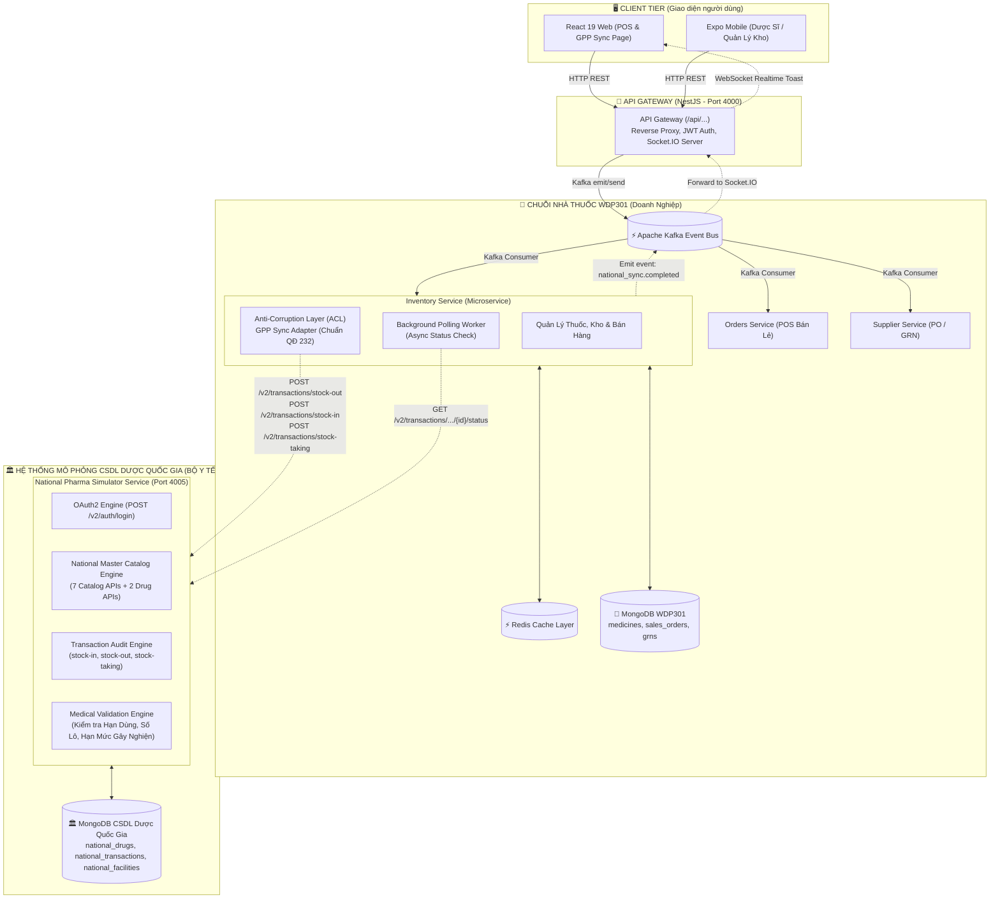

# TÀI LIỆU KỸ THUẬT & KIẾN TRÚC TÍCH HỢP HỆ THỐNG CƠ SỞ DỮ LIỆU DƯỢC QUỐC GIA VIỆT NAM

> **Chuẩn Đặc Tả API v1.1 ban hành theo Quyết định số 232/QĐ-TTYQG ngày 17/07/2026 của Giám đốc Trung tâm Thông tin Y tế Quốc gia – Bộ Y tế**
> **Dự án:** WDP301 - Hệ Thống Quản Trị Chuỗi Nhà Thuốc Doanh Nghiệp & Phân Hệ Mô Phỏng CSDL Dược Quốc Gia
> **Ngày cập nhật:** 07/10/2026
> **Trạng thái:** Sẵn sàng triển khai (Production-Ready)

---

## MỤC LỤC

1. [Căn Cứ Pháp Lý & Phạm Vi Áp Dụng](#1-căn-cứ-pháp-lý--phạm-vi-áp-dụng)
2. [Kiến Trúc Tổng Thể & Ranh Giới Hệ Thống (System Architecture)](#2-kiến-trúc-tổng-thể--ranh-giới-hệ-thống)
3. [Danh Mục 19 API Chuẩn Quyết Định 232/QĐ-TTYQG](#3-danh-mục-19-api-chuẩn-quyết-định-232qđ-ttyqg)
4. [Từ Điển Dữ Liệu & Quy Chuẩn Mã Hóa (Data Dictionaries)](#4-từ-điển-dữ-liệu--quy-chuẩn-mã-hóa)
5. [Sự Ăn Khớp Tuyệt Đối Với 3 Quy Trình Nghiệp Vụ WDP301 (BPMN)](#5-sự-ăn-khớp-tuyệt-đối-với-3-quy-trình-nghiệp-vụ-wdp301)
6. [Mô Hình Dữ Liệu & 3 Collections MongoDB Mới](#6-mô-hình-dữ-liệu--3-collections-mongodb-mới)
7. [Cấu Hình Hạ Tầng Docker Production Trên VPS](#7-cấu-hình-hạ-tầng-docker-production-trên-vps)
8. [Phân Quyền Người Dùng & Các Vai Trò (Roles & RBAC)](#8-phân-quyền-người-dùng--các-vai-trò)
9. [Lộ Trình Triển Khai Chi Tiết (Action Plan)](#9-lộ-trình-triển-khai-chi-tiết)

---

## 1. CĂN CỨ PHÁP LÝ & PHẠM VI ÁP DỤNG

### 1.1. Căn Cứ Pháp Lý

* **Luật Dược số 105/2016/QH13**, được sửa đổi bổ sung bởi **Luật số 44/2024/QH15** (Luật Dược sửa đổi 2024).
* **Nghị định số 163/2025/NĐ-CP** ngày 29/06/2025 quy định chi tiết và biện pháp thi hành Luật Dược.
* **Thông tư số 11/2025/TT-BYT** ngày 16/05/2025 sửa đổi, bổ sung Thông tư 02/2018/TT-BYT (Thực hành tốt cơ sở bán lẻ thuốc - GPP), Thông tư 03/2018/TT-BYT (Thực hành tốt phân phối thuốc - GDP), và Thông tư 36/2018/TT-BYT (Thực hành tốt bảo quản thuốc - GSP).
* **Quyết định số 232/QĐ-TTYQG** ngày 17/07/2026 của Giám đốc Trung tâm Thông tin Y tế Quốc gia – Bộ Y tế ban hành *"Tài liệu kỹ thuật đặc tả API Hệ thống cơ sở dữ liệu về dược" phiên bản 1.1* (thay thế cho QĐ 522/QĐ-TTYQG bản 1.0).

### 1.2. Tính Bắt Buộc Của Hệ Thống Đối Với Nhà Thuốc GPP

Theo quy định hiện hành, **100% cơ sở bán lẻ thuốc và chuỗi nhà thuốc bắt buộc phải có phần mềm kết nối liên thông dữ liệu với Hệ thống CSDL Dược Quốc gia**. Mọi hành vi không liên thông, báo cáo thiếu số lô hoặc bán thuốc không rõ nguồn gốc đều dẫn đến việc **bị thu hồi chứng nhận GPP và đình chỉ kinh doanh**.

### 1.3. Định Hướng Dự Án WDP301

Hệ thống WDP301 không chỉ vận hành chuỗi nhà thuốc thương mại nội bộ, mà còn **xây dựng một phân hệ độc lập mô phỏng Hệ thống Cổng CSDL Dược Quốc gia của Bộ Y tế** theo chuẩn 100% Quyết định 232. Mô hình này giúp:

1. Độc lập hoàn toàn với môi trường sandbox bên ngoài, không lo phụ thuộc tài khoản test.
2. Kiểm thử trọn vẹn luồng gửi nhận B2G (Business-to-Government) hai chiều theo thời gian thực.
3. Tạo điểm nhấn công nghệ và học thuật xuất sắc khi bảo vệ đồ án/dự án.

---

## 2. KIẾN TRÚC TỔNG THỂ & RANH GIỚI HỆ THỐNG

Hệ thống được thiết kế theo mô hình **Microservices Bounded Context** với ranh giới cô lập tuyệt đối giữa **Chuỗi Nhà Thuốc WDP301** và **Cơ Quan Quản Lý Quốc Gia (Bộ Y Tế)**:



### Các Mẫu Thiết Kế (Design Patterns) Trọng Yếu:

1. **Anti-Corruption Layer (ACL / Adapter Pattern):** `national-pharma.service.ts` đóng vai trò là tầng chuyển đổi adapter, tách biệt hoàn toàn mô hình dữ liệu nội bộ của WDP301 với chuẩn DTO của Bộ Y tế.
2. **Transactional Outbox / Resilient Event-Driven:** Nếu dịch vụ CSDL Dược bảo trì, hóa đơn bán hàng tại POS vẫn hoàn thành bình thường và được đưa vào hàng đợi Kafka để tự động đồng bộ lại (Retry with exponential backoff).
3. **Async 2-Step Protocol:** Bám sát Mục 6.2 của QĐ 232: Gửi giao dịch nhận mã `transaction_id` và trạng thái `accepted` ➡️ Polling nhận kết quả cuối cùng `completed` hoặc `rejected`.

---

## 3. DANH MỤC 19 API CHUẨN QUYẾT ĐỊNH 232/QĐ-TTYQG

Hệ thống mô phỏng cài đặt đầy đủ **19/19 API** được phân theo 4 nhóm chức năng chuẩn tại Mục 4 của Quyết định 232:

|     STT     | Nhóm Chức Năng    | Tên API Nghiệp Vụ                  | Phương Thức | URL Endpoint Chuẩn                                       |
| :----------: | :------------------- | :------------------------------------ | :------------: | :-------------------------------------------------------- |
| **1** | **Xác thực** | Đăng nhập lấy Bearer Token        |    `POST`    | `/v2/auth/login`                                        |
| **2** | **Danh mục**  | Danh mục Đơn vị tính             |    `GET`    | `/v2/master/units`                                      |
| **3** |                      | Danh mục Quốc gia sản xuất        |    `GET`    | `/v2/master/countries`                                  |
| **4** |                      | Danh mục Nhóm tác dụng dược lý |    `GET`    | `/v2/master/drug-groups`                                |
| **5** |                      | Danh mục Đường dùng thuốc       |    `GET`    | `/v2/master/routes`                                     |
| **6** |                      | Danh mục Hãng sản xuất thuốc     |    `GET`    | `/v2/master/manufacturers`                              |
| **7** |                      | Danh mục Tỉnh / Thành phố         |    `GET`    | `/v2/master/provinces`                                  |
| **8** |                      | Danh mục Xã / Phường              |    `GET`    | `/v2/master/communes` *(query: `province_id`)*      |
| **9** | **Thuốc**     | Danh sách thuốc Quốc gia           |    `GET`    | `/v2/master/drugs` *(phân trang & lọc ngày)*       |
| **10** |                      | Chi tiết một loại thuốc           |    `GET`    | `/v2/master/drugs/{drug_id}`                            |
| **11** | **Giao dịch** | **Tạo phiếu nhập hàng**     |    `POST`    | `/v2/transactions/stock-in`                             |
| **12** |                      | Xem chi tiết phiếu nhập hàng      |    `GET`    | `/v2/transaction/stock-in/{transaction_id}`             |
| **13** |                      | Xem trạng thái xử lý phiếu nhập |    `GET`    | `/v2/transaction/stock-in/{transaction_id}/status`      |
| **14** |                      | **Tạo phiếu xuất hàng**     |    `POST`    | `/v2/transactions/stock-out`                            |
| **15** |                      | Xem chi tiết phiếu xuất hàng      |    `GET`    | `/v2/transactions/stock-out/{transaction_id}`           |
| **16** |                      | Xem trạng thái xử lý phiếu xuất |    `GET`    | `/v2/transactions/stock-out/{transaction_id}/status`    |
| **17** |                      | **Tạo phiếu kiểm kho**       |    `POST`    | `/v2/transactions/stock-taking`                         |
| **18** |                      | Xem chi tiết phiếu kiểm kho        |    `GET`    | `/v2/transactions/stock-taking/{transaction_id}`        |
| **19** |                      | Xem trạng thái xử lý kiểm kho    |    `GET`    | `/v2/transactions/stock-taking/{transaction_id}/status` |

---

## 4. TỪ ĐIỂN DỮ LIỆU & QUY CHUẨN MÃ HÓA

### 4.1. Lý Do Nhập Hàng (`reason` trong `POST /transactions/stock-in` - Mục 6.4.1.1)

* `supplier`: Nhập từ nhà cung cấp (bắt buộc kèm `supplier_id`).
* `return`: Nhập trả lại từ khách hàng.
* `opening-balance`: Nhập tồn đầu kỳ.
* `other`: Nhập khác.

### 4.2. Lý Do Xuất Hàng (`reason` trong `POST /transactions/stock-out` - Mục 6.4.2.1)

* [ ] `sale-retail`: Xuất bán lẻ tại quầy POS.
* [ ] `return`: Xuất trả hàng nhà cung cấp (bắt buộc kèm `supplier_id`).
* [ ] `destroy`: Xuất huỷ thuốc hết hạn / thuốc hỏng theo quy định BYT.
* [ ] `other`: Xuất khác.

### 4.3. Phân Loại Thuốc Kê Đơn (`prescription_status` - Mục 6.4.3)

* `0`: Thuốc không kê đơn (**OTC**).
* `1`: Thuốc kê đơn (**ETC** - Bắt buộc có đơn thuốc của bác sĩ).

### 4.4. Phân Loại Thuốc Kiểm Soát Đặc Biệt (`special_control_type` - Mục 6.4.4)

* `0`: Thuốc thông thường (Không kiểm soát đặc biệt).
* `1`: Thuốc gây nghiện, chứa dược chất gây nghiện.
* `2`: Thuốc hướng thần, chứa dược chất hướng thần.
* `3`: Thuốc tiền chất, chứa tiền chất dùng làm thuốc.
* `4`: Thuốc độc.
* `5`: Thuốc thuộc danh mục cấm dùng cho các bộ, ngành.
* `6`: Thuốc phóng xạ.

### 4.5. Bảng Mã Trạng Thái Xử Lý Giao Dịch (Mục 6.2)

* `accepted`: Dữ liệu đã được hệ thống tiếp nhận vào hàng đợi xử lý.
* `processing`: Dữ liệu đang được hệ thống đối soát số lô, hạn dùng.
* `completed`: Dữ liệu đã được kiểm duyệt và ghi sổ quốc gia thành công.
* `rejected`: Bị từ chối do vi phạm quy chuẩn (bán thuốc hết hạn, sai mã GTIN...).
* `error`: Lỗi hệ thống.

---

## 5. SỰ ĂN KHỚP TUYỆT ĐỐI VỚI 3 QUY TRÌNH NGHIỆP VỤ WDP301

Ba quy trình BPMN chuẩn của WDP301 hoàn toàn không bị thay đổi logic, mà ăn khớp tự nhiên với các sự kiện kích hoạt của CSDL Dược Quốc gia:

```
┌────────────────────────────────────────────────────────────────────────────────────────┐
│ 1. QUY TRÌNH MUA HÀNG & NHẬP KHO (PROCUREMENT & GRN)                                    │
│    Bước 6: Quét mã, số lô, expDate & tạo GRN ──► Bước 7, 8: Tăng tồn kho & công nợ     │
│    👉 HOOK TỰ ĐỘNG: POST /v2/transactions/stock-in (reason: "supplier")                │
└────────────────────────────────────────────────────────────────────────────────────────┘

┌────────────────────────────────────────────────────────────────────────────────────────┐
│ 2. QUY TRÌNH KIỂM KÊ KHO DƯỢC PHẨM (INVENTORY STOCKTAKING)                             │
│    Bước 5: Tính chênh lệch (actual - system) ──► Bước 7: Quản lý duyệt COMPLETED       │
│    👉 HOOK TỰ ĐỘNG: POST /v2/transactions/stock-taking (system_quantity vs actual)    │
└────────────────────────────────────────────────────────────────────────────────────────┘

┌────────────────────────────────────────────────────────────────────────────────────────┐
│ 3. QUY TRÌNH XỬ LÝ THUỐC CẬN HẠN & HẾT HẠN SỬ DỤNG                                     │
│    ├─► Nhánh 60-90d (Xả hàng): Dược sĩ bán POS (Bước 6a)                               │
│    │   👉 HOOK TỰ ĐỘNG: POST /v2/transactions/stock-out (reason: "sale-retail")         │
│    ├─► Nhánh 30-60d (Đổi trả NCC): Đóng phiếu trả hàng (Bước 7b)                       │
│    │   👉 HOOK TỰ ĐỘNG: POST /v2/transactions/stock-out (reason: "return")             │
│    └─► Nhánh <15d (Hủy thuốc): Bàn giao xử lý rác y tế (Bước 7c)                       │
│        👉 HOOK TỰ ĐỘNG: POST /v2/transactions/stock-out (reason: "destroy")            │
└────────────────────────────────────────────────────────────────────────────────────────┘
```

---

## 6. MÔ HÌNH DỮ LIỆU & 3 COLLECTIONS MONGODB MỚI

Các collections này được lưu trữ trực tiếp trên cụm **MongoDB Atlas** hiện tại (`MONGODB_URI`) để đồng bộ hoàn toàn giữa Local và VPS Production:

### 6.1. Collection `national_drugs` (Danh Mục Thuốc Quốc Gia)

```json
{
  "_id": "67a3f81e92d04a1122334455",
  "id": "DRUG-0001",
  "name": "Panadol Extra với Actizorb",
  "drug_group_id": "GRP-01",
  "registration_number": "VN-22012-19",
  "old_registration_number": "VN-15421-12",
  "active_pharmaceutical_ingredient": "Paracetamol 500mg, Caffeine 65mg",
  "strength": "500mg/65mg",
  "routes": [{ "id": "R-01", "name": "Đường uống" }],
  "prescription_status": 0,
  "special_control_type": 0,
  "packagings": [
    { "unit_id": "U-01", "unit_name": "Hộp", "gtin": "8935001800012" },
    { "unit_id": "U-02", "unit_name": "Vỉ", "gtin": "8935001800029" },
    { "unit_id": "U-03", "unit_name": "Viên", "gtin": "8935001800036" }
  ],
  "last_update_time": "2026-07-20",
  "manufacturer": {
    "id": "M-GSK",
    "name": "GlaxoSmithKline Consumer Healthcare Pte Ltd",
    "country": "Vương Quốc Anh",
    "address": "980 Great West Road, Brentford, Middlesex, TW8 9GS, United Kingdom"
  },
  "approval_date": "2019-06-15",
  "expiry_date": "2029-06-15"
}
```

### 6.2. Collection `national_transactions` (Sổ Cái Giao Dịch Liên Thông)

```json
{
  "_id": "67a3f81e92d04a1122334466",
  "transaction_id": "TXN-OUT-20261007-882194",
  "transaction_type": "STOCK_OUT",
  "transaction_date": "2026-10-07T14:30:00",
  "facility_code": "79-001234",
  "practice_license_code": "GPP-HCM-2024-00192",
  "reason": "sale-retail",
  "reference_number": "HD-POS-20261007-0091",
  "status": "completed",
  "items": [
    {
      "drug_id": "DRUG-0001",
      "unit_id": "U-01",
      "quantity": 2,
      "batch_no": "LOT-2026-01",
      "packaging_specifications": "Hộp 15 vỉ x 12 viên",
      "expiry_date": "2028-12-31",
      "gtin": "8935001800012",
      "price": 45000.00
    }
  ],
  "validation_result": {
    "is_valid": true,
    "checked_at": "2026-10-07T14:30:02"
  },
  "created_at": "2026-10-07T14:30:00.120Z"
}
```

### 6.3. Collection `national_facilities` (Cơ Sở Nhà Thuốc Cấp Phép)

```json
{
  "_id": "67a3f81e92d04a1122334477",
  "facility_code": "79-001234",
  "branch_id": "BR-001",
  "name": "Nhà thuốc WDP301 - Chi nhánh Quận 1",
  "tax_code": "0312345678",
  "practice_license_code": "GPP-HCM-2024-00192",
  "address": "Số 123 Nguyễn Huệ, Phường Bến Nghé, Quận 1, TP. Hồ Chí Minh",
  "pharmacist_in_charge": "Dược sĩ Trần Hồng Phước",
  "status": "ACTIVE"
}
```

---

## 7. CẤU HÌNH HẠ TẦNG DOCKER PRODUCTION TRÊN VPS

Bổ sung service `national-pharma-simulator` vào tệp [`docker-compose.prod.yml`](file:///Users/tranhongphuoc/WDP301/docker-compose.prod.yml):

```yaml
  # ──────────────────────────────────────────────────────────
  # 8. National Pharmacy Database Simulator (Bộ Y Tế - QĐ 232)
  # ──────────────────────────────────────────────────────────
  national-pharma-simulator:
    <<: *backend-common
    container_name: wdp301-csdlduoc-simulator
    command: npx ts-node --transpile-only mock-csdlduoc/server.ts
    ports:
      - "4005:4005"
    environment:
      <<: *backend-env
      PORT: 4005
      CSDLDUOC_MOCK_PORT: 4005
    healthcheck:
      test: ["CMD-SHELL", "wget -qO- http://localhost:4005/v2/health > /dev/null 2>&1 || exit 1"]
      interval: 20s
      timeout: 5s
      retries: 3
      start_period: 15s
    deploy:
      resources:
        limits:
          memory: 256m
    networks:
      wdp301-network:
        aliases:
          - csdlduoc-simulator
```

Và cấu hình biến môi trường kết nối trong `inventory-service`:

```yaml
  inventory-service:
    <<: *backend-common
    container_name: wdp301-inventory
    command: node dist/apps/inventory-service/main.js
    environment:
      <<: *backend-env
      CSDLDUOC_BASE_URL: http://national-pharma-simulator:4005/v2
    depends_on:
      kafka:
        condition: service_healthy
      redis:
        condition: service_healthy
      national-pharma-simulator:
        condition: service_started
```

---

## 8. PHÂN QUYỀN NGƯỜI DÙNG & CÁC VAI TRÒ (ROLES & RBAC)

Hệ thống kết hợp giữa các Role nội bộ của WDP301 và Role Thanh tra cấp Nhà nước:

```
┌────────────────────────────────────────────────────────────────────────────────────────┐
│                                HỆ THỐNG PHÂN QUYỀN RBAC                                │
│                                                                                        │
│  [PHÍA NHÀ THUỐC WDP301]                               [PHÍA BỘ Y TẾ MÔ PHỎNG]          │
│  - PHARMACIST (Dược sĩ): Ký duyệt bán lẻ stock-out     - MOH_INSPECTOR (Thanh tra BYT): │
│  - WAREHOUSE (Thủ kho): Ký duyệt stock-in, stock-taking   Xem sổ cái quốc gia toàn bộ,  │
│  - ADMIN / DIRECTOR: Cấu hình mã cơ sở & giấy phép GPP    phát hiện thuốc cận hạn/lậu   │
└────────────────────────────────────────────────────────────────────────────────────────┘
```

---

## 9. LỘ TRÌNH TRIỂN KHAI CHI TIẾT (ACTION PLAN)

| Giai Đoạn | Công Việc Cụ Thể                                                         | Tệp Tin Tác Động                                          | Trạng Thái |
| :----------: | :--------------------------------------------------------------------------- | :------------------------------------------------------------ | :-----------: |
| **P1** | Hoàn thiện đủ 19 API trong Mock Server (thêm 9 API Giao dịch Mục 5.4) | `backend/mock-csdlduoc/routes/master.routes.ts`             | 🔄 Sẵn sàng |
| **P2** | Tạo 3 Collections MongoDB & Viết Script Init Data tự động               | `backend/mock-csdlduoc/init-db.ts`                          | 🔄 Sẵn sàng |
| **P3** | Bổ sung các trường pháp lý vào`MedicineSchema`                      | `inventory-service/src/medicine/schemas/medicine.schema.ts` | 🔄 Sẵn sàng |
| **P4** | Refactor Adapter`national-pharma.service.ts` sang chuẩn QĐ 232           | `inventory-service/src/sales/national-pharma.service.ts`    | 🔄 Sẵn sàng |
| **P5** | Nâng cấp UI Dược Sĩ`GppSyncPage.tsx` xem đủ 3 loại phiếu          | `frontend/src/pages/pharmacist/components/GPPView.tsx`      | 🔄 Sẵn sàng |
| **P6** | Cập nhật cấu hình Docker Compose Production cho VPS                      | `docker-compose.prod.yml`                                   | 🔄 Sẵn sàng |

---

*Tài liệu này được bảo quản tại `docs/CSDLQuocGia.md` và đóng vai trò là kim chỉ nam kỹ thuật cho toàn bộ nhóm phát triển WDP301.*
