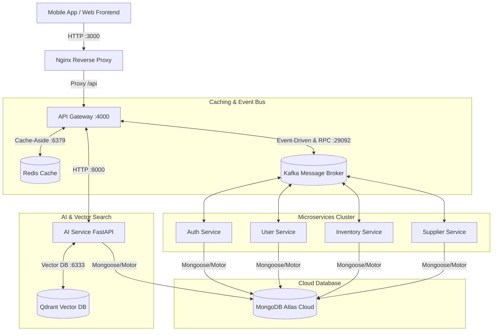

# Sổ Tay Tra Cứu & Đọc Cấu Hình Hệ Thống Microservices WDP301

> **Tài liệu hướng dẫn kiểm tra hạ tầng, debug cấu hình Kafka, Redis, Microservices & Database**  
> *Dành cho việc kiểm tra vận hành hệ thống thực tế và ôn luyện phỏng vấn kỹ thuật.*

---

## 1. Sơ Đồ Kiến Trúc Hạ Tầng Của Dự Án WDP301



---

## 2. Các Lệnh Đọc Cấu Hình & Trạng Thái Container

### 2.1 Kiểm tra danh sách và trạng thái sức khỏe (Healthcheck)
```bash
# Xem danh sách container, trạng thái Up/Exit, các port đang bind ra ngoài
docker compose ps

# Xem chi tiết cấu hình JSON của một container (Mount volumes, IP nội bộ, DNS)
docker inspect wdp301-gateway | grep -A 20 "NetworkSettings"

# Kiểm tra mức tiêu hao RAM và CPU thực tế của từng service
docker stats --no-stream --format "table {{.Name}}\t{{.CPUPerc}}\t{{.MemUsage}}\t{{.MemPerc}}"
```

### 2.2 Đọc biến môi trường thực tế đang nạp vào Container
Đôi khi biến trong file `.env` đã sửa nhưng container chưa được khởi động lại nên vẫn chạy biến cũ. Dùng lệnh này để kiểm tra chính xác giá trị thực tế đang chạy:

```bash
# Kiểm tra toàn bộ biến môi trường của Backend
docker exec -it wdp301-gateway env

# Lọc nhanh các biến cấu hình Database, Kafka, Redis
docker exec -it wdp301-gateway env | grep -E "MONGO|KAFKA|REDIS|PORT"
```

---

## 3. Các Lệnh Đọc & Kiểm Tra Cấu Hình Kafka

Kafka là trái tim giao tiếp (Event-Driven Backbone) của toàn bộ hệ sinh thái Microservices.

### 3.1 Liệt kê toàn bộ các Topic đang có trong Kafka
```bash
docker exec -it wdp301-kafka kafka-topics \
  --bootstrap-server localhost:9092 \
  --list
```

### 3.2 Đọc thông tin chi tiết (Partitions, Replicas) của một Topic
```bash
# Thay 'product.event.create' bằng topic bạn muốn kiểm tra
docker exec -it wdp301-kafka kafka-topics \
  --bootstrap-server localhost:9092 \
  --describe --topic product.event.create
```

### 3.3 Đọc dữ liệu (Message) trong Topic theo thời gian thực (Consumer Console)
Lệnh này giúp bạn xem ngay lập tức các tin nhắn JSON mà API Gateway hoặc Microservice bắn ra:

```bash
# Đọc từ đầu đến cuối (From beginning)
docker exec -it wdp301-kafka kafka-console-consumer \
  --bootstrap-server localhost:9092 \
  --topic product.event.create \
  --from-beginning

# Xem tin nhắn dạng Key-Value có in cả Timestamp
docker exec -it wdp301-kafka kafka-console-consumer \
  --bootstrap-server localhost:9092 \
  --topic product.event.create \
  --property print.timestamp=true \
  --property print.key=true
```

### 3.4 Kiểm tra Consumer Group và độ trễ xử lý (Consumer Lag)
> [!IMPORTANT]
> Đây là câu hỏi phỏng vấn cực kỳ phổ biến: *"Làm sao biết Microservice có xử lý kịp tin nhắn của Kafka không?"*

```bash
# Liệt kê tất cả consumer groups (các microservices đang lắng nghe)
docker exec -it wdp301-kafka kafka-consumer-groups \
  --bootstrap-server localhost:9092 \
  --list

# Xem chi tiết LAG (Số lượng tin nhắn còn tồn đọng chưa kịp xử lý)
docker exec -it wdp301-kafka kafka-consumer-groups \
  --bootstrap-server localhost:9092 \
  --describe --group wdp301-consumer-group
```
*(Nếu cột `LAG` tăng dần và không giảm về 0, nghĩa là microservice đang bị quá tải hoặc bị treo).*

---

## 4. Các Lệnh Đọc & Kiểm Tra Cấu Hình Redis Cache

Redis đóng vai trò là tầng đệm hiệu năng cao (**Cache-Aside Pattern**) giúp giảm tải truy vấn MongoDB.

### 4.1 Kiểm tra kết nối Redis & Thông số bộ nhớ
```bash
# Kiểm tra xem Redis còn sống không (kết quả trả về PONG là tốt)
docker exec -it wdp301-redis redis-cli ping

# Xem lượng RAM Redis đang sử dụng thực tế và số lượng keys
docker exec -it wdp301-redis redis-cli info memory
docker exec -it wdp301-redis redis-cli dbsize
```

### 4.2 Tra cứu dữ liệu Key-Value trong Redis
```bash
# Liệt kê các key đang được cache (ví dụ sản phẩm, token, user)
docker exec -it wdp301-redis redis-cli keys "*"

# Xem thời gian sống còn lại (TTL - Time To Live) của 1 key (tính bằng giây)
docker exec -it wdp301-redis redis-cli ttl "product:66f123abc456"

# Đọc nội dung JSON được lưu trong Cache Key
docker exec -it wdp301-redis redis-cli get "product:66f123abc456"

# Xóa thủ công 1 key để ép ứng dụng query lại Database (Evict Cache)
docker exec -it wdp301-redis redis-cli del "product:66f123abc456"

# Xóa toàn bộ cache trên Redis
docker exec -it wdp301-redis redis-cli flushall
```

### 4.3 Giám sát mọi lệnh Cache đọc/ghi thời gian thực (Live Monitor)
```bash
# Mở chế độ theo dõi trực tiếp mọi thao tác GET, SET, DEL từ Backend
docker exec -it wdp301-redis redis-cli monitor
```

---

## 5. Các Lệnh Kiểm Tra Qdrant Vector Database (AI Engine)

Qdrant lưu trữ vector embeddings phục vụ tính năng tìm kiếm thuốc thông minh, tư vấn triệu chứng và hỏi đáp RAG.

```bash
# 1. Kiểm tra trạng thái hoạt động của Qdrant
curl -s http://localhost:6333/healthz

# 2. Liệt kê danh sách các Collections vector hiện có
curl -s http://localhost:6333/collections | jq

# 3. Đọc thông tin chi tiết một Collection (Số lượng vector đã index)
curl -s http://localhost:6333/collections/medicine_embeddings | jq
```

---

## 6. Kiểm Tra Kết Nối Mạng Nội Bộ (Docker Network Discovery)

Trong Docker, các container tìm thấy nhau thông qua tên service chứ không dùng IP tĩnh. Dưới đây là cách kiểm tra thông mạch giữa các container:

```bash
# Kiểm tra API Gateway có phân giải được tên miền nội bộ của Kafka và Redis không
docker exec -it wdp301-gateway ping -c 2 kafka
docker exec -it wdp301-gateway ping -c 2 redis

# Kiểm tra Gateway có kết nối được đến cổng Redis (6379) không
docker exec -it wdp301-gateway nc -zv redis 6379

# Kiểm tra từ bên trong container có gọi ra được cụm MongoDB Atlas bên ngoài không
docker exec -it wdp301-gateway nc -zv cluster0.mongodb.net 27017
```

---

## 7. Góc Ôn Luyện Phỏng Vấn: Microservices Architecture & Observability

| Khái niệm phỏng vấn | Bản chất kỹ thuật & Cách trả lời xuất sắc |
| :--- | :--- |
| **Kafka Consumer Lag là gì? Nếu Lag liên tục tăng cao trong hệ thống WDP301, bạn xử lý như thế nào?** | **Consumer Lag** là khoảng cách giữa offset của tin nhắn mới nhất được ghi vào Kafka (Log End Offset) và offset của tin nhắn mà Consumer vừa xử lý xong (Current Offset). Lag tăng cao chứng tỏ tốc độ tiêu thụ chậm hơn tốc độ sản sinh tin nhắn.<br>**Cách xử lý:**<br>1. **Tăng Partition & Scale Consumer:** Tăng số lượng partition của Topic và nâng số lượng instance của Microservice tương ứng (mỗi consumer xử lý 1 partition).<br>2. **Tối ưu Batch Processing:** Cấu hình consumer đọc theo mảng (batch) thay vì từng message đơn lẻ.<br>3. **Kiểm tra nghẽn Database:** Xem Microservice có bị chậm do query MongoDB thiếu Index hay không. |
| **Giải thích cơ chế Cache-Aside và Cache Eviction được áp dụng trong dự án WDP301?** | * **Cache-Aside (Lazy Loading):** Khi người dùng đọc chi tiết sản phẩm (`GET /products/:id`), API Gateway kiểm tra Redis trước. Nếu có (*Cache Hit*), trả về ngay trong 1-2ms. Nếu không (*Cache Miss*), Gateway gửi message qua Kafka yêu cầu Product Service truy vấn MongoDB, sau đó lưu kết quả vào Redis với TTL (1 giờ) rồi mới trả về cho Client.<br>* **Cache Eviction:** Khi có sự kiện Cập nhật (`PUT`) hoặc Xóa (`DELETE`), API Gateway chủ động xóa key `product:${id}` khỏi Redis (`cacheManager.del`) ngay lập tức để tránh trả về dữ liệu lỗi thời (*Stale Data*). |
| **Sự khác biệt giữa Request-Response (`send()`) và Event-Driven (`emit()`) qua Kafka trong NestJS?** | * **`emit()` (EventPattern):** Gửi sự kiện một chiều bất đồng bộ (Fire-and-Forget). Gateway bắn xong là trả về HTTP 202 Accepted ngay lập tức, không chặn luồng (Non-blocking). Dùng cho các tác vụ ghi (Create, Update, Delete).<br>* **`send()` (MessagePattern):** Mô phỏng RPC hai chiều. Gateway gửi kèm `correlationId` và đợi Microservice xử lý xong trả kết quả về qua một Reply Topic tạm. Dùng cho các tác vụ đọc (Read One, Read All) cần lấy dữ liệu trả về cho client. |
