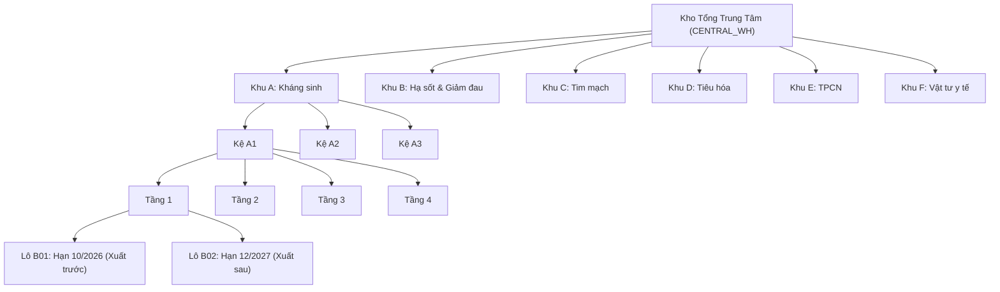
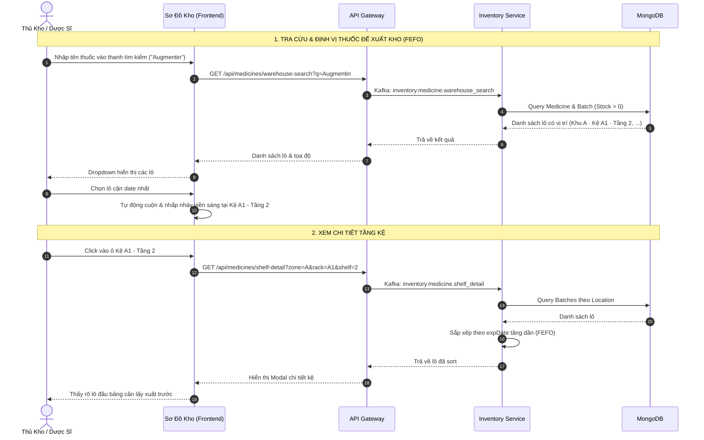

# TÀI LIỆU THIẾT KẾ LOGIC & CHỨC NĂNG SƠ ĐỒ KHO DƯỢC PHẨM (GSP PHARMACY WAREHOUSE MAP)

> **Dự án:** Hệ thống Quản trị Chuỗi Nhà thuốc & Dược phẩm Toàn diện (Pharma ERP)  
> **Phân hệ:** Quản lý Kho Tổng & Kho Chi nhánh (`inventory-service` + `frontend/warehouse`)  
> **Tiêu chuẩn áp dụng:** GSP (Good Storage Practice - Thực hành tốt bảo quản thuốc), Nguyên tắc FEFO (First Expired, First Out)  
> **Cập nhật lần cuối:** Tháng 09/2026  

---

## I. TỔNG QUAN HỆ THỐNG SƠ ĐỒ KHO (EXECUTIVE OVERVIEW)

Sơ đồ kho là công cụ trực quan hóa không gian lưu trữ vật lý của Kho Tổng Dược phẩm (Central Warehouse), giúp Thủ kho, Dược sĩ và Quản lý:
1. **Định vị chính xác:** Biết tức thì từng loại thuốc và từng lô thuốc cụ thể đang nằm ở Khu (Zone) nào, Kệ (Rack) nào và Tầng (Shelf) nào.
2. **Tuân thủ chuẩn GSP:** Phân chia các nhóm thuốc theo đặc tính dược lý và điều kiện bảo quản riêng biệt, chống nhiễm chéo và nhầm lẫn thuốc.
3. **Thực thi nguyên tắc FEFO:** Tự động ưu tiên xuất các lô thuốc có hạn sử dụng gần nhất trước, giảm thiểu tối đa tỷ lệ hủy thuốc do hết hạn.
4. **Cảnh báo sớm trực quan:** Phát hiện ngay các điểm nóng (tầng kệ có thuốc hết hạn, cận hạn hoặc sắp hết hàng) thông qua hệ thống mã màu cảnh báo thời gian thực.



---

## II. CẤU TRÚC PHÂN CẤP KHÔNG GIAN LƯU TRỮ (STORAGE HIERARCHY)

Không gian kho được chuẩn hóa thành 4 cấp độ quản lý từ vĩ mô đến vi mô:

| Cấp độ | Tên gọi | Định danh | Ý nghĩa nghiệp vụ |
| :--- | :--- | :--- | :--- |
| **Cấp 1** | **Khu vực (Zone)** | `zone: "A" .. "F"` | Đại diện cho các phân khu cách ly theo nhóm thuốc chuẩn GSP. |
| **Cấp 2** | **Dãy Kệ (Rack)** | `rack: "A1", "A2"...` | Dãy kệ chứa hàng vật lý trong từng khu. Mỗi dãy có định danh theo tiền tố của Khu. |
| **Cấp 3** | **Tầng Kệ (Shelf)** | `shelf: 1 .. 4` | Tầng chứa hàng của kệ (chuẩn hóa 4 tầng/kệ). Đây là đơn vị lưu trữ cơ sở được click xem trên bản đồ. |
| **Cấp 4** | **Lô Thuốc (Batch)** | `batchId` | Thực thể hàng hóa thực tế được đặt tại tầng kệ. Một tầng kệ có thể chứa nhiều lô của cùng một thuốc hoặc nhiều thuốc khác nhau. |

### Chi tiết phân vùng theo Danh mục GSP (`categoryZoneMap`):

```typescript
const categoryZoneMap: Record<string, string> = {
  'Kháng sinh': 'A',
  'Hạ sốt & Giảm đau': 'B',
  'Tim mạch': 'C',
  'Tiêu hóa': 'D',
  'Thực phẩm chức năng': 'E',
  'Vật tư y tế': 'F'
};
```

---

## III. LOGIC QUẢN LÝ "1 THUỐC CÓ NHIỀU LÔ HÀNG" (MULTI-BATCH LOGIC)

Trong ngành Dược, một mặt hàng thuốc (Medicine) thường được nhập qua nhiều đợt khác nhau, sinh ra **nhiều số lô (`batchNo`) với các hạn dùng (`expDate`) và số lượng tồn (`stock`) khác nhau**. 

Hệ thống xử lý bài toán này như sau:

### 1. Phân bổ vị trí lưu trữ (Storage Allocation)
* **Quy tắc cùng nhóm:** Toàn bộ các lô của cùng một loại thuốc bắt buộc phải thuộc về **cùng một Khu (Zone)** quy định cho nhóm dược lý đó.
* **Quy tắc rải tầng & kệ:**
  * Nếu một tầng kệ còn dung tích trống, các lô mới có thể được xếp chung vào cùng một tầng với lô cũ để tiện gom hàng.
  * Nếu tầng kệ đã đầy hoặc cần tách biệt theo ngày sản xuất, các lô mới sẽ được xếp vào **tầng tiếp theo (Shelf 1 -> 4)** hoặc **dãy kệ liền kề (A1 -> A2 -> A3)** trong cùng Zone.
* **Đồng bộ vị trí tự động (`syncLocations`):**
  * Với các lô thuốc mới nhập chưa được chỉ định vị trí, thuật toán sẽ tự động xác định Zone theo danh mục thuốc và rải đều tuần tự vào các Kệ và Tầng có sẵn:
    $$\text{Shelf} = (\text{Counter} \pmod 4) + 1$$
    Khi một kệ vượt quá 4 tầng, hệ thống tự động chuyển sang Kệ tiếp theo.

### 2. Nguyên tắc hiển thị & Sắp xếp FEFO (First Expired, First Out)
Khi người dùng mở bảng chi tiết của một tầng kệ (**ShelfDetailModal**), danh sách các lô hàng không hiển thị ngẫu nhiên mà được sắp xếp nghiêm ngặt theo thuật toán:

$$\text{Sort Order} = \text{Date}(\text{expDate}_A) - \text{Date}(\text{expDate}_B)$$

```typescript
batches.sort((a, b) => new Date(a.expDate).getTime() - new Date(b.expDate).getTime());
```

* **Lô có hạn dùng gần nhất (cận date nhất):** Luôn đứng ở vị trí **đầu tiên** trên bảng.
* **Số ngày còn hạn (`daysUntilExpiry`):** Được tính toán động:
  $$\text{daysUntilExpiry} = \left\lceil \frac{\text{expDate} - \text{Today}}{1000 \times 60 \times 60 \times 24} \right\rceil$$
* **Ý nghĩa thực tế:** Khi Thủ kho đi nhặt hàng (picking) để xuất bán hoặc điều chuyển sang chi nhánh, bảng chi tiết chỉ rõ lô trên cùng để lấy ngay, đảm bảo 100% tuân thủ FEFO.

---

## IV. QUY TẮC MÃ MÀU & TRẠNG THÁI CẢNH BÁO (COLOR CODING & THRESHOLDS)

Hệ thống sử dụng cơ chế **"Cảnh báo theo rủi ro cao nhất" (Worst-Case Status Aggregation)** để hiển thị màu sắc trên bản đồ tổng quan:

### 1. Phân định trạng thái từng Lô (`Batch Status`)
| Trạng thái | Ngưỡng điều kiện (Threshold) | Mã màu UI | Ý nghĩa nghiệp vụ |
| :--- | :--- | :--- | :--- |
| **`EXPIRED`** | $\text{expDate} < \text{Hôm nay}$ | 🔴 Đỏ | Lô thuốc đã hết hạn, bắt buộc khóa xuất và chuyển vào khu cách ly hủy. |
| **`NEAR_EXPIRY`** | $\text{Hôm nay} \le \text{expDate} \le \text{Hôm nay} + 90\text{ ngày}$ | 🟠 Cam | Thuốc cận date (dưới 3 tháng), cần ưu tiên xuất kho hoặc áp dụng khuyến mãi đẩy hàng. |
| **`LOW_STOCK`** | $\text{Stock} < 20\text{ đơn vị}$ | 🟡 Vàng | Số lượng tồn kho của lô xuống mức thấp, cần chuẩn bị nhập thêm. |
| **`OUT_OF_STOCK`** | $\text{Stock} = 0$ | ⚫ Xám đậm | Lô thuốc đã xuất hết. |
| **`NORMAL / ACTIVE`** | Còn hạn $> 90\text{ ngày}$ & $\text{Stock} \ge 20$ | 🟢 Xanh lá | Lô thuốc an toàn, chất lượng đảm bảo. |

### 2. Quy tắc gộp màu cho Ô Tầng Kệ trên Sơ đồ 2D (`Shelf Status Aggregation`)
Một ô tầng kệ (ví dụ: Kệ A1 - Tầng 2) có thể chứa nhiều lô. Trạng thái của cả ô tầng được quyết định bởi **lô có nguy cơ cao nhất**:
1. Nếu $\exists \text{ lô } \in \text{Shelf}$ có trạng thái **`EXPIRED`** $\rightarrow$ Ô kệ đổi sang **Màu Đỏ**.
2. Nếu không có lô hết hạn, nhưng $\exists \text{ lô}$ có trạng thái **`NEAR_EXPIRY`** $\rightarrow$ Ô kệ đổi sang **Màu Cam**.
3. Nếu tổng tồn của cả tầng $\sum \text{Stock} < 50$ $\rightarrow$ Ô kệ đổi sang **Màu Vàng (`LOW_STOCK`)**.
4. Nếu tổng tồn của tầng $= 0$ $\rightarrow$ Ô kệ đổi sang **Màu Xám (`EMPTY`)**.
5. Trường hợp còn lại $\rightarrow$ Ô kệ hiển thị **Màu Xanh Lá An Toàn (`NORMAL`)**.

---

## V. CÁC TÍNH NĂNG CHÍNH TRÊN GIAO DIỆN SƠ ĐỒ KHO (FRONTEND FEATURES)

```
+---------------------------------------------------------------------------------------+
|  [Boxes Icon] Sơ Đồ Kho Tổng — Phòng Khám (6 Khu · 150 Lô)   [25,400 Tồn] [12 Cảnh báo] |
|  [🔍 Tìm kiếm tên thuốc, mã SKU, vị trí kệ...                                       ] |
+---------------------------------------------------------------------------------------+
| +-------------------------+ +-------------------------+ +---------------------------+ |
| | KHU A - KHÁNG SINH      | | KHU B - HẠ SỐT & GIẢM ĐAU| | KHU C - TIM MẠCH          | |
| | +---------------------+ | | +---------------------+ | | +-----------------------+ | |
| | | KỆ A1               | | | | KỆ B1               | | | | KỆ C1                 | | |
| | | [Tầng 4: 2 lô|1200] | | | | [Tầng 4: 1 lô| 500] | | | | [Tầng 4: 3 lô|1800]   | | |
| | | [Tầng 3: 1 lô| 450] | | | | [Tầng 3: 4 lô| 900] | | | | [Tầng 3: 2 lô| 700]   | | |
| | | [Tầng 2: 3 lô| 800] | | | | [Tầng 2: 2 lô| 300] | | | | [Tầng 2: 1 lô| 250]   | | |
| | | [Tầng 1: 5 lô|2100] | | | | [Tầng 1: 3 lô|1500] | | | | [Tầng 1: 4 lô|3200]   | | |
| | +---------------------+ | | +---------------------+ | | +-----------------------+ | |
| +-------------------------+ +-------------------------+ +---------------------------+ |
+---------------------------------------------------------------------------------------+
```

### 1. Bản đồ tổng thể trực quan (WarehouseMap2D)
* Hiển thị lưới phân khu GSP rõ ràng với nền sáng hiện đại.
* Mỗi dãy kệ hiển thị dạng khối tủ đứng, chia thành các ô nút bấm đại diện cho từng tầng kệ từ 1 đến 4.
* Trên từng ô tầng kệ thể hiện ngay:
  * Số thứ tự tầng: `T1`, `T2`, `T3`, `T4`.
  * Huy hiệu tổng số lô: `X lô`.
  * Tổng tồn kho gộp: `Y tồn`.
  * Màu nền thể hiện mức độ an toàn hoặc cảnh báo.

### 2. Tìm kiếm & Định vị thông minh (WarehouseSearchBar & Pulse Highlight)
* Hỗ trợ tìm kiếm theo: **Tên thuốc** hoặc **Mã SKU**.
* Cơ chế Debounce 300ms giúp giảm tải truy vấn server.
* Khi tìm thấy, danh sách dropdown hiển thị danh sách tất cả các lô khả dụng cùng vị trí cụ thể (Ví dụ: `Panadol Extra - Lô P2401 -> Khu B · Kệ B1 · Tầng 2`).
* Khi người dùng nhấp chọn một kết quả:
  * Bản đồ tự động kích hoạt hiệu ứng **Highlight Pulse** (vòng sáng xanh dương nhấp nháy liên tục quanh ô tầng kệ đó).
  * Giúp thủ kho định vị ngay lập tức vị trí cần tìm trong khoang hàng rộng lớn.

### 3. Hộp thoại chi tiết tầng kệ (ShelfDetailModal)
* Kích hoạt khi click vào bất kỳ ô tầng kệ nào.
* Hiển thị danh mục chi tiết dạng bảng:
  * Tên thuốc & danh mục.
  * Mã số lô (`batchNo`).
  * Số lượng tồn kho và đơn vị tính (Hộp, Vỉ, Lọ).
  * Hạn dùng định dạng `YYYY-MM-DD` kèm số ngày còn lại.
  * Huy hiệu trạng thái động (Hết hạn / Cận date / An toàn).
  * Đơn giá thuốc.
* Thống kê tóm tắt đầu modal: Tổng số lô, tổng tồn kho và số lượng lô cần chú ý.

### 4. Thanh chỉ số thống kê thời gian thực (Header Quick Stats)
* **Tổng tồn kho:** Đếm tổng số lượng dược phẩm đang lưu kho trung tâm.
* **Tổng số lô hàng:** Đếm số lượng lô đang hoạt động (`ACTIVE`).
* **Tổng số cảnh báo:** Tổng hợp tất cả các tầng kệ đang gặp tình trạng cận hạn, hết hạn hoặc tồn kho thấp.

---

## VI. KIẾN TRÚC BACKEND & KAFKA PROTOCOLS

Tuân thủ kiến trúc Microservices chuẩn hóa: Client $\rightarrow$ API Gateway (HTTP + Redis Cache) $\rightarrow$ Kafka $\rightarrow$ Inventory Service $\rightarrow$ MongoDB.

### 1. Bảng danh mục Kafka Topics
| Tác vụ | Giao thức | Kafka Topic | Payload đầu vào | Kết quả trả về |
| :--- | :---: | :--- | :--- | :--- |
| **Lấy Sơ đồ tổng quan** | Request-Response (`send`) | `inventory.medicine.warehouse_map` | `{}` | Mảng cây cấu trúc `zones -> racks -> shelves` kèm trạng thái |
| **Lấy Chi tiết tầng kệ** | Request-Response (`send`) | `inventory.medicine.shelf_detail` | `{ zone, rack, shelf }` | Danh sách các lô thuốc đã sort FEFO |
| **Tìm kiếm vị trí thuốc** | Request-Response (`send`) | `inventory.medicine.warehouse_search` | `{ q: string }` | Danh sách thuốc + lô + tọa độ `targetId` |
| **Đồng bộ vị trí tự động**| Request-Response (`send`) | `inventory.medicine.sync_locations` | `{}` | Số lượng lô đã được gán tọa độ |

### 2. Pipeline MongoDB Aggregation tạo Sơ đồ kho (`getWarehouseMap`)
Backend sử dụng MongoDB Aggregation Pipeline 3 chặng để gom nhóm dữ liệu hàng chục nghìn lô thuốc thành cấu trúc cây chỉ trong vài mili-giây:

```javascript
[
  // Chặng 1: Lọc kho trung tâm và lô đang hoạt động
  { $match: { branchId: 'CENTRAL_WH', status: 'ACTIVE' } },

  // Chặng 2: Gom nhóm theo Tầng Kệ (Zone + Rack + Shelf)
  {
    $group: {
      _id: {
        zone: { $ifNull: ['$location.zone', 'A'] },
        rack: { $ifNull: ['$location.rack', 'A1'] },
        shelf: { $ifNull: ['$location.shelf', 1] }
      },
      totalStock: { $sum: '$stock' },
      batchCount: { $sum: 1 },
      minExpDate: { $min: '$expDate' }
    }
  },

  // Chặng 3: Gom nhóm các Tầng vào Kệ (Rack)
  {
    $group: {
      _id: { zone: '$_id.zone', rack: '$_id.rack' },
      shelves: {
        $push: {
          shelf: '$_id.shelf',
          totalStock: '$totalStock',
          batchCount: '$batchCount',
          minExpDate: '$minExpDate'
        }
      }
    }
  },

  // Chặng 4: Gom nhóm các Kệ vào Phân Khu (Zone)
  {
    $group: {
      _id: '$_id.zone',
      racks: { $push: { rack: '$_id.rack', shelves: '$shelves' } }
    }
  },

  // Chặng 5: Định dạng đầu ra và sắp xếp theo Zone
  { $project: { _id: 0, zone: '$_id', racks: 1 } },
  { $sort: { zone: 1 } }
]
```

---

## VII. QUY TRÌNH VẬN HÀNH THỰC TẾ TRONG KHO (OPERATIONAL WORKFLOWS)



---

## VIII. TỔNG KẾT & GIÁ TRỊ MANG LẠI

1. **Chuẩn hóa GSP:** Đảm bảo toàn bộ danh mục thuốc được quy hoạch theo từng phân khu độc lập, ngăn ngừa rủi ro nhầm lẫn thuốc có tên đọc giống nhau (Sound-alike, Look-alike - LASA).
2. **Triệt tiêu thất thoát:** Nhờ thuật toán FEFO tự động sắp xếp trên từng tầng kệ, doanh nghiệp giảm thiểu tối đa tình trạng thuốc bị quên trong góc kệ dẫn đến hết hạn.
3. **Tối ưu năng suất:** Thời gian tìm kiếm và nhặt thuốc của thủ kho giảm từ vài phút xuống còn vài giây nhờ tính năng định vị phát sáng trên sơ đồ.
4. **Hiệu năng cao:** Sử dụng cơ chế nén cây Aggregation Pipeline và bộ nhớ đệm Redis Cache tại API Gateway, sơ đồ tải mượt mà ngay cả khi kho chứa hàng trăm nghìn đơn vị sản phẩm.
