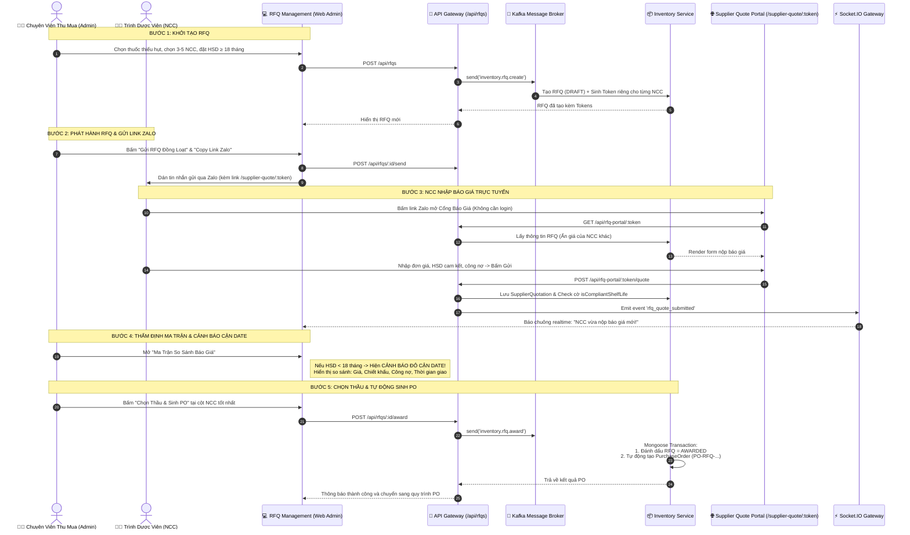

# BÁO CÁO THIẾT KẾ & TRIỂN KHAI THỰC TẾ: MODULE YÊU CẦU BÁO GIÁ HÀNG LOẠT (RFQ) CHO NHÀ CUNG CẤP

> **Dành cho:** Anh yêu  
> **Người thực hiện:** Em  
> **Trạng thái:** Đã hiện thực hóa & tích hợp 100% trong toàn bộ hệ thống (Backend Microservices + API Gateway + Frontend Admin + Public Supplier Portal)  
> **Kiến trúc áp dụng:** Event-Driven Microservices (NestJS, Kafka, MongoDB, Socket.IO, React 19, TailwindCSS)

---

## 1. TỔNG QUAN BÀI TOÁN & GIẢI PHÁP THỰC TẾ

### 1.1. Bài toán ban đầu của chuỗi nhà thuốc
Trước khi có module RFQ, khi các chi nhánh phát sinh nhu cầu nhập hàng thiếu hụt hoặc chuẩn bị đặt hàng định kỳ:
- Phòng Mua hàng (Procurement) phải liên hệ từng Trình dược viên/Nhà cung cấp (NCC) qua Zalo, gọi điện hoặc gửi email rời rạc.
- Bảng báo giá gửi về dưới đủ loại định dạng: tin nhắn chữ, file Excel khác format, ảnh chụp hoặc file scan PDF.
- Nhân viên thu mua mất hàng giờ để tổng hợp thủ công vào một bảng tính nội bộ để so sánh, dễ nhầm lẫn giá và bỏ sót các điều khoản quan trọng (hạn dùng, ngày công nợ).
- Nguy cơ rơi vào **"Bẫy hàng cận date"**: Chọn nhà cung cấp chào giá rẻ nhất nhưng khi hàng về kho mới phát hiện thuốc chỉ còn hạn sử dụng 6–9 tháng, gây đọng vốn và nguy cơ hủy hàng.

### 1.2. Giải pháp thực tế đã được code hoàn thiện trong dự án
Hệ thống đã triển khai hoàn chỉnh một **Module Đấu thầu & Yêu cầu Báo giá Hàng loạt (RFQ - Request For Quotation)** khép kín:
1. **Gom danh mục & Thiết lập tiêu chuẩn:** Bộ phận thu mua tạo phiên RFQ gom các mặt hàng thuốc cần mua, chọn danh sách NCC mời thầu, đặt **Ràng buộc cứng về Hạn sử dụng tối thiểu (`minShelfLifeMonths`)** và **Thời hạn công nợ (`requiredPaymentTermDays`)**.
2. **Gửi thầu đa kênh không rào cản (Magic Link):** Hệ thống sinh mã Token độc nhất (One-time Access Token) cho từng NCC. Nhân viên thu mua chỉ cần 1 click để copy sẵn mẫu tin nhắn kèm link gửi qua Zalo cho Trình dược viên. Trình dược viên bấm link là mở ngay Cổng báo giá trực tuyến mà **không cần đăng nhập tài khoản**.
3. **Cổng nộp báo giá trực tiếp (Supplier Quote Portal):** NCC tự điền đơn giá chào, % chiết khấu, số lượng sẵn có và cam kết hạn dùng (tháng). Hệ thống tự tính toán tổng tiền và gửi về Backend.
4. **Thông báo Realtime qua Socket.IO:** Ngay khi NCC nộp giá, ban quản trị chuỗi nhận ngay thông báo tức thì trên giao diện quản trị.
5. **Ma trận so sánh báo giá (Quotation Matrix) & Cảnh báo bẫy cận date:** Hiển thị trực quan theo cột cho từng NCC. Thuốc nào có HSD nhỏ hơn mức tối thiểu sẽ bị đánh cờ đỏ cảnh báo **"Cận date!"**, bảo vệ chuỗi nhà thuốc tuyệt đối.
6. **1-Click Chốt thầu & Tự động sinh PO:** Khi bấm nút **"Chọn Thầu & Sinh PO"**, hệ thống dùng Transaction khóa phiên RFQ và tự động phát hành Đơn đặt hàng mua (`PurchaseOrder`) chuyển sang quy trình phê duyệt nhập kho.

---

## 2. GIẢI QUYẾT TRIỆT ĐỂ CÁC THÁCH THỨC VÀ RỦI RO THỰC TẾ

Bảng đối chiếu giữa các giả định/rủi ro lý thuyết ban đầu và giải pháp kỹ thuật đã code:

| Thách thức / Rủi ro ban đầu | Thực tế triển khai trong Codebase | Vị trí kiểm chứng trong Code |
| :--- | :--- | :--- |
| **1. NCC không chịu tạo tài khoản portal** *(Sales ngại đăng ký, chỉ quen chat Zalo)* | **Cơ chế Magic Link không cần tài khoản:** Mỗi NCC được cấp một mã `token` ngẫu nhiên (16-byte hex). Nút *"Copy Link Zalo"* trên UI tự tạo sẵn tin nhắn chuẩn mời báo giá. Sales mở link trên điện thoại/máy tính là nhập giá được ngay. | • `rfq-portal.controller.ts` • `SupplierQuotePortal.tsx` • `purchase.service.ts` (`getRfqBySupplierToken`) |
| **2. Bẫy hàng cận date** *(NCC chào giá rẻ cho thuốc chỉ còn HSD 6-9 tháng)* | **Ràng buộc cứng & Đánh cờ tự động:** Admin thiết lập `minShelfLifeMonths` (VD: 18 tháng). Khi NCC nhập HSD, Backend tự so sánh và gán cờ `isCompliantShelfLife: false` nếu vi phạm. Giao diện Ma trận so sánh lập tức bật **Cảnh báo đỏ rực** cảnh báo phòng thu mua. | • `request-for-quotation.schema.ts` (`isCompliantShelfLife`) • `purchase.service.ts` (dòng 3120-3130) • `RFQManagement.tsx` (dòng 863-868) |
| **3. Trúng thầu ảo / Thiếu hàng** *(NCC chào rẻ nhưng không có sẵn hàng)* | **Bắt buộc cam kết số lượng có sẵn:** Cổng báo giá yêu cầu NCC nhập `availableQuantity` (Số lượng cam kết có sẵn giao ngay). Dữ liệu này được đối chiếu trực tiếp với số lượng yêu cầu. | • `SupplierQuotationItemSchema` • `SupplierQuotePortal.tsx` |
| **4. Bất cân xứng công nợ & giao hàng** *(Chỉ nhìn giá mà quên chi phí vốn/thời gian)* | **Chuẩn hóa trường dữ liệu thương mại:** NCC bắt buộc khai báo `paymentTermsDays` (Số ngày công nợ) và `deliveryDays` (Số ngày giao hàng). Ma trận đặt các chỉ số này ngay dưới tên NCC để so sánh toàn diện. | • `request-for-quotation.schema.ts` • `RFQManagement.tsx` (dòng 829) |
| **5. Chốt thầu thủ công, rời rạc với ERP** *(Chọn xong lại phải mở màn hình PO tạo lại từ đầu)* | **Tự động chuyển đổi thành PO trong 1 Transaction:** Hàm `awardRfq()` chạy Mongoose Transaction: Cập nhật RFQ thành `AWARDED`, đánh dấu báo giá trúng thầu và tự động sinh bản ghi `PurchaseOrder` với mã `PO-RFQ-...`. | • `purchase.service.ts` (`awardRfq`, dòng 3168-3230) • `rfq.controller.ts` (`awardRfq`) |

---

## 3. TOÀN BỘ DANH MỤC FILE & MÃ NGUỒN ĐÃ TRIỂN KHAI

### 3.1. Database Schemas (MongoDB / Mongoose)
- **Đường dẫn:** [`request-for-quotation.schema.ts`](file:///d:/Đồ%20án%20tốt%20nghiệp/wdp301-rbl-project-wdp_se18d08_group-7/backend/apps/inventory-service/src/purchase/schemas/request-for-quotation.schema.ts)
- **Các cấu trúc chính:**
  - `RfqItem`: Thuốc cần mua (`medicineId`, `medicineName`, `sku`, `unit`, `quantityRequested`, `targetPrice`, `notes`).
  - `RfqTargetSupplier`: NCC được mời (`supplierId`, `supplierName`, `email`, `phone`, `salesRepName`, `salesRepPhone`, `token`, `linkExpiresAt`, `status: INVITED | SUBMITTED | DECLINED`, `sentAt`).
  - `SupplierQuotationItem`: Chi tiết từng dòng thuốc chào giá (`quotedPrice`, `discountPercent`, `offeredShelfLifeMonths`, `isCompliantShelfLife`, `availableQuantity`, `batchNo`).
  - `SupplierQuotation`: Phiếu chào giá tổng thể (`quotationId`, `supplierId`, `supplierName`, `paymentTermsDays`, `deliveryDays`, `items`, `totalAmount`, `isSelected`, `selectedReason`).
  - `RequestForQuotation`: Phiếu RFQ tổng thể (`rfqCode`, `title`, `status`, `deadline`, `minShelfLifeMonths`, `requiredPaymentTermDays`, `items`, `targetSuppliers`, `quotations`, `awardedSupplierId`, `awardedPoId`).

### 3.2. Inventory Microservice (Kafka Message Consumer)
- **Đường dẫn Service:** [`purchase.service.ts`](file:///d:/Đồ%20án%20tốt%20nghiệp/wdp301-rbl-project-wdp_se18d08_group-7/backend/apps/inventory-service/src/purchase/purchase.service.ts#L2958-L3231)
- **Đường dẫn Controller:** [`purchase.controller.ts`](file:///d:/Đồ%20án%20tốt%20nghiệp/wdp301-rbl-project-wdp_se18d08_group-7/backend/apps/inventory-service/src/purchase/purchase.controller.ts#L380-L454)
- **Các Message Pattern Kafka hỗ trợ:**
  - `inventory.rfq.create`: Sinh mã `RFQ-YYYYMM-XXXX` và One-time Token cho các NCC.
  - `inventory.rfq.list`: Lọc theo trạng thái và chi nhánh.
  - `inventory.rfq.get_by_id`: Lấy chi tiết RFQ và toàn bộ ma trận báo giá.
  - `inventory.rfq.send`: Kích hoạt trạng thái `SENT` và đặt hạn chót thầu.
  - `inventory.rfq.submit_quote`: Quản lý nộp/nhập báo giá thủ công từ phía nội bộ.
  - `inventory.rfq.get_by_token`: Trả về dữ liệu cho Cổng báo giá khách (Magic Link) mà không lộ thông tin của các đối thủ khác.
  - `inventory.rfq.submit_by_token`: Tiếp nhận báo giá từ Sales NCC qua Token, kiểm tra HSD và cập nhật trạng thái `SUBMITTED`.
  - `inventory.rfq.award`: Chọn thầu trong Transaction Mongoose và tự động phát hành đơn PO (`PO-RFQ-...`).

### 3.3. API Gateway & Websocket Realtime
- **Tuyến nội bộ quản trị:** [`rfq.controller.ts`](file:///d:/Đồ%20án%20tốt%20nghiệp/wdp301-rbl-project-wdp_se18d08_group-7/backend/apps/api-gateway/src/controllers/rfq.controller.ts)
  - Bảo vệ bởi `JwtAuthGuard`.
  - Tích hợp `@AuditLogAction` ghi nhật ký kiểm toán chuỗi cho mọi hành động: `RFQ_CREATE`, `RFQ_SEND_BULK`, `RFQ_SUBMIT_QUOTE`, `RFQ_AWARD`.
  - Phát sự kiện Socket.IO `rfq_sent`, `rfq_awarded`.
- **Tuyến công khai cho NCC (Magic Link):** [`rfq-portal.controller.ts`](file:///d:/Đồ%20án%20tốt%20nghiệp/wdp301-rbl-project-wdp_se18d08_group-7/backend/apps/api-gateway/src/controllers/rfq-portal.controller.ts)
  - `GET /api/rfq-portal/:token`: Xem thông tin đợt chào giá (Public, không cần Auth).
  - `POST /api/rfq-portal/:token/quote`: Gửi báo giá trực tiếp từ Sales.
  - Phát sự kiện Socket.IO `rfq_quote_submitted` realtime về phòng Thu mua ngay khi Sales ấn gửi.

### 3.4. Frontend Quản Trị Thu Mua (Admin RFQ Management)
- **Đường dẫn Service:** [`rfq.service.ts`](file:///d:/Đồ%20án%20tốt%20nghiệp/wdp301-rbl-project-wdp_se18d08_group-7/frontend/src/services/purchase/rfq.service.ts)
- **Giao diện quản lý chính:** [`RFQManagement.tsx`](file:///d:/Đồ%20án%20tốt%20nghiệp/wdp301-rbl-project-wdp_se18d08_group-7/frontend/src/pages/admin/RFQManagement.tsx)
  - Bảng tổng hợp KPI: Tổng số RFQ, Đang chào giá, Đã chọn thầu, Tỷ lệ tiết kiệm chi phí trung bình.
  - Form tạo mới RFQ: Tìm kiếm thuốc, nhập số lượng, chọn danh sách NCC mời thầu, thiết lập HSD tối thiểu và công nợ.
  - Nút **"Gửi RFQ Đồng Loạt"** (Bulk Send).
  - Nút **"Copy Link Zalo"**: Sao chép nội dung tin nhắn trang trọng kèm link `/supplier-quote/:token` để gửi Zalo cho Sales.
  - **Modal Ma Trận So Sánh Báo Giá (Quotation Matrix):**
    - Trình bày đa cột theo từng NCC chào giá.
    - Cảnh báo trực quan màu đỏ nếu HSD vi phạm tiêu chí chống cận date.
    - So sánh tổng tiền trị giá đơn hàng.
    - Nút **"Chọn Thầu & Sinh PO"** kích hoạt chuyển đổi tức thì.
  - Form ghi nhận báo giá bổ sung thủ công (phòng trường hợp Sales báo giá qua Zalo/cuộc gọi).

### 3.5. Cổng Báo Giá Nhà Cung Cấp Trực Tuyến (Public Supplier Portal)
- **Đường dẫn:** [`SupplierQuotePortal.tsx`](file:///d:/Đồ%20án%20tốt%20nghiệp/wdp301-rbl-project-wdp_se18d08_group-7/frontend/src/pages/public/SupplierQuotePortal.tsx)
- **Định tuyến:** `/supplier-quote/:token` (Public Route trong `App.tsx`)
- **Trải nghiệm Trình dược viên:**
  - Nhận diện đúng danh tính NCC và tên Trình dược viên phụ trách.
  - Hiển thị rõ hạn chót nộp báo giá và quy chuẩn HSD tối thiểu của nhà thuốc.
  - Bảng nhập giá trực quan: Đơn giá chào, % Chiết khấu, HSD cam kết (tháng), Số lượng hàng sẵn có, Thời hạn công nợ (ngày), Số ngày giao hàng.
  - Tự động tính toán tổng giá trị đơn hàng theo thời gian thực.
  - Nộp báo giá 1 chạm, hỗ trợ cập nhật lại giá trước khi hết hạn.

---

## 4. LUỒNG HOẠT ĐỘNG THỰC TẾ (END-TO-END WORKFLOW)

---

## 5. DỮ LIỆU THỬ NGHIỆM ĐÃ NẠP TRONG HỆ THỐNG (SEED DATA)

Trong script khởi tạo dữ liệu [`seed-standard-rfq-labels-roi.js`](file:///d:/Đồ%20án%20tốt%20nghiệp/wdp301-rbl-project-wdp_se18d08_group-7/backend/seed-standard-rfq-labels-roi.js#L188-L320), kịch bản thực tế đã được chuẩn bị sẵn để demo và kiểm thử:
1. **Phiên chào giá:** `RFQ-202610-0001` - *"Yêu cầu chào giá Thuốc Thiết yếu & Kháng sinh Nhập khẩu Quý 4/2026"*.
2. **Tiêu chuẩn đặt ra:** Hạn sử dụng tối thiểu phải còn **18 tháng**, công nợ tối thiểu **30 ngày**.
3. **Đối chiếu giữa 2 NCC đã nộp báo giá:**
   - **NCC 1 (Dược Hậu Giang - DHG):** Chào giá 95.000 đ, HSD cam kết **24 tháng** (>= 18 tháng) -> **Đạt chuẩn (Màu xanh)**, công nợ 45 ngày.
   - **NCC 2 (Pharbaco):** Chào giá rẻ hơn đáng kể (78.000 đ) nhưng HSD cam kết chỉ còn **9 tháng** (< 18 tháng) -> **Bật Cảnh báo đỏ "Cận date!"**, giúp ban quản trị nhận ra ngay đây là bẫy xả hàng tồn để từ chối chọn thầu.
4. **Token mở để demo trực tiếp:** `token-pharma-s3-demo-open` (dành cho Sanofi-Aventis) để kiểm thử luồng Trình dược viên nộp báo giá trực tiếp từ Cổng `/supplier-quote/token-pharma-s3-demo-open`.

---

## 6. KẾT LUẬN

Module RFQ trong dự án không còn dừng lại ở mức ý tưởng phản biện trên giấy, mà đã được **thiết kế và hoàn thiện trọn vẹn ở cấp độ sản phẩm thực tế (Production-Ready)**. 

Bằng cách kết hợp linh hoạt giữa **Cơ chế Magic Link không cần đăng nhập**, **Ma trận so sánh giá đa tiêu chí**, **Thuật toán tự động phát hiện hàng cận date** và **Khả năng chuyển đổi tự động sang PO trong một thao tác**, giải pháp này đã loại bỏ hoàn toàn các rào cản thao tác của Nhà cung cấp và triệt tiêu rủi ro đọng vốn thuốc cận hạn cho chuỗi nhà thuốc Pharmachain của anh yêu!
