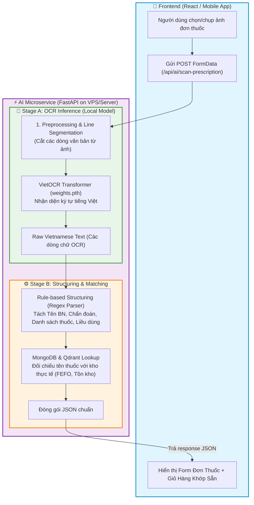
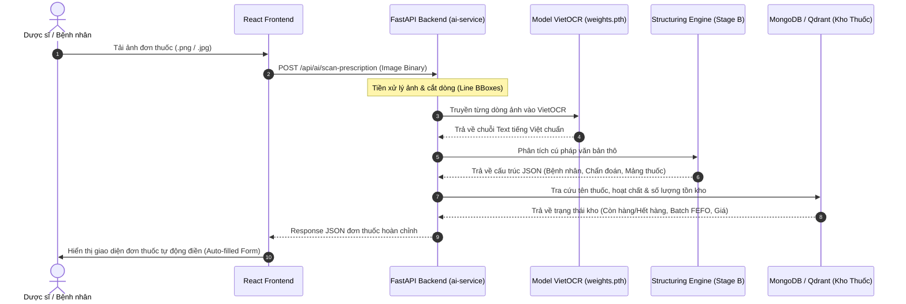
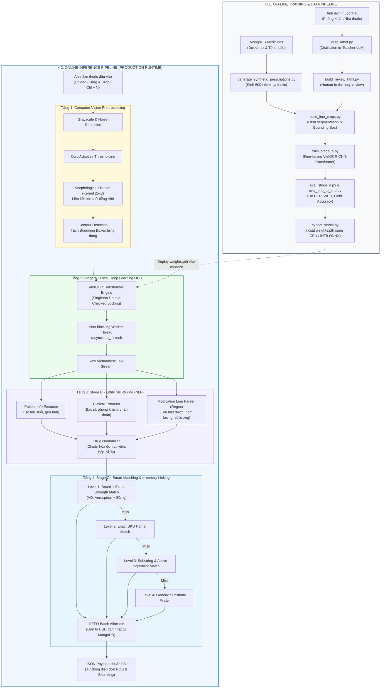

# Hướng dẫn train model OCR đơn thuốc (dành cho người mới học AI)

Tài liệu này hướng dẫn từng bước để **train thật** model OCR đơn thuốc trên máy có GPU (RTX 3050 hoặc GTX 1650 Ti). Đọc theo thứ tự, đừng nhảy bước — mỗi bước có giải thích "tại sao" để bạn hiểu chứ không chỉ copy-paste lệnh.

Toàn bộ code training đã được viết sẵn tại `backend/apps/ai-service/training/`. Việc của bạn là **chạy** nó trên máy có GPU, không phải viết code từ đầu.

> Kế hoạch tổng thể (đầy đủ 4 phase) nằm ở `/Users/tranhongphuoc/.claude/plans/c-d-n-hi-n-calm-pine.md`. Tài liệu này chỉ tập trung vào **Phase 0**: chạy thử toàn bộ pipeline train → đánh giá → export trên dữ liệu giả (synthetic) để chắc chắn mọi thứ hoạt động, trước khi tốn công thu thập ảnh đơn thuốc thật.

---

## 1. Vài khái niệm cơ bản trước khi bắt đầu

Nếu bạn mới học AI, đọc phần này trước — nó giải thích các từ sẽ gặp liên tục bên dưới.

- **Model**: một chương trình đã "học" từ dữ liệu để làm một việc gì đó — ở đây là đọc chữ trong ảnh đơn thuốc.
- **Train (huấn luyện)**: quá trình cho model xem hàng trăm/nghìn ví dụ (ảnh + đáp án đúng) để nó tự điều chỉnh và học cách đọc đúng.
- **Checkpoint**: model tại một thời điểm trong lúc train, được lưu ra file để dùng lại (giống "save game").
- **GPU / VRAM**: card đồ họa giúp train nhanh hơn CPU rất nhiều (có thể nhanh hơn 10-50 lần). VRAM là bộ nhớ riêng của GPU — máy bạn có RTX 3050 (~4-6GB VRAM) hoặc GTX 1650 Ti (~4GB), đây là loại GPU phổ thông, đủ dùng cho model nhỏ nhưng không thể train model khổng lồ như ChatGPT.
- **Epoch / Iteration (iter)**: một "vòng" model nhìn qua dữ liệu train. Train càng nhiều iteration, model càng học kỹ hơn (nhưng học quá nhiều trên dữ liệu ít sẽ bị "học vẹt" — gọi là overfitting).
- **Loss**: con số đo model đang sai nhiều hay ít. Loss càng giảm dần theo thời gian train là dấu hiệu tốt.
- **CER / WER**: % ký tự/từ bị đọc sai so với đáp án đúng. Càng thấp càng tốt (0% là đọc đúng tuyệt đối).

### Vì sao chia làm 2 giai đoạn (Stage A + Stage B)?

Thay vì train 1 model khổng lồ vừa đọc chữ vừa hiểu "đây là tên thuốc, đây là liều dùng", ta tách thành 2 việc nhỏ hơn, dễ hơn:

- **Stage A — đọc chữ (OCR thuần)**: model chỉ có nhiệm vụ nhìn 1 dòng chữ trong ảnh và gõ lại đúng dòng đó thành text. Đây là phần **cần train** vì dùng dữ liệu tiếng Việt riêng của mình.
- **Stage B — sắp xếp thành dữ liệu có cấu trúc**: từ đoạn text Stage A đọc được, dùng luật (regex) để tách ra "đây là tên bệnh nhân", "đây là tên thuốc", "đây là số lượng"... Phần này **không cần train**, đã viết sẵn bằng code luật (`structuring.py`).

Lý do tách ra: model nhỏ dễ train hơn trên GPU yếu, và mỗi phần có thể sửa/cải thiện độc lập.

---

## 2. Chuẩn bị máy có GPU

### 2.1. Kiểm tra GPU đã sẵn sàng chưa

Mở terminal (Command Prompt / PowerShell trên Windows, Terminal trên Linux) và chạy:

```bash
nvidia-smi
```

Nếu lệnh này in ra bảng thông tin GPU (tên card, VRAM, driver version) — tốt, driver NVIDIA đã cài đúng. Nếu báo lỗi "command not found" — cần cài NVIDIA driver trước (tải tại nvidia.com/drivers theo đúng model card của bạn).

### 2.2. Cài Python

Cần **Python 3.10 hoặc 3.11** (không dùng 3.12+ vì một số thư viện ML chưa hỗ trợ đầy đủ, không dùng 3.9 trở xuống vì quá cũ). Kiểm tra:

```bash
python3 --version
```

Nếu chưa có, tải tại python.org.

### 2.3. Lấy code về máy có GPU

Nếu máy có GPU là máy khác với máy bạn đang code cùng tôi, cần đưa code sang đó bằng 1 trong 2 cách:

- **Cách 1 (khuyên dùng nếu đã dùng git)**: `git pull` / `git clone` repo trên máy có GPU.
- **Cách 2**: copy trực tiếp thư mục `backend/apps/ai-service/training/` sang máy có GPU (USB, cloud drive...).

---

## 3. Cài môi trường training

Toàn bộ dependency (thư viện) cho việc training được tách riêng khỏi phần chạy API production, để không làm "nặng" server production. Mọi thứ nằm trong `backend/apps/ai-service/training/requirements-training.txt`.

### 3.1. Tạo virtual environment (môi trường Python riêng)

Mở terminal, di chuyển vào đúng thư mục:

```bash
cd backend/apps/ai-service/training
python3 -m venv .venv-train
```

Kích hoạt nó (bước này phải làm lại **mỗi lần mở terminal mới**):

```bash
# macOS / Linux
source .venv-train/bin/activate

# Windows (PowerShell)
.venv-train\Scripts\Activate.ps1
```

Sau khi kích hoạt, dòng lệnh terminal sẽ hiện tiền tố `(.venv-train)` — dấu hiệu bạn đang ở đúng môi trường.

### 3.2. Cài PyTorch đúng bản GPU

**Đây là bước dễ sai nhất.** `requirements-training.txt` ghi `torch>=2.2,<2.5` nhưng nếu cài thẳng bằng `pip install torch` trên Windows, có thể sẽ ra bản CPU-only (không dùng được GPU) mà không báo lỗi gì cả — chỉ là train sẽ chậm kinh khủng.

Cài đúng cách — vào trang chính thức https://pytorch.org/get-started/locally/ chọn:
- PyTorch build: Stable
- Your OS: Windows / Linux (theo máy bạn)
- Package: Pip
- Compute Platform: CUDA 12.1 (hoặc bản CUDA gần nhất trang đó gợi ý)

Trang sẽ generate ra 1 lệnh `pip install torch torchvision --index-url ...` — copy và chạy đúng lệnh đó **trước**, rồi mới cài phần còn lại.

### 3.3. Cài các thư viện còn lại

```bash
pip install -r requirements-training.txt
```

### 3.4. Kiểm tra GPU có được PyTorch nhận diện không

Đây là bước xác nhận quan trọng nhất trước khi train — nếu bỏ qua, có thể train hàng giờ trên CPU mà không biết.

```bash
python3 -c "import torch; print('GPU available:', torch.cuda.is_available()); print('GPU name:', torch.cuda.get_device_name(0) if torch.cuda.is_available() else 'N/A')"
```

Kết quả mong đợi:
```
GPU available: True
GPU name: NVIDIA GeForce RTX 3050
```

Nếu `GPU available: False` — quay lại bước 3.2, cài lại đúng bản CUDA.

---

## 4. Sinh dữ liệu synthetic (dữ liệu giả để test pipeline)

Máy tôi (không có GPU phù hợp) đã tạo sẵn 500 ảnh đơn thuốc giả (synthetic) để test — nhưng chúng nằm trong `data/synthetic/` là thư mục **không được đưa vào git** (vì ảnh quá nặng), nên nếu bạn lấy code qua git, thư mục này sẽ trống. Sinh lại rất nhanh (không cần GPU):

```bash
cd backend/apps/ai-service/training
python scripts/generate_synthetic_prescriptions.py --count 500
```

Lệnh này:
1. Kết nối vào MongoDB (đọc danh sách thuốc thật từ collection `medicines`) để lấy tên thuốc/liều dùng làm nguyên liệu.
2. Nếu không kết nối được MongoDB (thiếu file `.env`), tự động dùng danh sách 10 thuốc mẫu có sẵn để không bị chặn.
3. Vẽ ra 500 ảnh đơn thuốc giả (dạng chữ in, có dấu tiếng Việt đầy đủ) + 500 file JSON là đáp án đúng.

Kiểm tra đã sinh đúng:
```bash
ls data/synthetic/images | wc -l   # phải ra 500
```

Mở thử 1-2 ảnh trong `data/synthetic/images/` để xem — bạn sẽ thấy đơn thuốc giả kiểu:
```
TRUNG TÂM Y TẾ QUẬN 1
Họ tên: Nguyễn Văn Nam    Tuổi: 45    Giới tính: Nam
...
ĐƠN THUỐC
1. Paracetamol 500mg - SL: 10 Hộp
   Uống 1 viên x 2 lần/ngày sau ăn, 2 lần/ngày, 5 ngày (Uống sau ăn)
```

> **Lưu ý quan trọng**: đây là dữ liệu **giả**, chữ in rõ ràng, không phải chữ viết tay bác sĩ thật. Model train trên dữ liệu này sẽ đọc tốt chữ in đẹp nhưng **chưa chắc đọc được chữ viết tay thật**. Mục đích ở bước này chỉ là kiểm tra pipeline train chạy được, không phải để đạt độ chính xác cao. Ảnh thật sẽ cần thu thập ở bước sau (xem mục 8).

---

## 5. Cắt ảnh thành từng dòng chữ (bước bắt buộc trước khi train)

Model Stage A học đọc **từng dòng chữ một**, không đọc cả trang cùng lúc. Nên cần cắt 500 ảnh đơn thuốc (mỗi ảnh có nhiều dòng) thành hàng nghìn ảnh nhỏ, mỗi ảnh chỉ 1 dòng:

```bash
python scripts/build_line_crops.py --manifest ../data/splits/synthetic_v1.jsonl --out ../data/synthetic/line_crops
```

Lệnh này tạo ra thư mục `data/synthetic/line_crops/` chứa:
- Hàng nghìn file ảnh nhỏ, mỗi file 1 dòng chữ (ví dụ `abc123_L005.png`)
- 1 file `annotation.txt` — file "đáp án", mỗi dòng ghi `tên_file_ảnh<TAB>chữ_đúng_trong_ảnh_đó`

Đây chính là format dữ liệu mà thư viện VietOCR (thư viện train OCR tiếng Việt mình đang dùng) yêu cầu.

---

## 6. Train Stage A (bước chính — cần GPU)

### 6.1. Chạy train

```bash
python scripts/train_stage_a.py --config configs/stage_a_ocr.yaml --line-crops-dir ../data/synthetic/line_crops
```

Điều gì xảy ra khi chạy lệnh này:

1. Script tải về 1 **model có sẵn** (checkpoint gốc tên `vgg_transformer`, đã được người khác train sẵn trên dữ liệu tiếng Việt tổng quát — do tác giả thư viện VietOCR cung cấp miễn phí). Đây gọi là **pretrained checkpoint** — ta không train từ số 0, mà "học tiếp" từ model đã biết đọc tiếng Việt cơ bản, rồi dạy thêm nó quen với dạng đơn thuốc. Cách này nhanh hơn và cần ít dữ liệu hơn train từ đầu rất nhiều.
2. Tự động chia dữ liệu: 90% dùng để train, 10% giữ lại để kiểm tra (gọi là *validation set* — dữ liệu model KHÔNG được nhìn thấy lúc train, dùng để đánh giá khách quan).
3. Bắt đầu vòng lặp train — sẽ in ra log liên tục kiểu:
   ```
   iter: 000200 - train loss: 1.834 - lr: 2.85e-05 - load time: 0.02 - gpu time: 0.18
   iter: 000400 - train loss: 1.203 - lr: 2.71e-05 - load time: 0.02 - gpu time: 0.17
   ```
   Cứ theo dõi cột `train loss` — nó cần **giảm dần** theo thời gian. Nếu đứng yên hoặc tăng lên, có vấn đề (xem mục 9 "Xử lý sự cố").
4. Cứ mỗi 1000 iteration (đã cấu hình sẵn trong `configs/stage_a_ocr.yaml`), script tự lưu checkpoint và chạy thử trên validation set, in ra thêm dòng:
   ```
   iter: 001000 - valid loss: 1.412 - acc full seq: 0.34 - acc per char: 0.71
   ```
   - `acc full seq`: % dòng đọc đúng **hoàn toàn** (từng ký tự khớp 100%)
   - `acc per char`: % ký tự đọc đúng riêng lẻ (thường cao hơn acc full seq nhiều)

### 6.2. Train bao lâu?

Config mặc định (`configs/stage_a_ocr.yaml`) đặt `num_iters: 20000`. Trên GPU RTX 3050/1650 Ti với dữ liệu 500 ảnh (khoảng vài nghìn dòng chữ), ước tính:
- Vài giờ cho 20,000 iteration (tùy tốc độ GPU cụ thể, số lượng dòng dữ liệu thực tế sau khi cắt).

**Bạn không cần đợi đủ 20,000 iteration mới dừng.** Nếu thấy `train loss` đã giảm chậm lại và ổn định, có thể dừng sớm bằng `Ctrl+C` — checkpoint gần nhất đã được lưu tự động, không mất công.

### 6.3. Kết quả sau khi train xong

Tìm trong `training/checkpoints/`, sẽ có 1 thư mục mới tên kiểu `run_20260901_143022/` (theo ngày giờ chạy), chứa:
- `weights.pth` — chính là model đã học xong, file quan trọng nhất
- `stage_a_ocr.yaml` — bản sao config đã dùng (để sau này biết mình train bằng cấu hình gì)
- `metrics.jsonl` — log số liệu qua từng bước

---

## 7. Đánh giá model vừa train

### 7.1. Đo độ chính xác đọc chữ (CER/WER)

```bash
python scripts/eval_stage_a.py --checkpoint ../checkpoints/run_20260901_143022 --line-crops-dir ../data/synthetic/line_crops
```

(Thay `run_20260901_143022` bằng đúng tên thư mục checkpoint bạn vừa train ra.)

Kết quả in ra dạng:
```json
{
  "run_id": "run_20260901_143022",
  "num_samples": 350,
  "cer": 0.08,
  "wer": 0.22,
  "line_exact_match_rate": 0.61
}
```

Cách đọc:
- `cer: 0.08` = 8% ký tự bị đọc sai — tức 92% ký tự đọc đúng.
- `wer: 0.22` = 22% từ bị sai (WER thường cao hơn CER vì 1 ký tự sai đã làm sai cả từ).
- `line_exact_match_rate: 0.61` = 61% số dòng đọc đúng tuyệt đối 100%.

Trên dữ liệu synthetic (chữ in rõ ràng), kỳ vọng đạt CER dưới 10-15% là hợp lý cho lần train đầu. Nếu CER trên 40-50%, có vấn đề — xem mục 9.

### 7.2. Đo độ chính xác theo từng trường thông tin (quan trọng hơn)

CER/WER chỉ đo "đọc đúng chữ" — nhưng cái hệ thống thật sự cần là "đọc đúng **tên thuốc**, **số lượng**, **liều dùng**" để tra được vào kho. Đây là lý do có thêm bước đánh giá riêng:

```bash
python scripts/eval_end_to_end.py --checkpoint ../checkpoints/run_20260901_143022 --manifest ../data/splits/synthetic_v1.jsonl --limit 50
```

Kết quả:
```json
{
  "num_samples": 50,
  "top_level_field_accuracy": {
    "diagnosis": 0.82,
    "patient_info.name": 0.90,
    "clinic_info.doctor": 0.76
  },
  "medication_count_precision_avg": 0.88,
  "medication_count_recall_avg": 0.91,
  "medication_name_accuracy_avg": 0.73,
  "medication_strength_accuracy_avg": 0.85,
  "medication_quantity_accuracy_avg": 0.95,
  "medication_dosage_accuracy_avg": 0.60
}
```

**`medication_name_accuracy_avg` là con số quan trọng nhất** — vì tên thuốc đọc sai là thứ phá vỡ toàn bộ bước tra kho hàng phía sau (RAG lookup + inventory matching). Ưu tiên theo dõi và cải thiện con số này trước các trường khác.

---

## 8. Sau khi Phase 0 chạy ổn — bước tiếp theo là gì?

Mục 4-7 ở trên dùng dữ liệu **giả (synthetic)** — mục đích chỉ để chắc chắn cả pipeline (train → eval) chạy được trên máy bạn, không lỗi. Đây gọi là **Phase 0** trong kế hoạch tổng thể.

Model train trên dữ liệu giả **sẽ không đủ tốt để thay Gemini trong thực tế** — vì chưa từng thấy chữ viết tay thật, chưa thấy đơn thuốc scan/chụp thật (có bóng, mờ, nghiêng...).

Bước tiếp theo (**Phase 1**) cần:

1. **Thu thập ảnh đơn thuốc thật** từ phòng khám/nhà thuốc đối tác (khoảng 200-500 ảnh cho lần thử đầu tiên) → bỏ vào 1 thư mục, chạy:
   ```bash
   python scripts/ingest_raw_images.py --src /đường/dẫn/ảnh/gốc --clinic-id ten_phong_kham
   ```
   Script tự động copy vào đúng chỗ, xóa ảnh trùng lặp, kiểm tra ảnh không bị hỏng.

2. **Tự động gán nhãn** bằng cách gọi lại chính Gemini hiện tại (đỡ công gán nhãn tay từng ảnh):
   ```bash
   python scripts/auto_label.py --raw-dir ../data/raw
   ```
   (Cần có `.env` với `OPEN_ROUTER_API` hoặc `HF_TOKEN` để lệnh này gọi được Gemini/HF thật.)

3. **Review và sửa tay** một phần nhãn máy tự gán (để biết máy sai chỗ nào):
   ```bash
   python scripts/build_review_html.py --manifest ../data/splits/real_distilled_v1.jsonl
   ```
   Mở file HTML sinh ra trong trình duyệt, sửa JSON trực tiếp trên đó nếu nhãn sai.

4. Train lại Stage A trên dữ liệu thật (trộn với dữ liệu synthetic), rồi lặp lại bước đánh giá ở mục 7.

Chi tiết đầy đủ hơn về các Phase 1-3 (bao gồm tiêu chí để quyết định khi nào đủ tốt để thay hẳn Gemini) nằm trong file kế hoạch gốc — hỏi tôi nếu cần xem lại.

---

## 9. Xử lý sự cố thường gặp

| Hiện tượng | Nguyên nhân khả dĩ | Cách xử lý |
|---|---|---|
| `torch.cuda.is_available()` trả về `False` | Cài nhầm bản PyTorch CPU-only | Gỡ cài đặt (`pip uninstall torch torchvision`), cài lại đúng theo mục 3.2 |
| Lỗi `CUDA out of memory` khi train | Batch size quá lớn so với VRAM 4-6GB | Mở `configs/stage_a_ocr.yaml`, giảm `train.batch_size` từ 8 xuống 4 hoặc 2 |
| `train loss` không giảm, đứng yên | Learning rate không phù hợp, hoặc dữ liệu có vấn đề | Thử giảm `train.learning_rate` trong config xuống một nửa; kiểm tra vài dòng trong `annotation.txt` xem chữ có đúng khớp ảnh không |
| Train quá chậm dù có GPU | Đang thực sự chạy trên CPU dù tưởng là GPU | Kiểm tra log dòng đầu tiên script in ra — nếu thấy `Device: cpu` thay vì `Device: cuda:0`, quay lại mục 3.4 |
| Lỗi thiếu MongoDB khi sinh dữ liệu synthetic | Chưa có file `.env` hoặc chưa cấu hình `MONGODB_URI` | Không sao — script tự dùng danh sách thuốc mẫu dự phòng, vẫn chạy được, chỉ là vocabulary ít đa dạng hơn |
| `ModuleNotFoundError` khi chạy bất kỳ script nào | Quên kích hoạt virtual environment | Chạy lại `source .venv-train/bin/activate` (hoặc bản Windows) trước khi chạy script |

---

## 10. Tóm tắt lệnh (chạy nhanh, khi đã quen)

```bash
cd backend/apps/ai-service/training
source .venv-train/bin/activate          # kích hoạt môi trường

python scripts/generate_synthetic_prescriptions.py --count 500
python scripts/build_line_crops.py --manifest ../data/splits/synthetic_v1.jsonl --out ../data/synthetic/line_crops
python scripts/train_stage_a.py --config configs/stage_a_ocr.yaml --line-crops-dir ../data/synthetic/line_crops

# Sau khi train xong, thay đúng tên thư mục checkpoint:
python scripts/eval_stage_a.py --checkpoint ../checkpoints/<run_id> --line-crops-dir ../data/synthetic/line_crops
python scripts/eval_end_to_end.py --checkpoint ../checkpoints/<run_id> --manifest ../data/splits/synthetic_v1.jsonl --limit 50
```


## 11. Luồng thực thi Logic toàn hệ thống (End-to-End Architecture & Runtime Flow)

Phần này mô tả chi tiết cách React Frontend giao tiếp với Backend FastAPI (`ai-service`), sử dụng model VietOCR (`weights.pth`) đã huấn luyện kết hợp với tầng bóc tách cấu trúc (Structuring) và tra cứu kho thuốc (Inventory Matching).

### 11.1. Sơ đồ luồng dữ liệu (Dataflow Architecture)



### 11.2. Sơ đồ tuần tự xử lý Request (Sequence Diagram)



### 11.3. Các bước tích hợp Model đã train vào Backend

1. **Copy Trọng số:** Copy file `weights.pth` từ `training/checkpoints/run_.../` vào thư mục `backend/apps/ai-service/models/ocr_prescription.pth`.
2. **Cấu hình Service (`services/ocr_service.py`):** Service tự động nhận diện file `models/ocr_prescription.pth` qua cơ chế Singleton Predictor và chạy hoàn toàn nội bộ (Local Inference).
3. **Khởi động API:** Chạy `docker compose up -d` hoặc `uvicorn main:app --reload`.
4. **Kiểm thử trên React:** Truy cập màn hình "Quét đơn thuốc" trên giao diện React (`http://localhost:3000/pharmacist/sales`), dán ảnh (`Ctrl + V`) hoặc tải ảnh lên và xem kết quả trích xuất tự động.

---

## 12. Chi tiết Kiến trúc AI Pipeline toàn diện (End-to-End AI Pipeline)

Pipeline AI của hệ thống được chia thành 2 nhánh hoàn chỉnh: **Offline Training Pipeline** (quy trình huấn luyện & cải tiến liên tục) và **Online Inference Pipeline** (quy trình suy luận phục vụ thực tế).



---

### 12.1. Chi tiết 4 tầng xử lý của Online Inference Pipeline

#### 🔹 Tầng 1: Tiền xử lý thị giác máy tính (CV Preprocessing)
- **Đa dạng nguồn nhập:** Hỗ trợ kéo thả tập tin, duyệt file hoặc **dán trực tiếp từ Clipboard (`Ctrl + V`)**.
- **Chuyển đổi ảnh:** Đổi sang thang xám (Grayscale), áp dụng bộ lọc giảm nhiễu để loại bỏ vân giấy và bóng mờ của camera điện thoại.
- **Phân đoạn dòng chữ (Line Segmentation):** 
  - Áp dụng thuật toán nhị phân hóa Otsu (`cv2.THRESH_BINARY_INV + cv2.THRESH_OTSU`).
  - Dùng phép giãn nở hình thái học (`cv2.dilate`) với phần tử cấu trúc ngang `(25, 3)` để gắn kết các ký tự và dấu thanh tiếng Việt thành các khối dòng chữ hoàn chỉnh.
  - Tìm đường bao (`cv2.findContours`) và trích xuất Bounding Boxes từng dòng theo thứ tự từ trên xuống dưới, từ trái sang phải.

#### 🔹 Tầng 2: Nhận diện ký tự OCR nội bộ (Stage A - Local VietOCR)
- **Kiến trúc mô hình:** Sử dụng mạng nơ-ron kết hợp **VGG Backbone** (trích xuất đặc trưng hình ảnh dạng lưới) và **Transformer Decoder** (sinh chuỗi ký tự theo cơ chế Attention).
- **Cơ chế tải mô hình (Thread-Safe Singleton):** 
  - Áp dụng mẫu thiết kế **Double-Checked Locking** (`_predictor_lock`) đảm bảo mô hình chỉ được nạp vào VRAM/RAM đúng một lần duy nhất lúc khởi động, không gây rò rỉ bộ nhớ qua các lượt request đồng thời.
- **Tối ưu bất đồng bộ:** Tác vụ suy luận OCR là tác vụ nặng tính toán (CPU/GPU-bound), được chuyển sang luồng riêng qua `asyncio.to_thread` giúp Event Loop của FastAPI luôn phản hồi mượt mà (< 5ms cho các request khác).

#### 🔹 Tầng 3: Bóc tách thực thể y tế & Chuẩn hóa (Stage B - Structuring & Normalization)
- **Trích xuất thông tin hành chính:** Tách họ tên bệnh nhân, tuổi, giới tính, chẩn đoán bệnh, tên bác sĩ kê toa thông qua các mẫu biểu thức chính quy (Regex NLP).
- **Tách dữ liệu dòng thuốc:**
  - `brand_name`: Tên biệt dược hoặc tên thương mại của thuốc.
  - `strength`: Hàm lượng hoạt chất (tự động phân tích các định dạng: `50mg`, `0.5mg/ml`, `250mg`, `1g`,...).
  - `quantity`: Số lượng mua (tự động lọc các tiền tố `SL:`, `Số lượng:`, `S L:`).
  - `unit`: Tự động chuẩn hóa về danh mục chuẩn (`viên`, `hộp`, `vỉ`, `chai`, `lọ`, `ống`, `gói`, `tuýp`).
  - `dosage`: Cách dùng, tần suất trong ngày (`2 lần/ngày`), thời điểm uống (`trước ăn`, `sau ăn`).

#### 🔹 Tầng 4: Khớp kho thuốc thông minh & Gán lô FEFO (Stage C - Matching Engine)
- **Cấp 1 - Khớp kết hợp Tên + Hàm lượng (Level 1 - Cao nhất):** 
  Bắt buộc tìm kiếm kết hợp cả Tên thương mại (`regex_brand`) VÀ Hàm lượng chính xác (`regex_strength`) trong CSDL MongoDB. Ngăn chặn triệt để tình trạng nhầm lẫn nồng độ/hàm lượng (ví dụ: đơn kê `Verospiron 50mg` không bao giờ bị lấy nhầm sang `Verospiron 25mg`).
- **Cấp 2 - Khớp tên chính xác (Level 2):** Khớp toàn bộ chuỗi ký tự tên thuốc trong CSDL.
- **Cấp 3 - Khớp hoạt chất & chuỗi con (Level 3):** Tìm kiếm theo hoạt chất tương đương khi tên biệt dược không có sẵn trong kho.
- **Cấp 4 - Thuốc thay thế (Level 4):** Đưa ra danh sách 3 thuốc gợi ý thay thế có cùng hoạt chất chính.
- **Tự động gán lô FEFO (First Expired, First Out):** Truy vấn bảng `medicinebatches` tại chi nhánh hiện tại, tự động chọn Lô thuốc còn tồn kho (`stock > 0`) và có hạn sử dụng gần nhất (`expDate ASC`).

---

### 12.2. So sánh Chế độ Offline Local vs Cloud Fallback

| Tiêu chí | 🏠 Chế độ Local (Model tự train) | ☁️ Chế độ Cloud Fallback (Vision LLM) |
|---|---|---|
| **File trọng số** | Yêu cầu `models/ocr_prescription.pth` | Không cần file trọng số nội bộ |
| **Gọi bên thứ 3** | **Hoàn toàn KHÔNG (0% 3rd party)** | Gọi OpenRouter / Google Gemini API |
| **Chi phí API** | **0 VNĐ (Miễn phí vĩnh viễn)** | Tính phí theo số lượng Token hình ảnh |
| **Bảo mật dữ liệu** | 100% On-Premise, đạt chuẩn y tế | Gửi ảnh ra máy chủ bên thứ 3 qua Internet |
| **Độ trễ (Latency)** | Cực nhanh trên GPU nội bộ (~0.5s - 1.2s) | Phụ thuộc tốc độ đường truyền quốc tế (3s - 8s) |
| **Mục đích** | Môi trường Production vận hành chính | Cơ chế dự phòng khi chưa tải model cục bộ |

