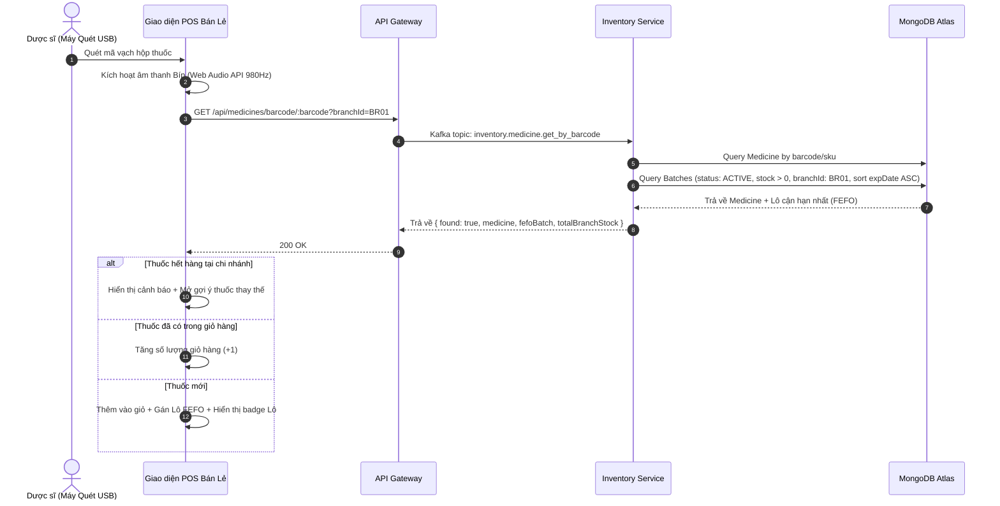

# TÀI LIỆU KỸ THUẬT: POS BARCODE FAST-SCAN & GÁN LÔ FEFO TỰ ĐỘNG

---

## 1. TỔNG QUAN TÍNH NĂNG (FEATURE OVERVIEW)
Tính năng **POS Barcode Fast-Scan** cho phép Dược sĩ sử dụng máy quét mã vạch cầm tay (USB/Bluetooth Scanner) hoặc nhập chuỗi mã vạch để tra cứu và tự động thêm thuốc vào giỏ hàng bán lẻ tại quầy với tốc độ cao, đồng thời tự động chỉ định Lô hàng có hạn dùng gần nhất theo nguyên tắc Dược phẩm **FEFO (First-Expired, First-Out)**.

---

## 2. NGUYÊN LÝ GIAO TIẾP PHẦN CỨNG (HARDWARE INTEGRATION)

### 2.1. Cơ Chế HID Keyboard Emulation
Hầu hết các máy quét Barcode trên thị trường (Honeywell, Zebra, Datalogic, Sunmi, Datalogic QuickScan) hoạt động ở chế độ **Giả lập Bàn Phím (HID Keyboard Emulation)**.
Khi quét một mã vạch, máy quét gửi một chuỗi ký tự ASCII đến trình duyệt trong khoảng thời gian siêu ngắn:
- Thời gian giữa 2 ký tự liên tiếp của máy quét: $t \approx 10\text{ms} - 35\text{ms}$ (trong khi con người gõ phím thông thường mất $120\text{ms} - 300\text{ms}$).
- Ký tự kết thúc chuỗi: Mặc định là ký tự `Enter` (`\r` hoặc `\n`).

### 2.2. Thuật Toán Lọc & Bắt Mã Quét Toàn Cục (Global Keystroke Listener)
```typescript
const handleGlobalKeyDown = (e: KeyboardEvent) => {
  const target = e.target as HTMLElement;
  const isInput = target && (target.tagName === 'INPUT' || target.tagName === 'TEXTAREA');

  const now = Date.now();
  const diff = now - lastKeyTimeRef.current;
  lastKeyTimeRef.current = now;

  if (e.key === 'Enter') {
    // Nhận diện kết thúc quét từ máy quét (chuỗi >= 4 ký tự gõ tốc độ cao)
    if (scanBufferRef.current.length >= 4 && (diff < 60 || !isInput)) {
      e.preventDefault();
      const code = scanBufferRef.current;
      scanBufferRef.current = "";
      handleBarcodeScanned(code);
    } else {
      scanBufferRef.current = "";
    }
  } else if (e.key.length === 1) {
    if (diff > 80 && !isInput) {
      scanBufferRef.current = e.key;
    } else {
      scanBufferRef.current += e.key;
    }
  }
};
```

---

## 3. LUỒNG XỬ LÝ NGHIỆP VỤ & ĐIỀU PHỐI LÔ FEFO



---

## 4. MA TRẬN XỬ LÝ TRƯỜNG HỢP BIÊN (EDGE CASES)

| Mã Case | Tình Huống | Hành Động Xử Lý Của Hệ Thống |
| :--- | :--- | :--- |
| **EC-01** | Quét trúng thuốc hết hàng tại chi nhánh | Chặn thêm giỏ hàng $\rightarrow$ Bật cảnh báo vàng $\rightarrow$ Tự động mở modal tìm thuốc thay thế cùng hoạt chất hoặc tra cứu chi nhánh khác còn tồn. |
| **EC-02** | Thuốc có nhiều quy cách (Hộp / Vỉ / Viên) | Tự động chọn quy cách khớp với mã barcode đã quét (nếu là mã vạch vỉ lẻ), hoặc chọn đơn vị mặc định và hiển thị dropdown đổi đơn vị trực tiếp. |
| **EC-03** | Dược sĩ quét 2 lần liên tiếp do nút bấm nảy (Bouncing) | Tích hợp Debounce threshold 300ms ngăn chặn tăng số lượng vô ý. |
| **EC-04** | Mã vạch lạ không có trong cơ sở dữ liệu | Phát âm thanh bíp cảnh báo lỗi $\rightarrow$ Thông báo toast đỏ kèm mã vừa quét. |
