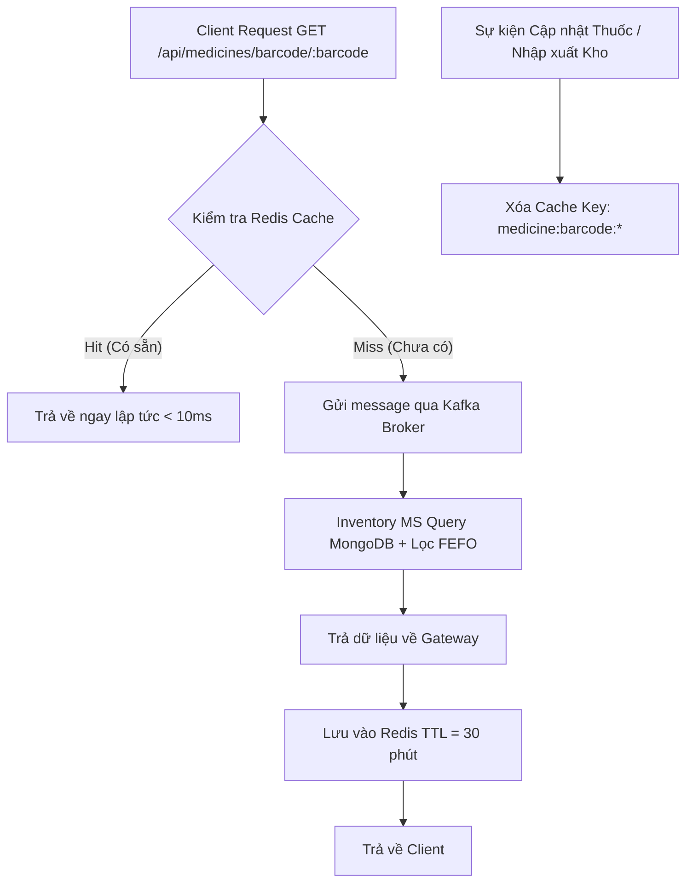

# TÀI LIỆU KỸ THUẬT: KIẾN TRÚC MICROSERVICES & CACHE REDIS CHO BARCODE

---

## 1. TỔNG QUAN KIẾN TRÚC HỆ THỐNG (SYSTEM TOPOLOGY)

Hệ thống Barcode tuân thủ nghiêm ngặt mô hình Microservices quy chuẩn:
- **API Gateway (`apps/api-gateway`):** Tiếp nhận HTTP Request, xác thực JWT, quản lý bộ nhớ đệm phân tán Redis (Cache-Aside Pattern).
- **Message Broker (Apache Kafka :9092):** Điều phối các gói tin đồng bộ (Request-Response) và bất đồng bộ giữa Gateway và Microservices.
- **Inventory Microservice (`apps/inventory-service`):** Lắng nghe sự kiện từ Kafka, thực thi truy vấn MongoDB với chỉ mục tối ưu, điều phối thuật toán FEFO.
- **Database (MongoDB Atlas):** Lưu trữ tập trung bảng dữ liệu `medicines` và `medicinebatches`.

---

## 2. ĐẶC TẢ KAFKA TOPICS & PAYLOAD CONTRACTS

### 2.1. Topic: `inventory.medicine.get_by_barcode`
- **Giao thức:** Request-Response (ClientKafka `send` $\rightarrow$ MessagePattern `return`).
- **Request Payload:**
```json
{
  "barcode": "8930003785326",
  "branchId": "BR-HOAN_KIEM"
}
```
- **Response Payload:**
```json
{
  "success": true,
  "found": true,
  "medicine": {
    "_id": "6a21b04a3f850e1d8be5ea99",
    "name": "Dung dịch tiêm Heparin-Belmed 5ml",
    "sku": "MED-E5EA99",
    "barcode": "8930003785326",
    "unit": "Hộp",
    "price": 269000,
    "totalBranchStock": 150
  },
  "batches": [
    {
      "batchNo": "BATCH-2026-001",
      "expDate": "2026-11-30T00:00:00.000Z",
      "stock": 50,
      "status": "ACTIVE"
    },
    {
      "batchNo": "BATCH-2026-002",
      "expDate": "2027-08-15T00:00:00.000Z",
      "stock": 100,
      "status": "ACTIVE"
    }
  ],
  "fefoBatch": {
    "batchNo": "BATCH-2026-001",
    "expDate": "2026-11-30T00:00:00.000Z",
    "stock": 50
  },
  "totalBranchStock": 150,
  "matchedUnit": null,
  "barcode": "8930003785326"
}
```

---

### 2.2. Topic: `inventory.medicine.generate_barcode`
- **Giao thức:** Request-Response
- **Request Payload:** `{ "id": "6a21b04a3f850e1d8be5ea99" }`
- **Response Payload:**
```json
{
  "success": true,
  "message": "Đã sinh mã vạch EAN-13 chuẩn thành công",
  "barcode": "8938741928374",
  "medicine": { ... }
}
```

---

## 3. CHIẾN LƯỢC CACHE-ASIDE TRÊN REDIS



- **Cache Key Format:** `medicine:barcode:{barcode}:{branchId}`
- **TTL (Time-To-Live):** `1800000 ms` (30 phút).
- **Chính sách nhất quán (Consistency):** Xóa cache lập tức (`cacheManager.del`) khi sinh lại mã hoặc cập nhật thông tin thuốc.

---

## 4. TỐI ƯU HÓA CHỈ MỤC MONGODB (INDEX STRATEGY)

Các index đã được thiết lập trên MongoDB Atlas để hỗ trợ tra cứu Barcode với độ phức tạp $O(1)$:
- `barcode_1`: B-Tree Index đơn trên trường `barcode`.
- `sku_1`: B-Tree Index trên trường `sku`.
- `branchId_1_medicineId_1_status_1_expDate_1`: Compound Index tối ưu hóa truy vấn lọc Lô hàng FEFO.
