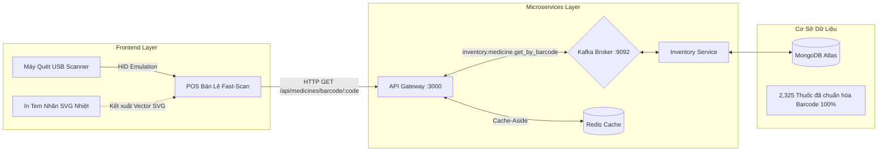

# PHARMACHAIN - HỆ THỐNG GIẢI PHÁP MÃ VẠCH (BARCODE SUITE)

Tài liệu này là mục lục và tổng quan toàn diện về bộ giải pháp **Mã Vạch Chuẩn Dược Phẩm GS1 EAN-13 & Quản Trị Kho Vận FEFO** của hệ thống PharmaChain.

---

## 📚 DANH MỤC CÁC TÀI LIỆU KỸ THUẬT CHI TIẾT

| STT | Tên Tài Liệu | Nội Dung Trọng Tâm | Đường Dẫn File |
| :---: | :--- | :--- | :--- |
| **01** | **POS Fast-Scan & Gán Lô FEFO** | Nghiệp vụ bán lẻ tại quầy, xử lý phần cứng máy quét USB (HID Keyboard Emulation), chống xung đột bàn phím, tự động gán Lô cận hạn nhất theo chuẩn FEFO. | [1_POS_BARCODE_FAST_SCAN.md](file:///d:/Đồ%20án%20tốt%20nghiệp/wdp301-rbl-project-wdp_se18d08_group-7/docs/barcode/1_POS_BARCODE_FAST_SCAN.md) |
| **02** | **Đặc Tả Toán Học GS1 EAN-13** | Thuật toán sinh mã EAN-13 chuẩn Việt Nam (đầu `893`), giải thuật kiểm tra Checksum Modulo 10, cấu trúc nhị phân 95-module và bộ sinh Vector SVG thuần. | [2_GS1_EAN13_SPECIFICATION_ENGINE.md](file:///d:/Đồ%20án%20tốt%20nghiệp/wdp301-rbl-project-wdp_se18d08_group-7/docs/barcode/2_GS1_EAN13_SPECIFICATION_ENGINE.md) |
| **03** | **Hệ Thống In Tem Nhãn Nhiệt 50x30mm** | Đặc tả in tem nhãn nhiệt chuẩn GSP, hỗ trợ in tem dán vỉ/hộp lẻ, xem trước trực quan và hỗ trợ đa khổ giấy (50x30mm, 40x30mm, A4). | [3_THERMAL_LABEL_PRINTING_SYSTEM.md](file:///d:/Đồ%20án%20tốt%20nghiệp/wdp301-rbl-project-wdp_se18d08_group-7/docs/barcode/3_THERMAL_LABEL_PRINTING_SYSTEM.md) |
| **04** | **Kiến Trúc Microservices & Redis Caching** | Luồng giao tiếp Event-Driven / Request-Response qua Apache Kafka, kiến trúc bộ nhớ đệm Cache-Aside trên Redis và tối ưu truy vấn MongoDB Index. | [4_MICROSERVICES_KAFKA_REDIS_BARCODE_ARCHITECTURE.md](file:///d:/Đồ%20án%20tốt%20nghiệp/wdp301-rbl-project-wdp_se18d08_group-7/docs/barcode/4_MICROSERVICES_KAFKA_REDIS_BARCODE_ARCHITECTURE.md) |

---

## 🎯 TỔNG QUAN VỀ HIỆU LỰC & QUY MÔ HỆ THỐNG

---

## 🛡️ CÁC TIÊU CHUẨN ĐẠT ĐƯỢC
1. **Chuẩn Dược GSP/GDP:** Tự động điều phối xuất kho theo nguyên tắc **FEFO (First-Expired, First-Out)**.
2. **Chuẩn Mã Vạch Quốc Tế:** Tuân thủ 100% tiêu chuẩn mã hóa **GS1 EAN-13** của Viện Tiêu chuẩn Chất lượng Việt Nam (GS1 VN).
3. **Hiệu Năng Phản Hồi:** Độ trễ tra cứu Barcode $\le 10\text{ms}$ khi Cache Hit trên Redis và $\le 80\text{ms}$ khi qua Kafka $\rightarrow$ MongoDB.
